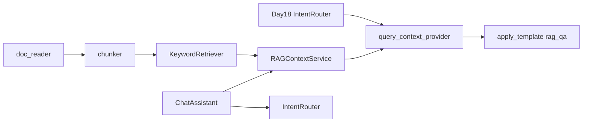

# ZL-NA-REQ-019 需求文档

**需求编号**：ZL-NA-REQ-019  
**需求名称**：RAG 检索入门 — 查询感知上下文管线  
**优先级**：P0  
**Sprint**：Sprint 3 第五日  
**状态**：已交付

---

## 1. 背景

智链科技 NexusAgent 在 Day 18 实现意图路由后，`rag_qa` 模板的 `context` 仍来自静态 `context_provider`（如 `doc_reader` 截断前 400 字），与用户问题无关。产品要求：根据**用户查询**从知识库检索相关片段，拼接为 Prompt `context`，实现 RAG 最小可用闭环。

## 2. 目标用户

- 终端用户（问答应引用与问题相关的资料片段）
- 知识库运营（调整分块参数、扩充 sample_docs）
- 后端开发（替换检索器、接入向量库）
- 测试与 CI（确定性关键词检索、可重复断言）

## 3. 功能需求

### FR-001 文档分块 TextChunk

| 项 | 描述 |
|----|------|
| 模块 | `src/rag/chunker.py` |
| 类 | `TextChunk`（frozen dataclass） |
| 字段 | `chunk_id`、`text`、`source`、`index`、`start_char`、`end_char` |
| 属性 | `char_count` |
| 函数 | `chunk_text(text, *, chunk_size=200, overlap=40, source="")` |
| 函数 | `chunk_documents(docs, *, chunk_size, overlap, use_cleaned=True)` |
| 策略 | 段落合并 → 滑动窗口切分，保留 overlap |

### FR-002 关键词检索 KeywordRetriever

| 项 | 描述 |
|----|------|
| 模块 | `src/rag/retriever.py` |
| 类 | `RetrievalResult`（chunk、score、matched_tokens） |
| 类 | `KeywordRetriever` |
| 方法 | `index(chunks)`、`search(query, *, top_k=3)` |
| 打分 | 命中 token 数 / 查询 token 总数；中文 bigram 辅助 |
| 排序 | score 降序，同分按 matched 数量与 chunk.index |

### FR-003 RAG 上下文服务

| 项 | 描述 |
|----|------|
| 模块 | `src/rag/context.py` |
| 类 | `DocumentIndex`（chunks + retriever） |
| 类 | `RAGContextService` |
| 工厂 | `from_documents`、`from_directory`、`from_sample_docs` |
| 方法 | `retrieve_context(query, *, top_k, max_chars, separator)` |
| 方法 | `retrieve_summary(query, *, top_k)` — 供 `/retrieve` |
| 输出格式 | `[片段N·source·score%]` 头 + 正文，块间 `\n---\n` |

### FR-004 query_context_provider 集成

| 项 | 描述 |
|----|------|
| 模块 | `prompts/intent.py` |
| 构造参数 | `query_context_provider: QueryContextProvider | None` |
| 方法 | `_resolve_rag_context(query)` |
| 优先级 | `query_context_provider(query)` > `context_provider()` > 默认占位 |
| 用法 | `IntentRouter(query_context_provider=service.retrieve_context)` |

### FR-005 ChatAssistant /retrieve 命令

| 项 | 描述 |
|----|------|
| 模块 | `chat/cli_assistant.py` |
| 构造参数 | `rag_service: RAGContextService | None` |
| 命令 | `/retrieve [查询词]` — 调用 `retrieve_summary`，不调 LLM |
| 未启用 | 返回「RAG 检索未启用。请传入 rag_service。」 |

### FR-006 演示脚本

| 项 | 描述 |
|----|------|
| `chunk_demos.py` | `raw_notice.txt` 分块打印 |
| `retriever_demos.py` | 四条查询检索摘要 |
| `rag_context_demo.py` | 单 query 拼接 context 展示 |
| `routed_rag_demo.py` | `/retrieve` + `auto_route` + RAG 联调 |

### FR-007 单元测试

| 项 | 描述 |
|----|------|
| 文件 | `tests/day19/test_rag.py` |
| 数量 | 12 条 |
| 覆盖 | 分块、空输入、非法 overlap、批量分块、检索命中、max_chars、query_context_provider、静态回退、route_and_apply、/retrieve、auto_route+RAG |

## 4. 非功能需求

| 编号 | 要求 |
|------|------|
| NFR-001 | 检索零 LLM、零外网，单测秒级 |
| NFR-002 | 分块与检索参数可构造注入，便于 A/B |
| NFR-003 | 与 Day 18 `IntentRouter`、`apply_template` 兼容 |
| NFR-004 | `retrieve_context` 遵守 `max_chars` 上限，防 Prompt 爆炸 |

## 5. 验收标准

```bash
export PYTHONPATH=src
python3 src/day19/chunk_demos.py
python3 src/day19/retriever_demos.py
python3 src/day19/rag_context_demo.py
NEXUS_LLM_MOCK=1 python3 src/day19/routed_rag_demo.py
python3 -m pytest tests/day19/test_rag.py -v
```

全部通过，且 `test_retriever_finds_yield_info` 验证收益率相关命中。

## 6. 范围外（后续迭代）

- Day 20：Embedding 向量相似度检索  
- Day 25+：向量数据库持久化索引  
- 混合检索（关键词 + 向量）  
- 重排序（Reranker）与引用溯源 UI  

## 7. 依赖关系


