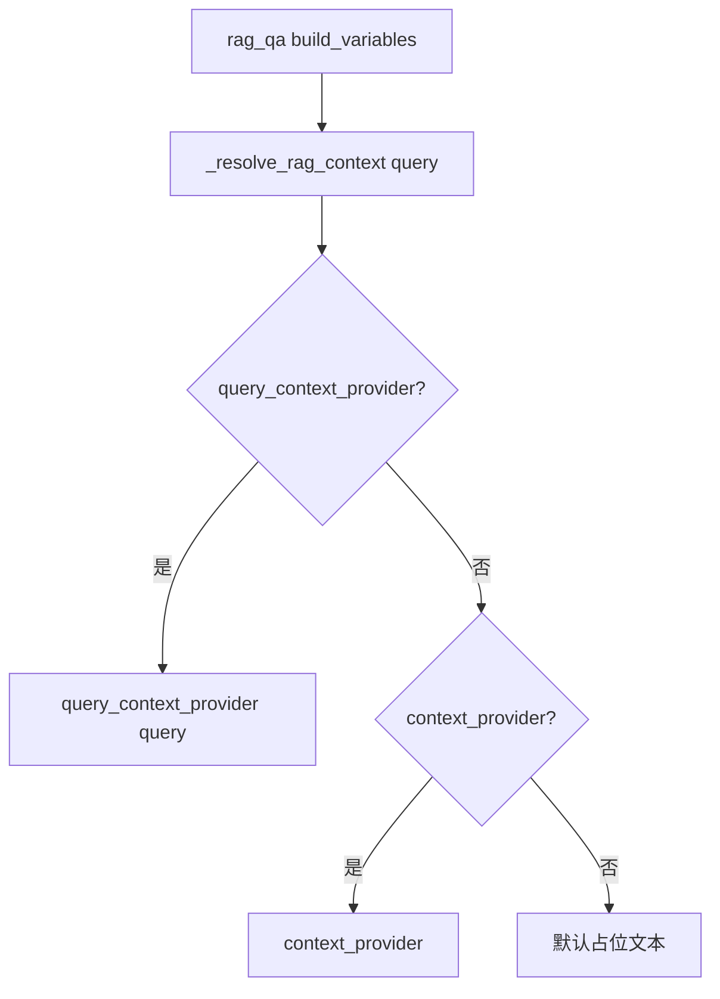

# ZL-NA-REQ-019 需求文档（扩展）

**关联**：`02_需求文档.md`  
**读者**：架构师、测试、Day 20 Embedding 迭代

---

## E-001 分块参数默认值与 rationale

| 参数 | 默认值 | 说明 |
|------|--------|------|
| chunk_size | 200 | 适配 `raw_notice.txt` 篇幅，单块约 2–3 句 |
| overlap | 40 | 20% 重叠，降低「收益率」被切断概率 |
| use_cleaned | True | 优先 `DocumentRecord.cleaned`，去噪后分块 |

**调参指南**：`chunk_size` 增大 → 块数减少、检索粒度变粗；`overlap` 增大 → 冗余增多、索引体积上升。

---

## E-002 TextChunk 标识契约

`chunk_id` 格式：`{source}:{block_idx}:{sub_idx}`

| 场景 | 示例 |
|------|------|
| 短段落整块 | `raw_notice.txt:0:0` |
| 长段滑动切分 | `raw_notice.txt:1:2` |

`index` 为全局递增序号，供检索同分排序 tie-break。

---

## E-003 检索打分语义

```python
score = len(matched_tokens) / len(query_tokens)
```

| 场景 | score | 说明 |
|------|-------|------|
| 无命中 | 0（不返回） | 过滤零分块 |
| 全命中 | 1.0 | 查询词全部出现在块中 |
| 部分命中 | 0.33–0.9 | 依命中比例 |

**中文 bigram**：`年化收益率` → tokens 含 `年化`、`化收`、`收益` 等，提高子串匹配鲁棒性。

---

## E-004 retrieve_context 输出契约

```
[片段1·raw_notice.txt·67%]
第一段正文...
---
[片段2·raw_notice.txt·50%]
第二段正文...
```

| 规则 | 描述 |
|------|------|
| max_chars | 默认 800，超出截断最后一块并加 `...` |
| 空 query | 返回「（请输入检索问题）」 |
| 零命中 | 返回「（未检索到相关片段...）」 |

与 Day 17 `RAG_QA` 的 `{context}` 占位直接对接。

---

## E-005 query_context_provider 与 context_provider



**迁移路径**：Day 18 作业若仍用 `context_provider`，测试 `test_intent_router_static_context_fallback` 保证向后兼容。

---

## E-006 /retrieve 与 /route 对比

| 命令 | 依赖 | 输出 | 调 LLM |
|------|------|------|--------|
| /route | intent_router | IntentMatch.summary | 否 |
| /retrieve | rag_service | retrieve_summary 多行 | 否 |

联调时先 `/retrieve` 确认命中，再 `/route` 确认意图，最后 `chat_turn` 看完整回复。

---

## E-007 测试用例矩阵

| 测试函数 | 断言要点 |
|----------|----------|
| test_chunk_text_splits_with_overlap | 多块、source 一致 |
| test_chunk_text_empty | 空串返回 [] |
| test_chunk_text_invalid_overlap | overlap >= chunk_size 抛 ValueError |
| test_chunk_documents_from_reader | sample_docs 含 raw_notice.txt |
| test_retriever_finds_yield_info | 年化收益率命中 |
| test_retriever_finds_risk_notice | context 含「风险」 |
| test_retrieve_context_respects_max_chars | len <= 130 |
| test_intent_router_query_context_provider | vars context 含收益/年化 |
| test_intent_router_static_context_fallback | 无 query provider 时静态 |
| test_route_and_apply_with_rag | template rag_qa + context 键 |
| test_assistant_retrieve_command | msg 含 score= |
| test_assistant_auto_route_with_rag | auto_route + rag_qa |

---

## E-008 Day 20 衔接预留

`KeywordRetriever.search` 接口签名保持不变，Day 20 可实现 `EmbeddingRetriever` 并注入 `DocumentIndex.retriever`，`RAGContextService` 无需改动调用方。
