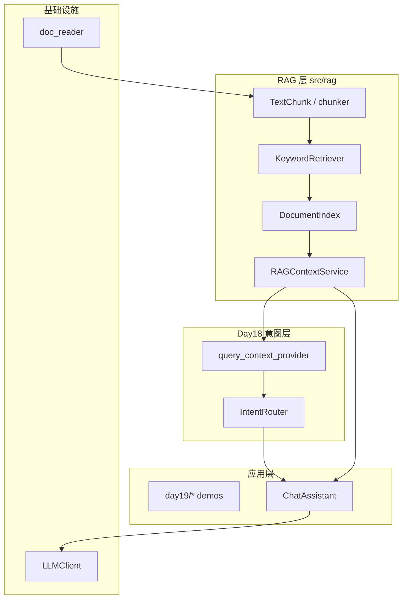
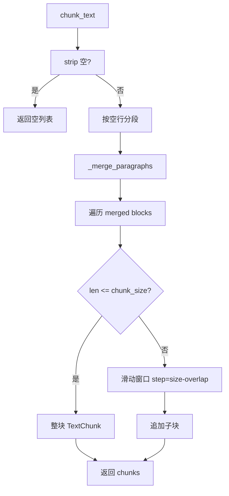
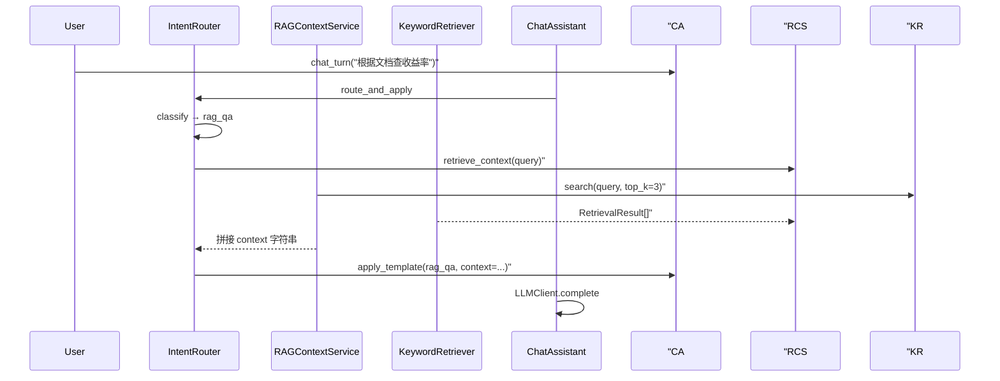

# Day 19 架构设计

**模块**：`src/rag/*` + `IntentRouter` / `ChatAssistant` 扩展  
**需求**：ZL-NA-REQ-019

---

## 1. 分层架构



## 2. 核心类与符号

| 符号 | 模块 | 职责 |
|------|------|------|
| `TextChunk` | chunker.py | 不可变文本块元数据 |
| `chunk_text` | chunker.py | 单文本分块 |
| `chunk_documents` | chunker.py | 批量 DocumentRecord 分块 |
| `RetrievalResult` | retriever.py | 检索命中 + preview() |
| `KeywordRetriever` | retriever.py | 关键词索引与 search |
| `DocumentIndex` | context.py | chunks + retriever 聚合 |
| `RAGContextService` | context.py | 工厂方法 + retrieve_context |
| `query_context_provider` | intent.py | 查询感知上下文注入 |
| `rag_service` | cli_assistant.py | /retrieve 命令依赖 |
| `/retrieve` | cli_assistant.py | 检索预览命令 |

## 3. 分块控制流



## 4. 检索序列



## 5. 模块边界

| 模块 | 负责 | 不负责 |
|------|------|--------|
| chunker | 文本切分、元数据 | 检索、Prompt |
| retriever | 打分排序 | 读文件、拼接 |
| context | 管线编排、格式化 | 意图分类 |
| intent | 变量注入策略 | 分块实现 |
| cli_assistant | 命令与联调 | 检索算法 |

## 6. 数据流（sample_docs）

```
sample_docs/*.txt
  → read_documents(clean=True)
  → DocumentRecord[]
  → chunk_documents(chunk_size=200, overlap=40)
  → TextChunk[] (N 块)
  → KeywordRetriever.index
  → search("年化收益率") → top_k 结果
  → retrieve_context → Prompt {context}
```

## 7. 扩展点（Day 20+）

1. **检索器可替换**：`DocumentIndex.retriever` 接受任意实现 `search(query, top_k)` 的对象  
2. **分块策略可插拔**：未来可增加 `MarkdownChunker`、`SemanticChunker`  
3. **上下文格式可配置**：`separator`、`max_chars`、header 模板  

## 8. 与 Day 18 集成点

```python
service = RAGContextService.from_sample_docs()
router = IntentRouter(query_context_provider=service.retrieve_context)
assistant = ChatAssistant(
    client=client,
    intent_router=router,
    auto_route=True,
    rag_service=service,
)
```

`build_variables` 在 `template_name == "rag_qa"` 时调用 `_resolve_rag_context(match.user_text)`，将用户原话作为检索 query。
