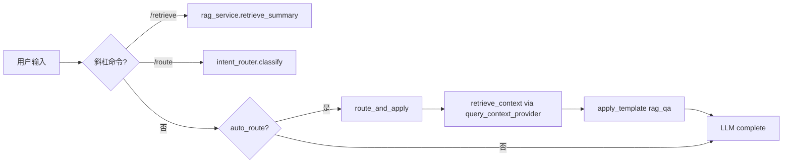
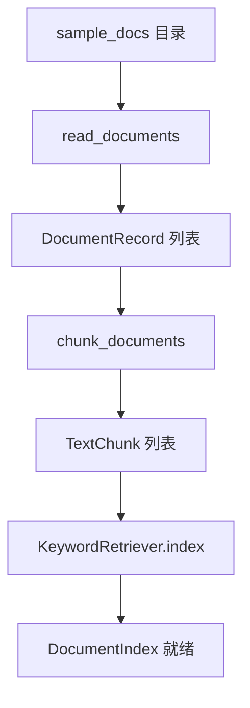
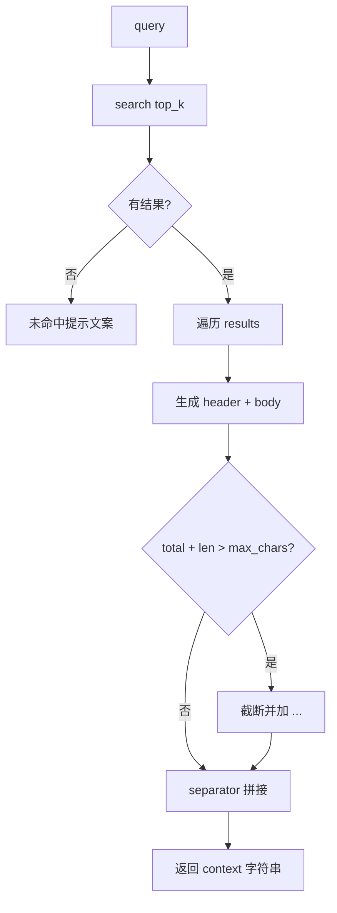
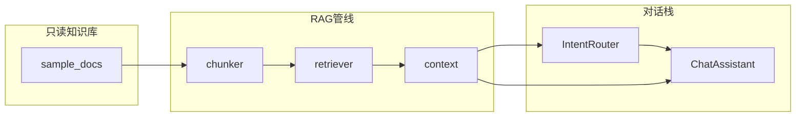
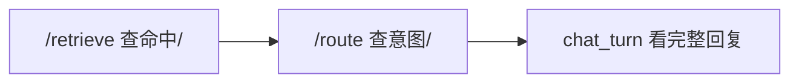

# Day 19 流程图与示意图

**主题**：RAG 检索管线与查询感知上下文全链路

---

## 1. RAG 主流程（auto_route + RAG）



## 2. 文档入库与索引（离线）



## 3. retrieve_context 拼接逻辑



## 4. 关键词 tokenize 示意

```
查询: "年化收益率是多少"

_tokenize 产出:
  - 整词: 年化收益率, 是多少  (经 lower)
  - bigram: 年化, 化收, 收益, 益率, 率是, 是多, 多少

块文本: "...年化收益率可达8%..."
命中: 年化, 化收, 收益, 益率 → score = 4/8 = 50%
```

## 5. overlap 滑动窗口示意

```
原文: [====|====|====|====]  (长度 > chunk_size)

块1: [========]
块2:      [========]   ← 与块1 重叠 overlap 字符
块3:           [========]

目的: 「投资有风险」若横跨边界，至少一块完整包含
```

## 6. 组件依赖图



## 7. Day 18 → Day 19 上下文演进

| 阶段 | context 来源 | 是否 query 感知 |
|------|-------------|----------------|
| Day 17 | 模板占位 `{context}` | 否 |
| Day 18 | `context_provider()` 静态截断 | 否 |
| Day 19 | `query_context_provider(query)` 检索 | **是** |
| Day 20 | Embedding 向量检索 | 是（语义级） |

## 8. 调试三板斧



林晓 Lab 记录：先 `/retrieve 年化收益` 确认 score，再自然语言提问验证 `auto_route`。
