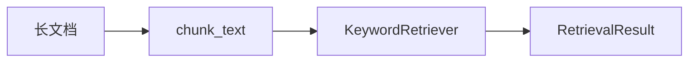

# Day 19 课堂笔记（上午）

**讲师**：陈默  
**记录**：林晓  
**时段**：09:00–12:00

---

## 09:00 RAG 概论

### 什么是 RAG？

**Retrieval-Augmented Generation**：检索增强生成。先找资料，再让 LLM 根据资料回答。

> 陈默：「没有检索的 `rag_qa` 只是名字叫 RAG，本质是开放式问答。」

### Day 18 痛点复盘

```python
# Day 18 典型写法 — 与 query 无关
router = IntentRouter(
    context_provider=lambda: read_notice()[:400]
)
```

用户问「客服电话」和「收益率」，context 相同 → 幻觉风险上升。

---

## 09:30 chunker.py 走读

### TextChunk 字段

| 字段 | 林晓笔记 |
|------|----------|
| chunk_id | 调试时定位用，格式 source:block:sub |
| source | 文件名，多文档时区分来源 |
| index | 全局序号，检索 tie-break |
| start_char / end_char | 未来高亮引用预留 |

### overlap 实验

```bash
python3 src/day19/chunk_demos.py
```

林晓将 `chunk_size=120, overlap=20` 改为 `overlap=0`，发现「年化收益率」有时被切成「年化」和「收益率」两块 —— overlap 的价值直观可见。

### 段落合并 `_merge_paragraphs`

短段合并到 `chunk_size` 内，避免一句一段造成索引碎片。

---

## 10:45 KeywordRetriever

### 打分公式

```
score = |matched_tokens| / |query_tokens|
```

赵岩问：「为什么不用 TF-IDF？」  
陈默：「MVP 要可测、零依赖；TF-IDF 放扩展阅读。」

### search 排序键

```python
scored.sort(key=lambda r: (-r.score, -len(r.matched_tokens), r.chunk.index))
```

同分先看命中词数量，再看块序号（稳定排序）。

---

## 11:30 上午小结



**林晓疑问（待下午）**：`retrieve_context` 的 header 格式 `[片段1·source·67%]` 会不会浪费 token？  
陈默：「`max_chars` 会截断；header 换可解释性，运营验收用。」

---

## 关键词速记

- **chunk_size / overlap**：分块粒度与边界保护  
- **top_k**：返回几条块，默认 3  
- **matched_tokens**：可解释性，对应 `/retrieve` 输出  

---

## 预习作业（午休）

阅读 `src/rag/context.py` 的 `from_sample_docs` 与 `retrieve_context` 全文。
