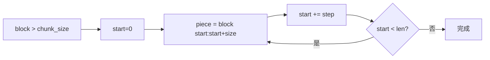

# Day 19 RAG 检索详解

**专题**：从文档分块到查询感知上下文 — NexusAgent RAG MVP 全链路

---

## 1. 为什么需要 RAG？

大模型参数知识有截止日期，且无法获知智链内部产品说明书。RAG 在生成前**检索**相关资料片段，注入 Prompt，使回答有据可查。

| 模式 | 优点 | 缺点 |
|------|------|------|
| 纯 LLM | 实现简单 | 易幻觉、无溯源 |
| 全量塞入 Prompt | 信息全 | 超长、超 token、噪音大 |
| **RAG** | 相关片段、可扩展知识库 | 需分块与检索工程 |

Day 19 实现**关键词 RAG MVP**；Day 20 升级语义检索。

---

## 2. TextChunk 数据模型

```python
@dataclass(frozen=True)
class TextChunk:
    chunk_id: str
    text: str
    source: str
    index: int
    start_char: int
    end_char: int

    @property
    def char_count(self) -> int:
        return len(self.text)
```

| 字段 | 设计意图 |
|------|----------|
| frozen | 块元数据不可变，索引安全 |
| chunk_id | 日志与 UI 引用 |
| source | 多文档溯源 |
| index | 稳定排序 |

---

## 3. chunk_text 算法

### 3.1 段落切分

```python
_PARA_SPLIT = re.compile(r"\n\s*\n+")
paragraphs = [p.strip() for p in _PARA_SPLIT.split(text) if p.strip()]
```

### 3.2 段落合并

短段合并至 `chunk_size`，减少碎片：

```python
elif len(buffer) + 1 + len(para) <= chunk_size:
    buffer = f"{buffer}\n{para}"
```

### 3.3 滑动窗口

长块按 `step = chunk_size - overlap` 滑动：



---

## 4. KeywordRetriever

### 4.1 Tokenize

- 中文连续段、英文数字段  
- 中文额外提取 bigram（二字滑动）  

### 4.2 打分与排序

```python
matched = tuple(t for t in tokens if t in lower)
score = len(matched) / len(tokens)
```

排序：`-score` → `-len(matched_tokens)` → `chunk.index`

### 4.3 RetrievalResult.preview

供 `/retrieve` 单行摘要，默认 60 字符。

---

## 5. RAGContextService

### 5.1 构建索引

```python
@classmethod
def from_sample_docs(cls, **kwargs) -> RAGContextService:
    return cls.from_directory(get_path("sample_docs"), **kwargs)
```

### 5.2 retrieve_context

核心产品接口：检索 + 格式化 + 长度控制。

```python
header = f"[片段{i}·{result.chunk.source}·{result.score:.0%}]"
piece = f"{header}\n{body}"
```

### 5.3 retrieve_summary

运维友好多行输出，含 `score=`、`命中=`、`preview`。

---

## 6. query_context_provider 集成

Day 18 `IntentRouter` 扩展：

```python
def _resolve_rag_context(self, query: str) -> str:
    if self.query_context_provider:
        return self.query_context_provider(query)
    ...
```

**关键**：`build_variables` 将 `match.user_text` 作为 query 传入，用户自然语言整句参与检索。

---

## 7. 端到端示例

```python
from prompts import IntentRouter
from rag import RAGContextService
from chat import ChatAssistant

rag = RAGContextService.from_sample_docs()
router = IntentRouter(query_context_provider=rag.retrieve_context)
assistant = ChatAssistant(
    client=client,
    intent_router=router,
    auto_route=True,
    rag_service=rag,
)
reply = assistant.chat_turn("根据文档，年化收益率是多少？")
```

---

## 8. 局限与 Day 20 方向

| 局限 | Day 20 对策 |
|------|-------------|
| 同义词 | Embedding 余弦相似度 |
| 语序无关 | 向量语义匹配 |
| 多语言混合 | 统一 embedding 空间 |

---

## 9. 与测试对照

| 行为 | 测试 |
|------|------|
| overlap 分块 | test_chunk_text_splits_with_overlap |
| 收益率命中 | test_retriever_finds_yield_info |
| 风险 context | test_retriever_finds_risk_notice |
| 查询感知注入 | test_intent_router_query_context_provider |
| /retrieve | test_assistant_retrieve_command |

阅读 `tests/day19/test_rag.py` 即阅读活文档。
