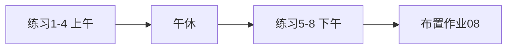

# Day 19 课堂练习册

**适用**：上午 chunker 讲完后、下午检索讲完后各做一半  
**时长**：各 25 分钟

---

## 练习 1：TextChunk 字段填空（基础）

阅读 `chunker.py` 中 `TextChunk` 定义，填空：

1. `chunk_id` 的典型格式是 `____:____:____`  
2. `index` 字段表示________在全局列表中的序号  
3. `frozen=True` 表示实例________  

<details><summary>答案</summary>
1. source:block_idx:sub_idx（如 raw_notice.txt:0:0）  
2. 当前块  
3. 不可变（immutable）  
</details>

---

## 练习 2：手算 overlap（进阶）

`chunk_size=10`，`overlap=3`，块文本长度 25 字符（无段落）。

1. 滑动步长 `step` = ?  
2. 大约产生几块？  

<details><summary>答案</summary>
1. step = 10 - 3 = 7  
2. start=0,7,14 → 3 块（第三块可能较短）  
</details>

---

## 练习 3：检索打分（进阶）

查询 token 列表：`["年化", "收益", "化收", "益率"]`（4 个）  
块 A 命中：`年化, 收益`  
块 B 命中：`年化, 化收, 收益, 益率`  

1. 块 A 的 score？  
2. 块 B 的 score？  
3. 排序谁在前？  

<details><summary>答案</summary>
1. 2/4 = 0.5  
2. 4/4 = 1.0  
3. 块 B 在前（score 更高）  
</details>

---

## 练习 4：代码阅读（基础）

`chunk_documents` 中 `use_cleaned=True` 时，内容取自：

- A. `doc.content`  
- B. `doc.cleaned`（若存在）  
- C. 总是两者拼接  

<details><summary>答案</summary>B — `doc.cleaned if use_cleaned and doc.cleaned else doc.content`</details>

---

## 练习 5：retrieve_context 输出（进阶）

若 `search` 返回 0 条， `retrieve_context` 返回的字符串是？

<details><summary>答案</summary>「（未检索到相关片段，请换关键词或扩充知识库）」</details>

---

## 练习 6：集成连线（综合）

将左侧与右侧连线：

| 左 | 右 |
|----|-----|
| chunk_text | 单文件分块 |
| KeywordRetriever.search | 按 query 打分 |
| retrieve_context | 拼接 Prompt context |
| query_context_provider | IntentRouter 注入点 |
| /retrieve | ChatAssistant 预览命令 |

<details><summary>答案</summary>一一对应</details>

---

## 练习 7：动手实验（Lab 预习）

在 Python REPL 中执行：

```python
from rag import chunk_text
LONG = "第一段。\n\n第二段。\n\n第三段。"
chunks = chunk_text(LONG, chunk_size=10, overlap=2, source="t")
len(chunks)
```

记录块数并解释为何 `\n\n` 影响结果。

---

## 练习 8：错误诊断（综合）

同学代码：

```python
router = IntentRouter(context_provider=lambda: "ctx")
# 未设 query_context_provider
service = RAGContextService.from_sample_docs()
assistant = ChatAssistant(client=c, rag_service=service, auto_route=True, intent_router=router)
```

用户问「根据文档查收益」，`context` 会是什么？如何修复？

<details><summary>答案</summary>
context 为固定「ctx」，与 query 无关。修复：`IntentRouter(query_context_provider=service.retrieve_context)`  
</details>

---

## 讲师用：课堂节奏


