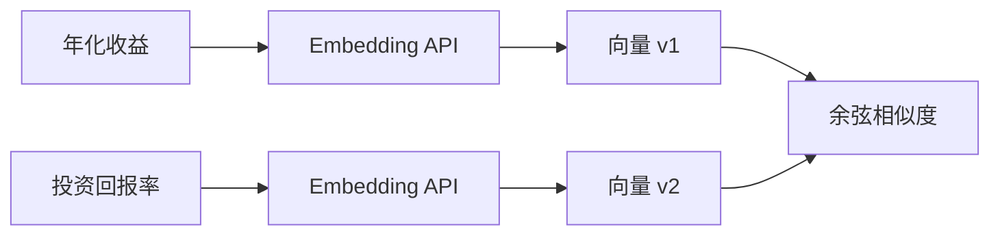
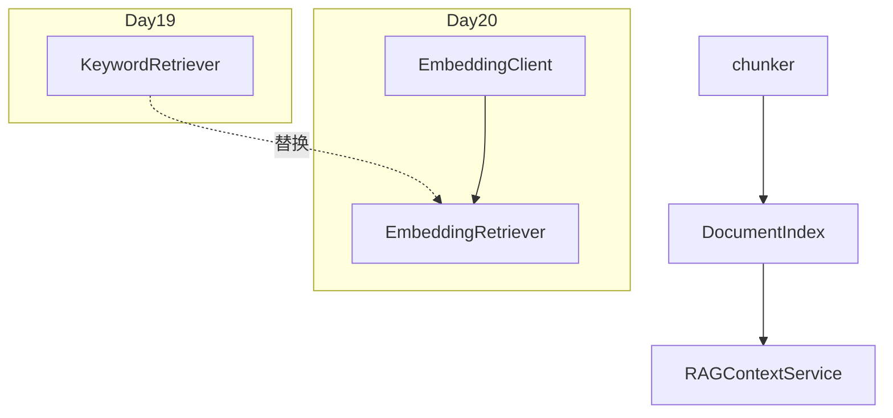

# Day 19 深度扩展：Embedding 与向量检索预习

**定位**：Day 20 先导阅读，今日不实现  
**读者**：学有余力的学员与架构组

---

## 1. 关键词检索的天花板

Day 19 `KeywordRetriever` 基于字面重叠：

| 查询 | 文档表述 | 能否命中 |
|------|----------|----------|
| 年化收益 | 年化收益率可达 8% | 能 |
| 投资回报率 | 年化收益率可达 8% | 难 |
| yield rate | 年化收益率 | 难 |

**语义鸿沟**需向量空间中的距离度量。

---

## 2. Embedding 是什么？

将文本映射为固定维度浮点向量（如 768 维），语义相近的文本向量距离更近。



---

## 3. 余弦相似度

\[
\text{sim}(A, B) = \frac{A \cdot B}{\|A\| \|B\|}
\]

取值 [-1, 1]，检索时常取 top_k 最大者。

与 Day 19 打分对比：

| 维度 | KeywordRetriever | 向量检索 |
|------|------------------|----------|
| 同义词 | 弱 | 强 |
| 可解释性 | 高（matched_tokens） | 中（相似度分数） |
| 依赖 | 无 | Embedding 模型/API |
| CI | 完全离线 | 需 mock 或本地小模型 |

---

## 4. Day 20 预期架构



**接口不变**：`search(query, top_k) -> list[RetrievalResult]`，`RAGContextService` 调用方无感。

---

## 5. 索引构建差异

| 阶段 | 关键词 | 向量 |
|------|--------|------|
| 离线 | 存 TextChunk 文本 | 存 TextChunk + embedding 向量 |
| 在线 | tokenize + 重叠 | embed(query) + 近邻搜索 |
| 存储 | 内存列表 | 内存 / FAISS / 向量库 |

---

## 6. 混合检索（企业常见）

```
final_score = α * keyword_score + (1-α) * vector_score
```

智链规划：Day 25+ 在合规场景保留关键词精确匹配（如「400-888-9999」），语义检索补同义词。

---

## 7. 预习任务（可选）

1. 阅读 OpenAI / 开源 Embedding API 文档一节  
2. 思考：`RetrievalResult.matched_tokens` 在向量检索中可改为 `distance` 字段  
3. 列出 3 个你希望在 Day 20 用向量解决的查询对（同义不同词）  

---

## 8. 与今日作业关系

作业 E `max_chars` 实验在 Day 20 仍然适用 —— 无论检索器如何实现，**拼接与截断**逻辑仍在 `RAGContextService`。

---

## 9. 陈默寄语

> 「Day 19 把管子接通，Day 20 换更好的泵。不要跳过今日关键词 MVP —— 它是向量检索的测试基线。」
