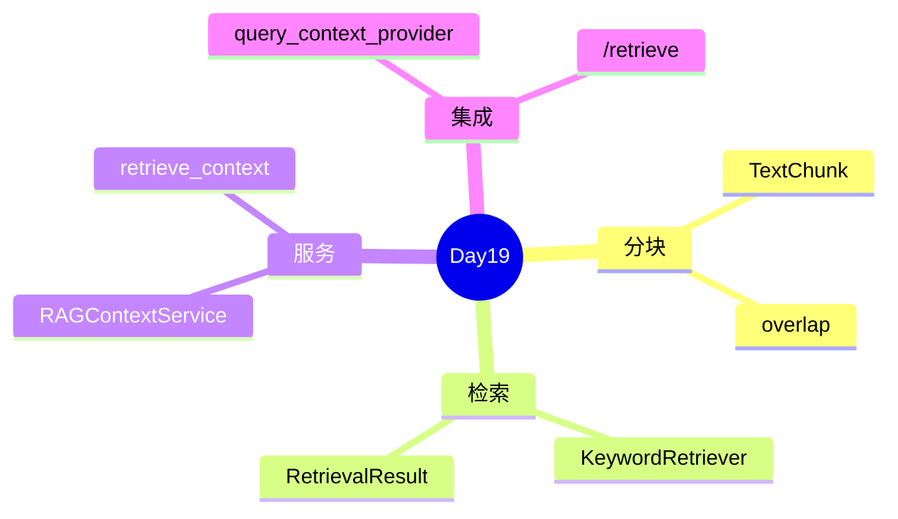

# Day 19 复习卡片

**用法**：自测遮挡右侧答案；小组互相抽查  
**配套测试**：`pytest tests/day19/test_rag.py`

---

## 卡片 1

**Q**：RAG 三字分别指什么？  
**A**：Retrieval-Augmented Generation — 检索增强生成。

---

## 卡片 2

**Q**：`TextChunk` 的 `chunk_id` 格式？  
**A**：`{source}:{block_idx}:{sub_idx}`，如 `raw_notice.txt:1:0`。

---

## 卡片 3

**Q**：`overlap` 必须满足什么不等式？  
**A**：`0 <= overlap < chunk_size`。

---

## 卡片 4

**Q**：`KeywordRetriever` 的 score 公式？  
**A**：`len(matched_tokens) / len(query_tokens)`。

---

## 卡片 5

**Q**：检索结果排序的第三关键字？  
**A**：`chunk.index`（升序，作稳定 tie-break）。

---

## 卡片 6

**Q**：`retrieve_context` 默认 `max_chars`？  
**A**：800。

---

## 卡片 7

**Q**：`query_context_provider` 与 `context_provider` 优先级？  
**A**：query 感知优先；无 query provider 才用静态。

---

## 卡片 8

**Q**：`/retrieve` 依赖 ChatAssistant 哪个属性？  
**A**：`rag_service`（`RAGContextService` 实例）。

---

## 卡片 9

**Q**：`RAGContextService.from_sample_docs()` 读哪个目录？  
**A**：`get_path("sample_docs")`。

---

## 卡片 10

**Q**：中文 bigram 的目的？  
**A**：无分词库时提高复合词（如「收益率」）命中率。

---

## 卡片 11

**Q**：零检索命中时 `retrieve_context` 返回？  
**A**：「（未检索到相关片段，请换关键词或扩充知识库）」。

---

## 卡片 12

**Q**：`tests/day19/test_rag.py` 多少条？  
**A**：12 条。

---

## 卡片 13

**Q**：Day 20 将用什么替代纯关键词匹配？  
**A**：Embedding + 向量相似度（余弦）。

---

## 卡片 14

**Q**：`chunk_documents` 默认用 `cleaned` 还是 `content`？  
**A**：`use_cleaned=True` 时优先 `doc.cleaned`。

---

## 卡片 15

**Q**：`route_and_apply` 后 `rag_qa` 的 `context` 谁提供？  
**A**：`_resolve_rag_context(user_text)` → `query_context_provider(query)`。

---

## 速记口诀

> **分块重叠防切断，关键词打分 MVP；query 注入 context，retrieve 预览再聊天。**

