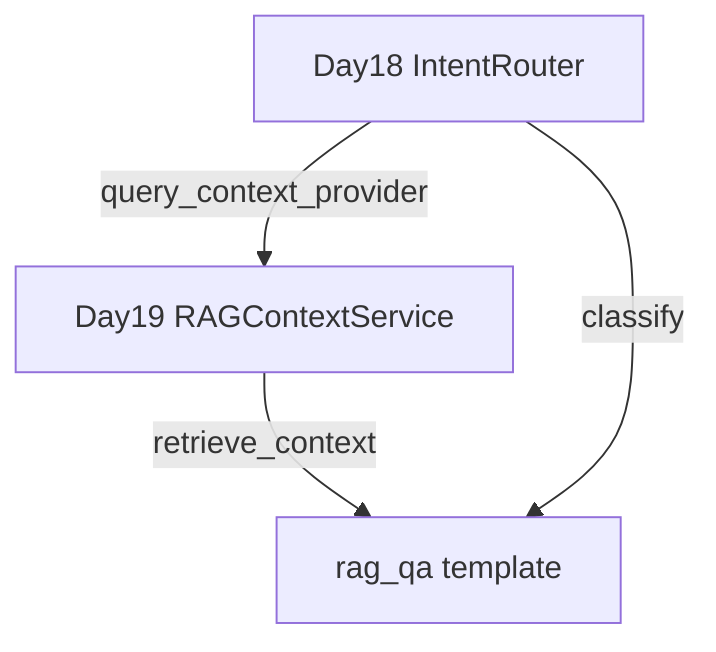

# Day 19 与 Day 18 意图路由对照表

**目的**：串联「意图路由」与「RAG 检索」两层抽象

---

## 1. 能力对照

| 维度 | Day 18 意图路由 | Day 19 RAG 检索 |
|------|----------------|-----------------|
| 核心问题 | 用户这句话用哪个 Prompt？ | rag_qa 的 context 从哪来？ |
| 主模块 | `prompts/intent.py` | `src/rag/*` |
| 核心类 | `RuleBasedIntentClassifier`, `IntentRouter` | `RAGContextService`, `KeywordRetriever` |
| Chat 命令 | `/route [话术]` | `/retrieve [查询]` |
| 上下文 | `context_provider()` 静态 | `query_context_provider(query)` 检索 |
| 输出物 | `IntentMatch` | 检索拼接字符串 |

---

## 2. IntentRouter 参数演进

| 参数 | Day 18 | Day 19 |
|------|--------|--------|
| context_provider | `() -> str` | 保留，作回退 |
| query_context_provider | 无 | `(query: str) -> str` **新增** |
| _resolve_rag_context | 无 | 优先级解析 **新增** |

---

## 3. rag_qa 变量注入对照

### Day 18

```python
if name == "rag_qa":
    context = self.context_provider() if self.context_provider else "（暂无检索上下文）"
    return {**base, "context": context}
```

### Day 19

```python
if name == "rag_qa":
    context = self._resolve_rag_context(text)  # text = match.user_text
    return {**base, "context": context}
```

**变化**：context 依赖用户原话 `text` 作为检索 query。

---

## 4. ChatAssistant 扩展对照

| 属性/命令 | Day 18 | Day 19 |
|-----------|--------|--------|
| intent_router | ✓ | ✓ |
| auto_route | ✓ | ✓ |
| rag_service | 无 | `RAGContextService \| None` |
| /retrieve | 无 | 检索预览 |

---

## 5. API 调用链对照

### Day 18 自动路径

```
用户: 请根据文档查询
  → classify → rag_qa
  → context_provider() → 静态截断
  → apply_template(rag_qa)
  → LLM
```

### Day 19 自动路径

```
用户: 请根据文档查询年化收益
  → classify → rag_qa
  → retrieve_context(user_text)
      → chunk_index.search
      → 拼接 [片段·source·score]
  → apply_template(rag_qa, context=...)
  → LLM
```

---

## 6. 调试命令对照

| 目的 | Day 18 | Day 19 |
|------|--------|--------|
| 看意图 | `/route 话术` | `/route 话术` |
| 看材料 | 无 | `/retrieve 查询词` |
| 看模板 | `/template list` | `/template list` |

**推荐顺序**：`/retrieve` → `/route` → 自然语言 `chat_turn`

---

## 7. 测试对照

| Day | 文件 | 条数 | 主题 |
|-----|------|------|------|
| 18 | test_intent.py | 12 | 分类、路由、auto_route |
| 19 | test_rag.py | 12 | 分块、检索、query_context_provider |

Day 19 保留 `test_intent_router_static_context_fallback` 验证 Day 18 兼容。

---

## 8. 依赖关系图



---

## 9. 林晓对照笔记

| 误区 | 正解 |
|------|------|
| 有 rag_service 就有 RAG context | 还须 query_context_provider |
| /retrieve 会改模板 | 仅预览，不调 apply_template |
| 检索替代意图 | 两层协作：先 route 再 retrieve |

---

## 10. Day 20 前瞻

| 层 | Day 19 | Day 20 |
|----|--------|--------|
| 检索实现 | KeywordRetriever | EmbeddingRetriever |
| 意图 | 不变 | 不变 |
| context 拼接 | 不变 | 不变 |

意图路由与检索拼接**解耦**，便于独立升级。
