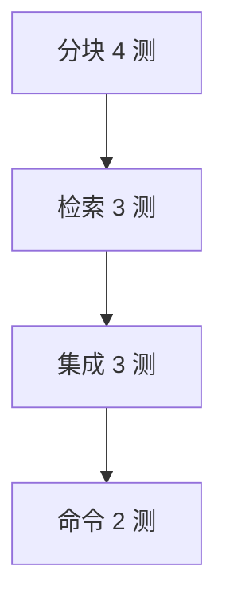

# Day 19 完整代码走查

**范围**：`src/rag/*`、`prompts/intent.py` 扩展、`chat/cli_assistant.py` 扩展、`day19/*`、`tests/day19/test_rag.py`

---

## 1. 文件清单

| 路径 | 行数级 | 职责 |
|------|--------|------|
| src/rag/chunker.py | ~150 | 分块 |
| src/rag/retriever.py | ~100 | 关键词检索 |
| src/rag/context.py | ~140 | 服务层 |
| src/rag/__init__.py | 导出 | 公共 API |
| prompts/intent.py | +query 分支 | 上下文注入 |
| chat/cli_assistant.py | +/retrieve | 命令 |
| src/day19/*.py | 4 演示 | 教学 |
| tests/day19/test_rag.py | 12 测试 | 验收 |

---

## 2. chunker.py 走查

### 2.1 TextChunk

```python
@dataclass(frozen=True)
class TextChunk:
    chunk_id: str
    text: str
    source: str
    index: int
    start_char: int
    end_char: int
```

`frozen=True`：块作为索引元素，禁止意外修改。

### 2.2 参数校验

```python
if chunk_size <= 0:
    raise ValueError("chunk_size 必须为正整数")
if overlap < 0 or overlap >= chunk_size:
    raise ValueError("overlap 必须满足 0 <= overlap < chunk_size")
```

对应 `test_chunk_text_invalid_overlap`。

### 2.3 滑动窗口核心

```python
step = chunk_size - overlap
start = 0
while start < len(block):
    piece = block[start : start + chunk_size]
    ...
    start += step
```

### 2.4 chunk_documents

```python
content = doc.cleaned if use_cleaned and doc.cleaned else doc.content
chunks = chunk_text(content, ..., source=doc.name)
```

---

## 3. retriever.py 走查

### 3.1 index 与 search

```python
def index(self, chunks: list[TextChunk]) -> None:
    self._chunks = list(chunks)

def search(self, query: str, *, top_k: int = 3) -> list[RetrievalResult]:
```

空 query 或空索引 → `[]`。

### 3.2 _tokenize

```python
_TOKEN_PATTERN = re.compile(r"[\u4e00-\u9fff]+|[a-zA-Z0-9]+")
```

中文段内 bigram 循环 —— 见 `11_RAG检索详解.md`。

### 3.3 排序

```python
scored.sort(key=lambda r: (-r.score, -len(r.matched_tokens), r.chunk.index))
```

---

## 4. context.py 走查

### 4.1 DocumentIndex

```python
@dataclass
class DocumentIndex:
    chunks: list[TextChunk] = field(default_factory=list)
    retriever: KeywordRetriever = field(default_factory=KeywordRetriever)

    def search(self, query: str, *, top_k: int = 3) -> list[RetrievalResult]:
        return self.retriever.search(query, top_k=top_k)
```

**扩展点**：`retriever` 可替换为向量实现。

### 4.2 retrieve_context 截断

```python
if total + len(piece) > max_chars:
    remain = max_chars - total
    if remain <= 20:
        break
    piece = piece[:remain] + "..."
```

### 4.3 retrieve_summary

多行人类可读，供 `/retrieve`。

---

## 5. intent.py 扩展走查

```python
query_context_provider: QueryContextProvider | None = None,

def _resolve_rag_context(self, query: str) -> str:
    if self.query_context_provider:
        return self.query_context_provider(query)
    if self.context_provider:
        return self.context_provider()
    return "（暂无检索上下文）"
```

`build_variables` 中 `rag_qa` 调用 `_resolve_rag_context(text)`。

---

## 6. cli_assistant.py 扩展走查

```python
"/retrieve": "RAG 检索预览（/retrieve 查询词）",

def __init__(..., rag_service: RAGContextService | None = None):
    self.rag_service = rag_service

if cmd == "/retrieve":
    if not self.rag_service:
        return True, "RAG 检索未启用。请传入 rag_service。", False
    query = args.strip() or "（未提供查询词）"
    return True, self.rag_service.retrieve_summary(query), False
```

---

## 7. day19 演示脚本走查

| 脚本 | 入口行为 |
|------|----------|
| chunk_demos.py | raw_notice 分块列表 |
| retriever_demos.py | QUERIES 四条 summary |
| rag_context_demo.py | 单 query 打印 context |
| routed_rag_demo.py | 脚本化 /retrieve + chat + /route |

`routed_rag_demo.py` 关键构造：

```python
rag = RAGContextService.from_sample_docs()
router = IntentRouter(query_context_provider=rag.retrieve_context)
assistant = ChatAssistant(..., intent_router=router, auto_route=True, rag_service=rag)
```

---

## 8. test_rag.py 走查



| 分组 | 测试名 |
|------|--------|
| 分块 | splits_with_overlap, empty, invalid_overlap, from_reader |
| 检索 | finds_yield, finds_risk, respects_max_chars |
| 集成 | query_context_provider, static_fallback, route_and_apply |
| 命令 | retrieve_command, auto_route_with_rag |

---

## 9. 调用栈（一次 chat_turn）

```
ChatAssistant.chat_turn
  → IntentRouter.route_and_apply
    → classify
    → build_variables
      → _resolve_rag_context
        → RAGContextService.retrieve_context
          → DocumentIndex.search
            → KeywordRetriever.search
    → assistant.apply_template
  → LLMClient.complete
```

---

## 10. 走查自检题

1. `chunk_id` 在滑动切分时如何变化？  
2. `search` 返回不足 top_k 条时行为？  
3. 为何 `test_retrieve_context_respects_max_chars` 允许 130？  
4. 静态 `context_provider` 何时仍有用？  

<details><summary>参考答案</summary>
1. sub_idx 递增  
2. 返回所有 score>0 的，可能少于 top_k  
3. header 与截断容差  
4. 单测回退、无知识库环境  
</details>
