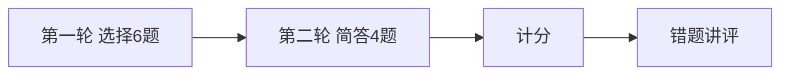

# Day 19 课堂知识竞赛

**形式**：小组抢答 + 个人闭卷  
**题量**：10 题（选择 6 + 简答 4）  
**建议时长**：20 分钟

---

## 第一部分：选择题（每题 10 分）

### 1

`chunk_text` 空字符串输入返回什么？

- A. 含一个空 TextChunk  
- B. 空列表 `[]`  
- C. 抛异常  
- D. 返回 None  

答案
B — 见 test_chunk_text_empty

### 2

`overlap` 合法取值必须满足？

- A. overlap <= chunk_size  
- B. 0 <= overlap < chunk_size  
- C. overlap 任意非负  
- D. overlap == 0  

答案
B

### 3

`KeywordRetriever` 的 score 含义是？

- A. TF-IDF 值  
- B. 命中 token 占查询 token 比例  
- C. 向量余弦相似度  
- D. BM25 分数  

答案
B

### 4

`query_context_provider` 与 `context_provider` 同时配置时，谁优先？

- A. context_provider  
- B. query_context_provider  
- C. 随机  
- D. 两者拼接  

答案
B

### 5

`/retrieve` 命令会调用 LLM 吗？

- A. 会  
- B. 不会  
- C. 仅 rag_qa 会  
- D. 仅 auto_route 时才会  

答案
B — 仅 retrieve_summary

### 6

`tests/day19/test_rag.py` 共有多少条测试？

- A. 10  
- B. 11  
- C. 12  
- D. 15  

答案
C

---

## 第二部分：简答题（每题 10 分）

### 7

写出 `retrieve_context` 默认的 `max_chars` 与 `top_k`。

答案
max_chars=800，top_k=3

### 8

列举 `RAGContextService` 任意两个工厂方法名。

答案
from_sample_docs、from_directory、from_documents（任意两个）

### 9

`build_variables` 将用户哪段文字作为检索 query 传入 `_resolve_rag_context`？

答案
match.user_text（用户原始输入整句）

### 10

Day 19 关键词检索的主要局限是什么？Day 20 如何改进？（各一句）

答案
局限：同义词/语义相近词难命中；Day 20：Embedding 向量余弦相似度检索

---

## 竞赛流程

---

## 评分与奖品（示例）

| 区间 | 奖励 |
|------|------|
| 90–100 | RAGContext 速查手册打印 + 复习卡片 |
| 70–89 | 电子版 Day 18 对照表 |
| 60–69 | 补考 Day 18 复习卡片 |
| &lt;60 | 晚自习一对一 15 分钟 |

---

## 讲师讲评要点

- 第 4 题：混淆两个 provider，对照 `test_intent_router_static_context_fallback`  
- 第 5 题：混淆 `/retrieve` 与 `chat_turn`  
- 第 10 题：串联 Day 20 预习与 `13_深度扩展`  
