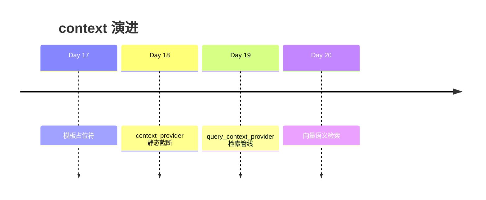
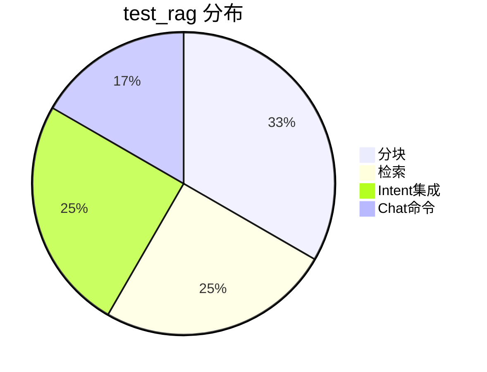

# Day 19 RAG 检索深度讲义

**适用**：下午集成环节深化、Sprint 3 架构组内部分享  
**需求**：ZL-NA-REQ-019

---

## 第一章 RAG 在 NexusAgent 中的定位

### 1.1 三代上下文演进



### 1.2 系统边界

RAG 层**不**负责：

- 意图判断（IntentRouter）  
- Prompt 渲染（apply_template）  
- LLM 调用（LLMClient）  

RAG 层**只**负责：给定 query，返回可塞进 `{context}` 的字符串。

---

## 第二章 分块工程

### 2.1 为何先分块？

| 原因 | 说明 |
|------|------|
| 上下文窗口有限 | 无法整篇说明书塞入 Prompt |
| 检索粒度 | 块越小越精准，越大越完整 |
| 引用溯源 | chunk_id、source 支持审计 |

### 2.2 段落优先策略

先 `_PARA_SPLIT` 再合并，尊重文档结构。列表、条款等若用纯固定窗口，可能在条目中间切断。

### 2.3 overlap 数学

设块长 `C`，重叠 `O`，步长 `S = C - O`。覆盖长度 `L` 的文本，滑动子块数近似：

\[
\left\lceil \frac{L - O}{S} \right\rceil \quad (L > C)
\]

**工程建议**：`O` 取 `C` 的 15%–25%。

### 2.4 多文档

`chunk_documents` 连续 `extend`，`index` 全局递增，`source` 区分文件 —— `test_chunk_documents_from_reader` 验证。

---

## 第三章 关键词检索

### 3.1 设计约束

- 零外部 API  
- 确定性（同输入同输出）  
- 可解释（matched_tokens）  

### 3.2 Token 策略

```python
_TOKEN_PATTERN = re.compile(r"[\u4e00-\u9fff]+|[a-zA-Z0-9]+")
```

中文 bigram：在整词匹配基础上，增加二字切片，缓解无分词器问题。

### 3.3 打分与排序

主键 `-score`，次键 `-len(matched_tokens)`，三键 `chunk.index` —— 保证稳定、可复现。

### 3.4 与 BM25 对比（概念）

| 特性 | 本实现 | BM25 |
|------|--------|------|
| 词频 | 二元命中 | 饱和 TF |
| 文档频率 | 无 | IDF 降权 |
| 复杂度 | O(块数×词数) | 略高 |
| 教学价值 | 透明 | 工业常用 |

Day 25+ 可引入 BM25 作为关键词一路。

---

## 第四章 RAGContextService

### 4.1 门面模式

对外隐藏 chunker + retriever 细节：

```python
service = RAGContextService.from_sample_docs()
context = service.retrieve_context(query)
```

### 4.2 格式化契约

```
[片段{i}·{source}·{score:.0%}]
{body}
```

运营可用 score 与 source 验收；模型解析自然语言正文。

### 4.3 长度治理

双层控制：

1. `top_k` 限制块数  
2. `max_chars` 限制总字符  

防止 Prompt 爆炸 —— `test_retrieve_context_respects_max_chars`。

### 4.4 retrieve_summary

与 `retrieve_context` 分离：运维调试不污染 Prompt 格式。

---

## 第五章 与 IntentRouter 集成

### 5.1 注入点

```python
IntentRouter(query_context_provider=service.retrieve_context)
```

`retrieve_context` 签名 `(query, *, top_k, max_chars, separator)` 与 `QueryContextProvider` 兼容（额外参数有默认值）。

### 5.2 user_text 作 query 的利弊

| 利 | 弊 |
|----|-----|
| 零额外抽取逻辑 | 「请帮我」等噪音进检索 |
| 保留用户原意 | 长句可能稀释关键词 |

**演进**：Day 22 Query Rewriting；今日朴素实现。

### 5.3 向后兼容

`test_intent_router_static_context_fallback` 保证仅 `context_provider` 时行为与 Day 18 一致。

---

## 第六章 ChatAssistant 运维面

### 6.1 双通道

| 通道 | API | 用户 |
|------|-----|------|
| 自动 | query_context_provider | 终端用户 |
| 手动 | /retrieve | 运营、测试 |

### 6.2 routed_rag_demo 脚本解读

顺序设计意图：

1. `/retrieve` — 孤立验证检索  
2. `chat_turn` — 端到端  
3. `/route` — 证明意图可切换出 rag_qa  

---

## 第七章 测试即规格

12 条测试覆盖：



新增功能应先写失败测试，再实现 —— Sprint 3 纪律。

---

## 第八章 生产 checklist

1. [ ] `sample_docs` 或生产目录文档版本正确  
2. [ ] chunk_size/overlap 经抽测  
3. [ ] 高频 20 query `/retrieve` 命中合理  
4. [ ] `max_chars` 与模型 context window 匹配  
5. [ ] CI `test_rag.py` 绿  

---

## 第九章 Day 20 衔接

保留：

- `TextChunk`、`DocumentIndex` 结构  
- `retrieve_context` 拼接逻辑  
- `query_context_provider` 注入点  

替换：

- `KeywordRetriever` → `EmbeddingRetriever`  

---

## 第十章 思考题

1. 若块内含表格，字符切分会有什么问题？  
2. 检索结果重复段落（overlap 导致）如何 dedupe？  
3. 金融场景下，是否应对「收益率」类块加权？  

（无标准答案，供 Sprint 4 讨论）
