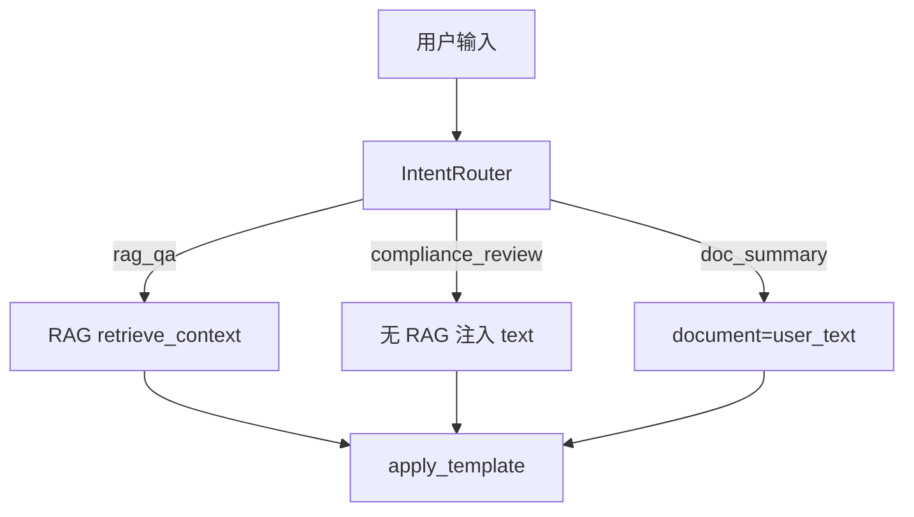

# Day 19 RAG 检索企业实践

**编制**：赵岩、陈默、周航  
**场景**：智链科技客服、合规、运维

---

## 1. 知识库治理

### 1.1 文档准入

| 检查项 | 标准 |
|--------|------|
| 格式 | 本期 txt；清洗后 `cleaned` 无乱码 |
| 时效 | 说明书版本号与文件名一致 |
| 敏感 | 无真实客户 PII |

### 1.2 目录结构建议

```
knowledge/
  product/          # 产品说明
  compliance/       # 合规条文
  faq/              # 高频问答原文
```

`RAGContextService.from_directory(Path("knowledge/product"))` 分库加载，降低跨产品噪音。

---

## 2. 分块参数选型

### 2.1 智链默认 (200, 40)

基于 `raw_notice.txt` 篇幅与内测抽测：

| 指标 | (120,20) | (200,40) | (300,60) |
|------|----------|----------|----------|
| 块数 | 多 | 中 | 少 |
| 检索精度 | 高 | 中 | 低 |
| context 连贯性 | 低 | 中 | 高 |

**结论**：客服场景默认 (200, 40)，合同类可增大 chunk_size。

### 2.2 变更流程

1. 修改参数 → 2. 跑 `chunk_demos` → 3. 跑 20 条 `/retrieve` → 4. 产品签字 → 5. 合并

---

## 3. 检索质量验收

### 3.1 黄金查询集

赵岩维护 `golden_queries.yaml`（规划）：

```yaml
- query: 年化收益率是多少
  must_contain: ["收益", "8%"]
- query: 投资有风险吗
  must_contain: ["风险"]
- query: 客服电话
  must_contain: ["400"]
```

自动化：循环 `retrieve_context`，断言子串。

### 3.2 零命中处理

产品话术：「当前知识库未找到相关资料，建议联系人工客服 400-xxx。」

**禁止**：零命中时编造收益率数字。

---

## 4. 与意图路由协作



**林晓教训**：合规审阅不应靠 RAG 找材料，应走 `compliance_review` 模板 + 用户粘贴原文。

---

## 5. 运维 Runbook 摘要

### 5.1 日常巡检

```bash
export PYTHONPATH=src
python3 src/day19/retriever_demos.py
python3 -m pytest tests/day19/test_rag.py -q
```

### 5.2 故障：大面积零命中

| 步骤 | 动作 |
|------|------|
| 1 | 检查知识库目录挂载 |
| 2 | `service.index.chunk_count` 是否 > 0 |
| 3 | 抽查 `read_documents` 输出 |
| 4 | 回滚最近 chunk 参数变更 |

### 5.3 故障：context 超长

调低 `max_chars` 或 `top_k`；检查是否误设 `top_k=20`。

---

## 6. 安全与合规

- 检索结果仅来自授权知识库，不爬外网  
- 日志中 `context` 脱敏（手机号中间四位）— Sprint 4  
- 审计保留 `chunk.source` 与 `chunk_id`  

---

## 7. 监控指标（规划）

| 指标 | 说明 |
|------|------|
| retrieve_hit_rate | 有命中查询占比 |
| avg_score_top1 | 首位得分均值 |
| context_chars_p95 | context 长度 P95 |
| rag_qa_ratio | rag_qa 意图占比 |

周航：Prometheus 埋点接在 `retrieve_context` 出口。

---

## 8. A/B 实验框架

| 组 | 检索器 | 目的 |
|----|--------|------|
| A | KeywordRetriever | 基线 |
| B | EmbeddingRetriever | Day 20 |
| C | 混合 | Day 25 |

`DocumentIndex.retriever` 可注入，无需改 Chat 层。

---

## 9. 团队分工（智链）

| 角色 | 职责 |
|------|------|
| 赵岩 | 黄金查询集、验收标准 |
| 陈默 | 管线架构、接口稳定 |
| 周航 | CI、监控、Runbook |
| 林晓 | 演示脚本、作业、文档反馈 |

---

## 10. Day 20 企业准备

1. 选定 Embedding 模型（API vs 本地）  
2. 评估离线 embed 全库耗时  
3. 准备同义词黄金对（回报率 ↔ 收益率）  

---

## 附录：内测反馈摘录

> 「`/retrieve` 太好用了，运营自己能查为什么答错。」—— 小张  
> 「希望明天向量检索能懂『回报率』。」—— 林晓  
> 「先别追求花哨，12 条测试绿了再上线。」—— 周航  
