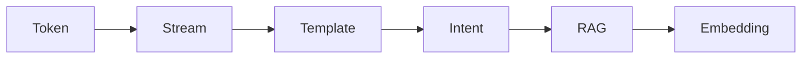
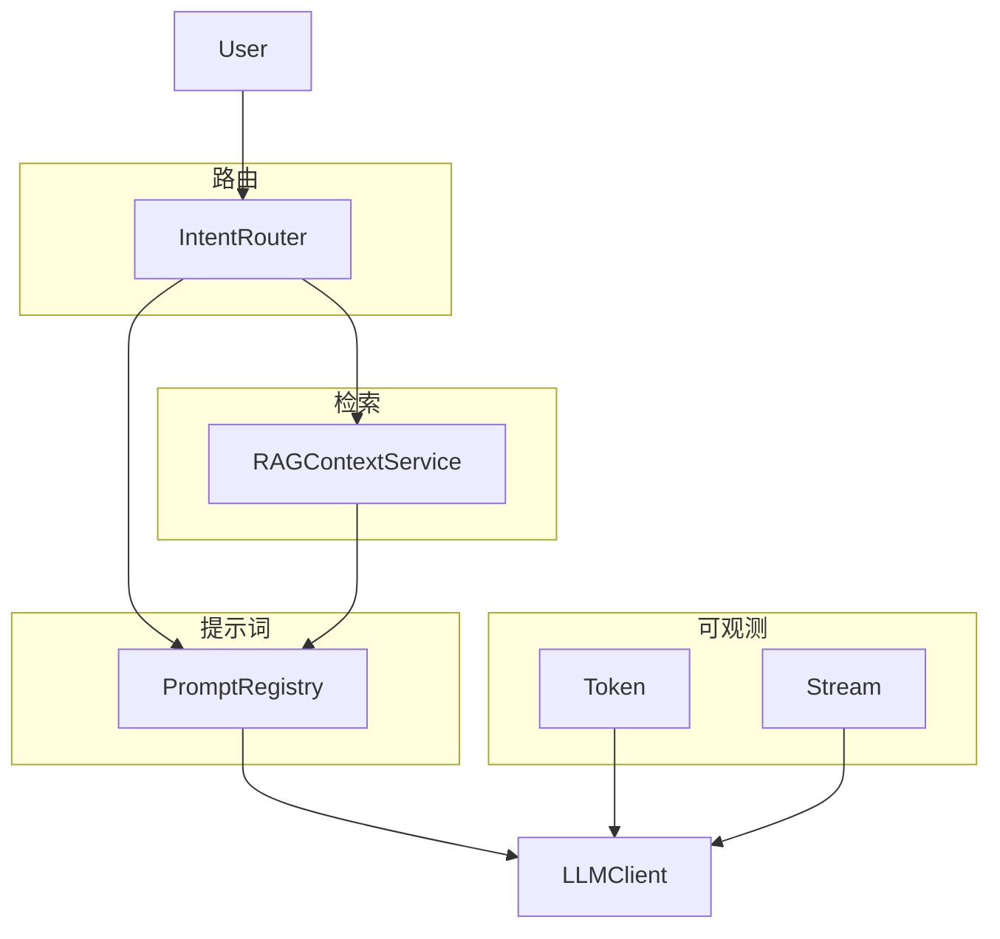

# Sprint 3 阶段回顾（Day 15–19）

**日期锚点**：2026-07-24（Day 19 完成日）  
**范围**：Phase 2 Sprint 3 前五日

---

## 1. Sprint 3 目标回顾

> 提升 NexusAgent **可观测性**与**对话体验**，为 RAG 与 Agent 工具调用铺路。

| 维度 | 起点 (Day 14) | 当前 (Day 19) |
|------|---------------|---------------|
| 输出 | 一次性完整回复 | 流式 + Token 计数 |
| Prompt | 硬编码字符串 | 模板库 + 意图路由 |
| 知识 | 无 | 关键词 RAG 检索 |
| 调试 | 有限 | /route、/retrieve、/template |

---

## 2. 五日交付矩阵

| Day | 主题 | 核心模块 | 测试 |
|-----|------|----------|------|
| 15 | Token 计数 | usage 统计 | test_tokens |
| 16 | 流式输出 | stream API | test_stream |
| 17 | Prompt 模板 | PromptRegistry | test_prompts |
| 18 | 意图分类 | IntentRouter | test_intent (12) |
| 19 | RAG 检索 | RAGContextService | test_rag (12) |



---

## 3. 架构演进图



---

## 4. 林晓五日学习曲线

| Day | 难点 | 突破 |
|-----|------|------|
| 15 | prompt/completion 区分 | 画 token 流向图 |
| 16 | 流式拼接 | mock stream 脚本 |
| 17 | required_vars | apply_template 走查 |
| 18 | 同分优先级 | INTENT_PRIORITY 表 |
| 19 | query vs 静态 provider | /retrieve 三板斧 |

---

## 5. 技术债与已知局限

| 项 | 状态 | 计划 |
|----|------|------|
| 关键词检索同义词 | 局限 | Day 20 Embedding |
| user_text 整句检索噪音 | 已知 | Day 22 query 改写 |
| 仅 txt 知识库 | 局限 | Sprint 4 解析 |
| 意图规则引擎 | MVP | Day 22+ LLM 分类 |

---

## 6. 质量门禁

```bash
# Sprint 3 前五日测试一键（示例）
export PYTHONPATH=src
pytest tests/day15 tests/day16 tests/day17 tests/day18 tests/day19 -q
```

周航目标：五目录 **连续绿** 进 main。

---

## 7. 团队协作亮点

- **陈默**：每日模块边界清晰，接口可替换  
- **赵岩**：黄金场景驱动课件案例  
- **周航**：每日 12 条测试纪律  
- **林晓**：学员视角反馈融入 FAQ  

---

## 8. Sprint 3 剩余预览（Day 20–24）

| Day | 主题（规划） |
|-----|-------------|
| 20 | Embedding / 向量相似度 |
| 21 | 向量索引持久化 |
| 22 | LLM 意图分类 |
| 23 | Agent 工具雏形 |
| 24 | Sprint 3 复盘与演示 |

---

## 9. 自评问卷（学员）

1. 能否不看代码画出 Day 19 RAG 管线？  
2. 能否解释 Intent 与 RAG 两层分工？  
3. 能否独立跑通 `routed_rag_demo.py`？  

三题「是」→ 可进入 Day 20。

---

## 10. 陈默 Sprint 3 中段总结

> 「前五日我们把『会说话』拆成：算得清 token、流式体验、模板专业、意图对路、资料可查。后五日让资料查得更准、手伸得更远（工具）。别松劲。」

---

## 附录：课件与代码对照

| 课件目录 | 代码目录 |
|----------|----------|
| course/day15 | src/day15 |
| course/day16 | src/day16 |
| course/day17 | src/day17 |
| course/day18 | src/day18 |
| course/day19 | src/rag + src/day19 |

Day 19 起 RAG 进入 `src/rag` 包，为后续多日共用。
