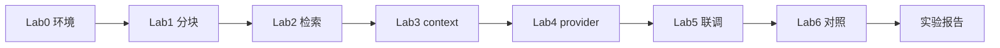

# Day 19 实操 Lab 手册

**实验环境**：`nexus-agent-platform`  
**预计时长**：90 分钟  
**角色**：林晓（学员）— 智链科技实训

---

## Lab 0：环境准备（10 分钟）

```bash
cd /workspace/nexus-agent-platform
export PYTHONPATH=src
export NEXUS_LLM_MOCK=1

python3 --version   # 建议 3.11+
python3 -m pytest tests/day19/test_rag.py -v
```

**验收**：12 passed。

---

## Lab 1：文档分块观察（15 分钟）

### 步骤

1. 打开 `src/day19/chunk_demos.py`  
2. 将 `chunk_size=120` 改为 `200`，`overlap=20` 改为 `40`  
3. 运行：

```bash
python3 src/day19/chunk_demos.py
```

### 记录表

| chunk_size | overlap | 块数 | 第一块 preview |
|------------|---------|------|----------------|
| 120 | 20 | | |
| 200 | 40 | | |

### 思考题

为何 `overlap` 小于 `chunk_size`？若相等会怎样？

<details><summary>提示</summary>见 test_chunk_text_invalid_overlap</details>

---

## Lab 2：关键词检索（15 分钟）

```bash
python3 src/day19/retriever_demos.py
```

### 任务

在 `retriever_demos.py` 的 `QUERIES` 末尾添加：`"林晓的学号是多少"`（应零命中或低分）

### 记录表

| 查询 | top1 score | 命中 token | source |
|------|------------|------------|--------|
| 年化收益率是多少 | | | |
| 投资有风险吗 | | | |
| 客服电话 | | | |
| 内部资料外传 | | | |

---

## Lab 3：context 拼接（15 分钟）

```bash
python3 src/day19/rag_context_demo.py
```

### 任务

修改 `QUERY` 为你的姓名 + 「理财产品风险」，观察 context 是否含「风险」字样。

### 扩展

在 Python REPL 中：

```python
from rag import RAGContextService
s = RAGContextService.from_sample_docs()
len(s.retrieve_context("测试", max_chars=100))
len(s.retrieve_context("测试", max_chars=500))
```

记录长度差异。

---

## Lab 4：query_context_provider 实验（15 分钟）

创建 `lab19_query_provider.py`（可放 `/tmp`）：

```python
import sys
from pathlib import Path
SRC = Path("src").resolve()
sys.path.insert(0, str(SRC))

from prompts import IntentRouter
from rag import RAGContextService

service = RAGContextService.from_sample_docs()
router = IntentRouter(query_context_provider=service.retrieve_context)

match = router.classify("请根据文档说明年化收益率")
vars_ = router.build_variables(match)
print(match.summary())
print("context 前 200 字:", vars_["context"][:200])
```

**验收**：`context` 含 `[片段` 与「收益」相关字样。

---

## Lab 5：/retrieve 与 auto_route 对比（20 分钟）

```bash
NEXUS_LLM_MOCK=1 python3 src/day19/routed_rag_demo.py
```

### 任务

阅读 `routed_rag_demo.py` 的 `script` 列表，解释为何先 `/retrieve` 再 `chat_turn`。

### 自建对比脚本

创建 `lab19_retrieve_vs_route.py`：

```python
# 同一 query「年化收益率」
# 1. assistant.handle_command("/retrieve 年化收益率")
# 2. assistant.handle_command("/route 根据文档查年化收益率")
# 打印两次输出，说明差异
```

| 命令 | 输出类型 | 是否切换模板 | 是否调 LLM |
|------|----------|--------------|------------|
| /retrieve | | | |
| /route | | | |

---

## Lab 6：与 Day 18 对照实验（10 分钟）

```python
from prompts import IntentRouter

static = IntentRouter(context_provider=lambda: "静态截断400字")
dynamic = IntentRouter(query_context_provider=service.retrieve_context)

q = "客服电话多少"
# 对两者分别 build_variables(classify(q)) 比较 context
```

**结论一句**：生产环境应使用哪一种？为什么？

---

## Lab 7：挑战 — 黄金查询（选做，+10 分）

编写 `lab19_golden.py`：

- 5 条查询 + `assert` 子串在 `retrieve_context` 中  
- 至少 1 条 `pytest.raises` 或 assert 零命中文案  

```bash
python3 lab19_golden.py
```

---

## 实验报告模板

```markdown
# Day 19 Lab 报告 - 姓名

## 环境
- Python 版本：
- pytest 结果：12 passed / 失败说明

## Lab 1-3 记录表
（粘贴）

## Lab 4 context 截图或前 200 字

## Lab 5 /retrieve vs /route 结论

## 今日收获（3 条）

## Day 20 预习问题（1 条）
```

---

## 故障排除

| 现象 | 处理 |
|------|------|
| 导入 rag 失败 | `export PYTHONPATH=src` |
| 零命中 | 换 QUERY 词，查 sample_docs |
| routed_rag 无输出 | 确认 NEXUS_LLM_MOCK=1 |

---

## 讲师验收标准

- [ ] Lab 0–5 完成  
- [ ] 能口述 RAG 管线四步：读文档 → 分块 → 检索 → 拼接  
- [ ] 能演示 `/retrieve` 与 `auto_route` 联调  
- [ ] 实验报告提交学习平台  



---

## 延伸阅读

- `17_RAGContext速查手册.md`  
- `25_rag精读.md`  
- Day 20：Embedding 向量检索课件
