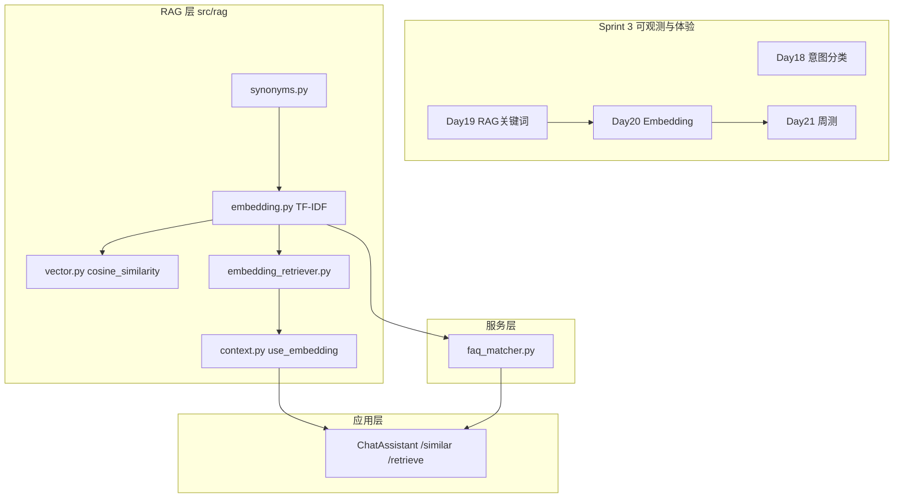

# Day 20 旁白解读：从字面匹配到语义近邻

> **前置要求**：完成 Day 19 `KeywordRetriever`、`RAGContextService`、`/retrieve` 与 `query_context_provider`

---

## 旁白

2026 年 7 月 25 日，周六。智链科技 Sprint 3 第六日晨会，赵岩投屏内测反馈：

> 「用户问『投资回报率怎么算』，`/retrieve` 显示**未命中任何片段**。但文档里明明写着『年化收益率可达 8%』。」

林晓举手：「Day 19 的 `KeywordRetriever` 按字面 token 重叠打分，『回报率』和『收益率』对不上。」

陈默在白板上把 Day 19 的检索框接长：

```
用户输入
    ↓
IntentRouter.classify
    ↓
rag_qa → query_context_provider(query)
    ↓
RAGContextService.retrieve_context
    ↓
doc_reader → chunk_text → EmbeddingRetriever.search   ← 今日升级
    ↓
TfidfEmbeddingModel.fit → embed → cosine_similarity
    ↓
拼接 context → apply_template → LLM
```

> 「今天建 Embedding 最小闭环：**向量化、余弦相似度、可替换检索器**。MVP 用 TF-IDF 离线向量，不引外网 API。同义词表 `synonyms.py` 辅助召回。」

周航补充：

> 「`tests/day20/test_embedding.py` 共 12 条用例：余弦相似度、TF-IDF fit/embed、同义词检索、关键词 vs 向量对比、`use_embedding=True`、`SimilarQuestionMatcher` 与 `/similar` 命令。全部离线。」

下午 Lab，林晓运行 `vector_search_demos.py`：

```
查询: 投资回报率是多少

[KeywordRetriever]
  （未命中）

[EmbeddingRetriever]
  sim=42% source=raw_notice.txt 智链科技理财产品说明书。本产品年化收益率可达8%...
```

她又跑 `faq_matcher_demo.py`，输入「怎么打客服？」匹配到标准 FAQ「如何联系客服？」。

傍晚 `routed_embedding_demo.py` 跑通：终端依次出现 `/similar` 摘要、`/retrieve` 向量命中、`auto_route` 对话中 `context` 含 `sim=42%` 标注。

站会末尾预告 Day 21：

> 「明天 Sprint 3 周测，把意图路由、RAG、FAQ 匹配和工具调用串起来验收。」

---

## 今日在架构中的位置



---

## 林晓的学习建议

1. 先读 `src/rag/vector.py`，手算二维向量余弦相似度  
2. 读 `embedding.py` 的 `fit` 与 `embed`，理解 TF × IDF  
3. 运行 `embedding_demos.py`，对照 `PAIRS` 四条相似度分数  
4. 读 `synonyms.py` 的 `TOKEN_SYNONYMS` 与 `PHRASE_GROUPS`  
5. 运行 `vector_search_demos.py`，记录关键词 vs 向量差异  
6. 阅读 `tests/day20/test_embedding.py` 全部 12 条  
7. `NEXUS_LLM_MOCK=1 routed_embedding_demo.py`，对比 `/similar` 与 `/retrieve`

---

## 今日关键词

| 术语 | 含义 |
|------|------|
| EmbeddingVector | 文本的向量表示，含 `values` 与 `dimension` |
| TfidfEmbeddingModel | 离线 TF-IDF 向量化模型 |
| EmbeddingClient | Embedding 门面，支持 `fit_corpus` / `embed_batch` |
| cosine_similarity | 余弦相似度，取值约 [-1, 1] |
| EmbeddingRetriever | 基于向量相似度的检索器 |
| TOKEN_SYNONYMS | 词级同义词扩展表 |
| SimilarQuestionMatcher | FAQ 相似问题匹配服务 |
| /similar | Chat 命令，预览 FAQ 匹配 |
| use_embedding | `RAGContextService` 工厂参数，切换检索器 |

---

## 与昨日衔接

Day 19 回答「**从知识库找哪些片段**」用关键词重叠；Day 20 回答「**语义相近也能命中**」用向量余弦相似度。检索器可替换，`RAGContextService` 调用方无感，FAQ 匹配复用同一套 Embedding 基础设施。
