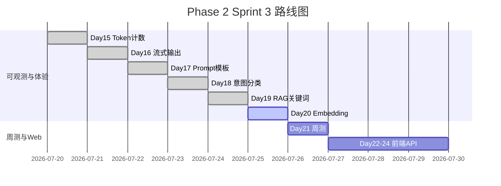

# Day 20 企业背景与今日任务

**日期**：2026 年 7 月 25 日  
**Sprint**：Sprint 3 第六日 — Embedding 与向量相似度检索

## 晨会纪要

### 赵岩（产品）

> 「Day 19 关键词检索在『投资回报率』类同义表达上失准。用户问法和文档措辞不一致时，RAG 注入空 context，助手只能瞎编。今日必须引入**语义相似度检索**，并上线 FAQ 智能匹配减少重复问答。」

### 陈默（架构）

> 「新增 `vector.py`、`embedding.py`、`synonyms.py`、`embedding_retriever.py`；`RAGContextService.from_sample_docs(use_embedding=True)` 切换检索器；`SimilarQuestionMatcher` 服务 + `/similar` 命令。接口与 Day 19 保持一致。」

### 周航（DevOps）

> 「`tests/day20/test_embedding.py` 12 条进 CI，TF-IDF 完全离线。演示脚本 `day20/*` 不连外网。与 Day 19 测试并行，互不影响。」

### 林晓（学员代表）

> 「TF-IDF 和 OpenAI Embedding 差多少？生产能用吗？」

陈默：「今日 TF-IDF 是**教学 MVP**，演示余弦相似度与同义词召回；Day 25+ 换密集向量 API，接口 `EmbeddingClient` 不变。」

## 任务分配

| ID | 任务 | 负责人 | 优先级 |
|----|------|--------|--------|
| ZL-NA-REQ-020 | 实现 Embedding 向量检索管线 | 全员 | P0 |
| ZL-NA-401 | `cosine_similarity` + 向量运算 | 林晓 | P0 |
| ZL-NA-402 | `TfidfEmbeddingModel` + `EmbeddingClient` | 林晓 | P0 |
| ZL-NA-403 | `synonyms.py` 同义词扩展 | 助教 | P0 |
| ZL-NA-404 | `EmbeddingRetriever` + `use_embedding` | 助教 | P0 |
| ZL-NA-405 | `SimilarQuestionMatcher` + `/similar` | 助教 | P0 |
| ZL-NA-406 | `day20/*` 演示脚本 | 助教 | P1 |
| ZL-NA-407 | `tests/day20/test_embedding.py` 全绿 | 周航 | P0 |

## Definition of Done

- [ ] `python3 src/day20/embedding_demos.py` 输出四条 PAIRS 相似度
- [ ] `python3 src/day20/vector_search_demos.py` 向量命中「投资回报率」
- [ ] `python3 src/day20/faq_matcher_demo.py` 六条问题有匹配摘要
- [ ] `NEXUS_LLM_MOCK=1 python3 src/day20/routed_embedding_demo.py` 联调通过
- [ ] `pytest tests/day20/test_embedding.py -v` 12 passed
- [ ] 能口述：余弦相似度公式、TF-IDF 计算步骤、同义词扩展作用
- [ ] 能解释：`use_embedding=True` 与 `KeywordRetriever` 的差异
- [ ] 能说明：`/similar` 与 `/retrieve` 的行为差异

## 今日节奏

| 时段 | 内容 |
|------|------|
| 09:00-09:30 | Embedding 概论、Day 19 同义词痛点回顾 |
| 09:30-10:30 | `vector.py` 与余弦相似度手算练习 |
| 10:45-12:00 | `TfidfEmbeddingModel` 与 `synonyms.py` 走读 |
| 14:00-15:30 | `EmbeddingRetriever` 与 `use_embedding` 集成 |
| 15:45-17:00 | `SimilarQuestionMatcher`、`/similar` 与联调测试讲评 |

## 环境准备

```bash
cd nexus-agent-platform
export PYTHONPATH=src
export NEXUS_LLM_MOCK=1

python3 src/day20/embedding_demos.py
python3 src/day20/vector_search_demos.py
python3 src/day20/faq_matcher_demo.py
python3 src/day20/routed_embedding_demo.py
python3 -m pytest tests/day20/test_embedding.py -v
```

## Sprint 3 全景（Day 15–24 预览）



## 与 Day 19 的差异

| 维度 | Day 19 关键词检索 | Day 20 Embedding 检索 |
|------|------------------|----------------------|
| 关注点 | 字面 token 重叠 | 向量余弦相似度 |
| 核心模块 | `retriever.py` | `embedding.py` + `embedding_retriever.py` |
| 打分含义 | 命中比例 | sim ∈ [-1, 1]，展示为百分比 |
| 同义词 | 弱 | 强（向量 + synonyms 扩展） |
| 新命令 | `/retrieve` | `/similar`（FAQ 匹配） |
| 工厂参数 | 默认 KeywordRetriever | `use_embedding=True` |
