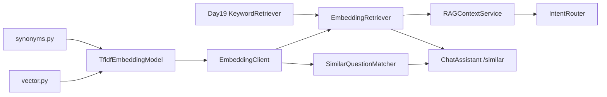

# ZL-NA-REQ-020 需求文档

**需求编号**：ZL-NA-REQ-020  
**需求名称**：Embedding 与向量相似度检索  
**优先级**：P0  
**Sprint**：Sprint 3 第六日  
**状态**：已交付

---

## 1. 背景

智链科技 NexusAgent 在 Day 19 实现关键词 RAG 后，「投资回报率」等同义表达无法命中「年化收益率」文档片段，FAQ 重复问答成本高。产品要求：引入 **Embedding 向量相似度检索** 提升语义召回，并落地 **相似问题匹配** 服务。

## 2. 目标用户

- 终端用户（同义问法也能获得相关 context 与 FAQ 答案）
- 知识库运营（观察 sim 分数、调整同义词表与阈值）
- 后端开发（替换 Embedding 模型、接入向量库）
- 测试与 CI（确定性 TF-IDF、可重复断言）

## 3. 功能需求

### FR-001 向量运算 cosine_similarity

| 项 | 描述 |
|----|------|
| 模块 | `src/rag/vector.py` |
| 函数 | `dot_product(a, b)` — 向量点积，维度不一致抛 `ValueError` |
| 函数 | `vector_norm(v)` — L2 范数 |
| 函数 | `cosine_similarity(a, b)` — 余弦相似度，零向量返回 0.0 |
| 函数 | `normalize_vector(v)` — 单位化（展示用） |
| 约束 | 纯标准库 `math`，无第三方依赖 |

### FR-002 TF-IDF Embedding 模型

| 项 | 描述 |
|----|------|
| 模块 | `src/rag/embedding.py` |
| 类 | `EmbeddingVector`（text、values、dimension、`similarity_to`） |
| 类 | `TfidfEmbeddingModel`（`fit`、`embed`、`similarity`） |
| 类 | `EmbeddingClient`（`fit_corpus`、`embed_batch` 门面） |
| 算法 | 语料 fit 建词表与 IDF；embed 计算 TF × IDF 稀疏向量 |
| 分词 | 调用 `synonyms.tokenize` + `expand_tokens` |

### FR-003 同义词扩展 synonyms

| 项 | 描述 |
|----|------|
| 模块 | `src/rag/synonyms.py` |
| 常量 | `TOKEN_SYNONYMS` — 词级同义词映射 |
| 常量 | `PHRASE_GROUPS` — 短语级同义组 |
| 函数 | `tokenize(text)` — 中英文 token + 中文 bigram |
| 函数 | `expand_tokens(tokens, text)` — 同义词与短语组扩展 |

### FR-004 EmbeddingRetriever 向量检索器

| 项 | 描述 |
|----|------|
| 模块 | `src/rag/embedding_retriever.py` |
| 类 | `IndexedChunk`（chunk + vector） |
| 类 | `EmbeddingRetriever` |
| 方法 | `index(chunks)` — fit 语料并预计算块向量 |
| 方法 | `search(query, *, top_k=3)` — 余弦相似度排序，低于 `min_score` 过滤 |
| 接口 | 与 `KeywordRetriever` 一致，返回 `RetrievalResult` |
| 可解释性 | `_overlap_terms` 提取查询与文档共现词 |

### FR-005 RAGContextService use_embedding 集成

| 项 | 描述 |
|----|------|
| 模块 | `src/rag/context.py` |
| 参数 | `from_documents(..., use_embedding=False)` |
| 行为 | `use_embedding=True` 时注入 `EmbeddingRetriever` |
| 输出 | header 格式 `sim={score:.0%}`（原 score 字段复用） |
| 类型 | `Retriever = KeywordRetriever \| EmbeddingRetriever` |

### FR-006 FAQ 相似问题匹配与 /similar 命令

| 项 | 描述 |
|----|------|
| 模块 | `services/faq_matcher.py` |
| 类 | `FaqEntry`（question、answer、category） |
| 类 | `FaqMatch`（entry、score、user_question、`summary()`） |
| 类 | `SimilarQuestionMatcher`（`match`、`match_all`） |
| 阈值 | 默认 `threshold=0.32`，低于阈值返回 None |
| 模块 | `chat/cli_assistant.py` |
| 命令 | `/similar [用户问题]` — 调用 `faq_matcher.match`，不调 LLM |
| 未启用 | 返回「FAQ 匹配未启用。请传入 faq_matcher。」 |

### FR-007 演示脚本与单元测试

| 项 | 描述 |
|----|------|
| `embedding_demos.py` | PAIRS 四条余弦相似度演示 |
| `vector_search_demos.py` | 关键词 vs 向量检索对比 |
| `faq_matcher_demo.py` | 六条用户问题 FAQ 匹配 |
| `routed_embedding_demo.py` | `/similar` + `/retrieve` + `auto_route` 联调 |
| 文件 | `tests/day20/test_embedding.py` |
| 数量 | 12 条 |
| 覆盖 | 余弦相似度、TF-IDF、同义词检索、kw vs emb、use_embedding、FAQ、/similar、embedding RAG route |

## 4. 非功能需求

| 编号 | 要求 |
|------|------|
| NFR-001 | TF-IDF 零 LLM、零外网，单测秒级 |
| NFR-002 | `EmbeddingClient` 可注入，便于 Day 25+ 换 API 实现 |
| NFR-003 | 检索器接口与 Day 19 兼容，`DocumentIndex` 无感切换 |
| NFR-004 | FAQ 阈值可构造注入，便于 A/B |

## 5. 验收标准

```bash
export PYTHONPATH=src
python3 src/day20/embedding_demos.py
python3 src/day20/vector_search_demos.py
python3 src/day20/faq_matcher_demo.py
NEXUS_LLM_MOCK=1 python3 src/day20/routed_embedding_demo.py
python3 -m pytest tests/day20/test_embedding.py -v
```

全部通过，且 `test_embedding_retriever_finds_synonym_query` 验证同义词查询命中。

## 6. 范围外（后续迭代）

- Day 21：Sprint 3 周测 / 工具调用整合  
- Day 25+：密集向量 API、Chroma 向量库持久化  
- 混合检索（关键词 + 向量 RRF）  
- Reranker 重排序  

## 7. 依赖关系


