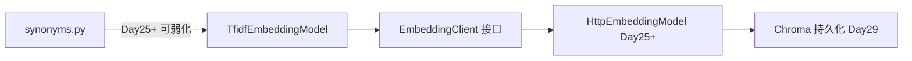

# ZL-NA-REQ-020 需求文档扩展

**关联**：`02_需求文档.md` FR-001 至 FR-007  
**读者**：架构评审、测试设计、Day 21 周测命题组

---

## 扩展 1：验收用例矩阵

| 用例 ID | 测试函数 | 验证点 |
|---------|----------|--------|
| AC-001 | `test_cosine_similarity_identical` | 同向量 sim = 1.0 |
| AC-002 | `test_cosine_similarity_orthogonal` | 正交向量 sim = 0.0 |
| AC-003 | `test_embedding_model_fit_and_embed` | fit 后 dimension > 0 |
| AC-004 | `test_embedding_similarity_synonym_pair` | 「投资回报率」与 NOTICE sim > 0.15 |
| AC-005 | `test_embedding_retriever_finds_synonym_query` | 检索命中含「收益」或「年化」 |
| AC-006 | `test_keyword_vs_embedding_synonym` | 向量比关键词更可能命中 |
| AC-007 | `test_rag_service_use_embedding` | retriever 类型为 EmbeddingRetriever |
| AC-008 | `test_faq_matcher_synonym_question` | 「投资回报率怎么算」匹配 product |
| AC-009 | `test_faq_matcher_risk_question` | 「有没有风险啊」category=risk |
| AC-010 | `test_faq_matcher_no_match` | 无关问题返回 None |
| AC-011 | `test_assistant_similar_command` | `/similar` 输出含「客服」 |
| AC-012 | `test_assistant_embedding_rag_route` | auto_route + embedding RAG 联调 |

---

## 扩展 2：同义词表维护规范

`TOKEN_SYNONYMS` 与 `PHRASE_GROUPS` 由**知识库运营**与**合规**联合维护：

| 字段 | 维护周期 | 负责人 |
|------|----------|--------|
| 金融产品术语 | 每 Sprint | 赵岩 |
| 合规禁传短语 | 合规变更时 | 法务对接 |
| 客服渠道用语 | 客服 SOP 更新时 | 运营 |

新增词条须附带**至少 2 条回归查询**，写入 `tests/day20/` 或周测题库。

---

## 扩展 3：阈值与参数默认值

| 参数 | 默认值 | 调参建议 |
|------|--------|----------|
| `EmbeddingRetriever.min_score` | 0.05 | 语料增大时可略升，减少噪声 |
| `SimilarQuestionMatcher.threshold` | 0.32 | TF-IDF 下 0.28–0.38 区间 A/B |
| `RAGContextService` top_k | 3 | 与 Day 19 一致 |
| `RAGContextService` max_chars | 800 | 与 Day 19 一致 |

---

## 扩展 4：与 Day 25 密集向量迁移路径

迁移 checklist：

1. 实现 `HttpEmbeddingModel.embed` 返回 `EmbeddingVector`  
2. `EmbeddingClient.__init__` 注入新模型  
3. `synonyms.py` 保留为可选后处理  
4. 回归 `tests/day20/test_embedding.py` 中不依赖具体维度的用例  

---

## 扩展 5：安全与合规

- FAQ `DEFAULT_FAQ` 答案不得含未公开收益率承诺  
- `/similar` 仅返回标准答案摘要，不自动调用 LLM 改写  
- 内部资料类 FAQ（category=compliance）匹配日志须脱敏  

---

## 扩展 6：Day 21 周测衔接

周测将覆盖：

- Day 18 `IntentRouter` + Day 19 `query_context_provider` + Day 20 `use_embedding`  
- `/route`、`/retrieve`、`/similar` 三命令行为  
- 工具调用雏形与多轮对话整合（见 ROADMAP Day 21）

建议学员今日完成 `08_作业` 全部必做题，作为周测预习。
