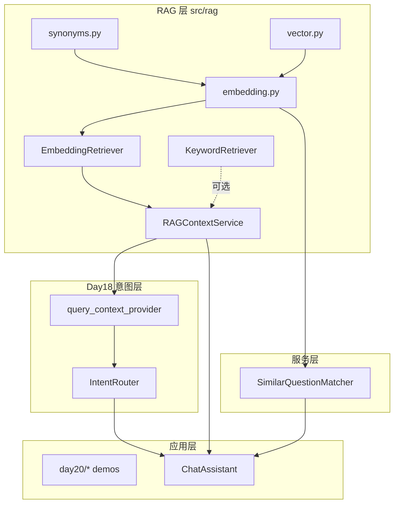
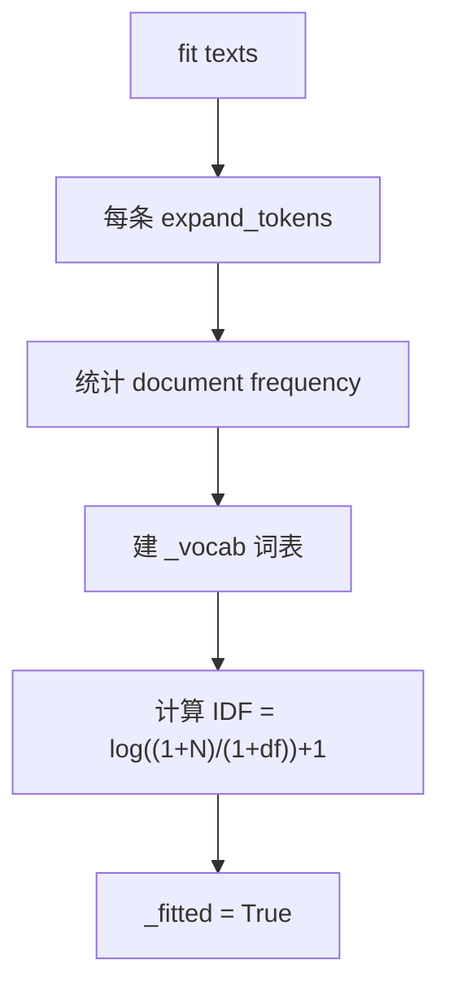
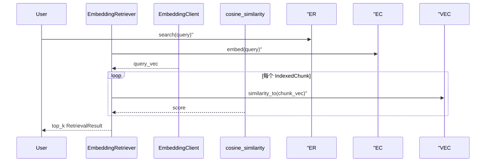
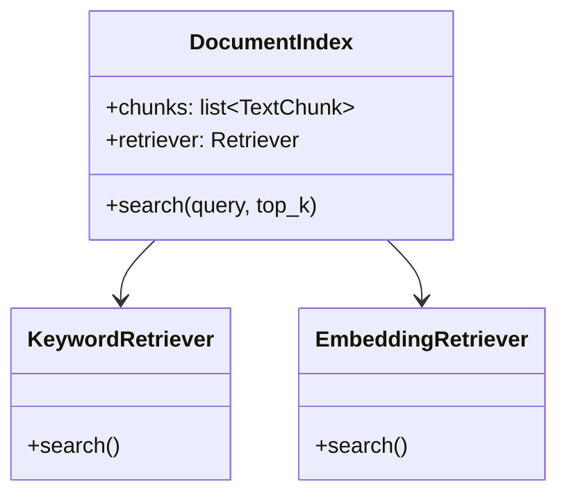
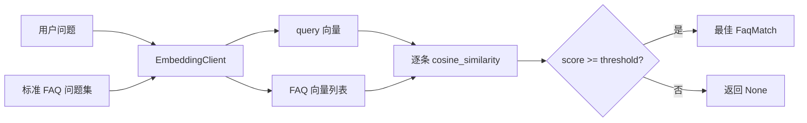

# Day 20 架构设计

**模块**：`src/rag/vector.py`、`embedding.py`、`synonyms.py`、`embedding_retriever.py` + `services/faq_matcher.py`  
**需求**：ZL-NA-REQ-020

---

## 1. 分层架构

## 2. 核心类与符号

| 符号 | 模块 | 职责 |
|------|------|------|
| `cosine_similarity` | vector.py | 余弦相似度纯函数 |
| `EmbeddingVector` | embedding.py | 文本向量 + `similarity_to` |
| `TfidfEmbeddingModel` | embedding.py | fit 语料、embed 单条 |
| `EmbeddingClient` | embedding.py | 门面，批量编码 |
| `TOKEN_SYNONYMS` | synonyms.py | 词级同义扩展 |
| `PHRASE_GROUPS` | synonyms.py | 短语级同义组 |
| `EmbeddingRetriever` | embedding_retriever.py | 向量索引与 search |
| `IndexedChunk` | embedding_retriever.py | 块 + 预计算向量 |
| `use_embedding` | context.py | 工厂开关 |
| `SimilarQuestionMatcher` | faq_matcher.py | FAQ 匹配 |
| `FaqEntry` / `FaqMatch` | faq_matcher.py | FAQ 数据与结果 |
| `/similar` | cli_assistant.py | FAQ 预览命令 |

## 3. TF-IDF fit 控制流

## 4. embed 与检索序列

## 5. 检索器可替换设计

`Retriever = KeywordRetriever | EmbeddingRetriever`，`RAGContextService` 不感知具体实现。

## 6. FAQ 匹配架构

## 7. 与 Day 19 的增量

| 组件 | Day 19 | Day 20 增量 |
|------|--------|-------------|
| 检索打分 | token 重叠比例 | 余弦相似度 |
| 索引构建 | 存 chunks | fit TF-IDF + 预计算向量 |
| context header | `score%` | `sim=score%` |
| Chat 命令 | `/retrieve` | + `/similar` |
| 服务层 | 仅 RAG | + FAQ 匹配 |

## 8. 设计原则

1. **接口稳定**：`search(query, top_k) -> list[RetrievalResult]` 不变  
2. **离线优先**：TF-IDF 无 API 依赖，CI 友好  
3. **可解释性**：保留 `matched_tokens`（共现词）  
4. **渐进增强**：`EmbeddingClient` 为 Day 25 API 换芯预留  
