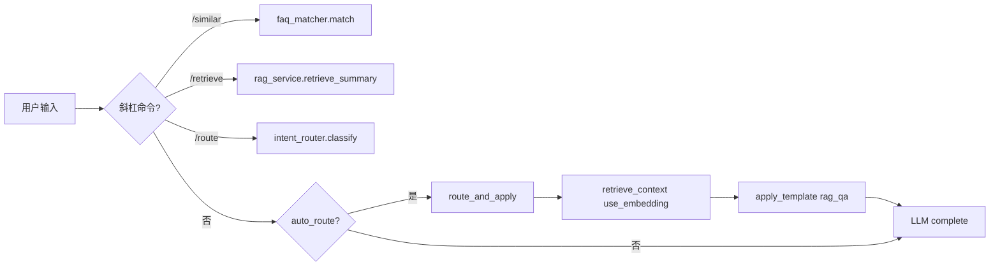
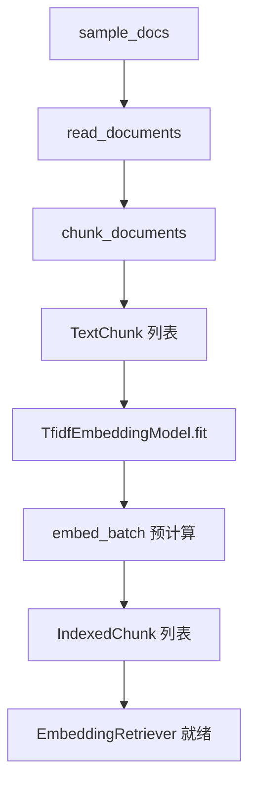
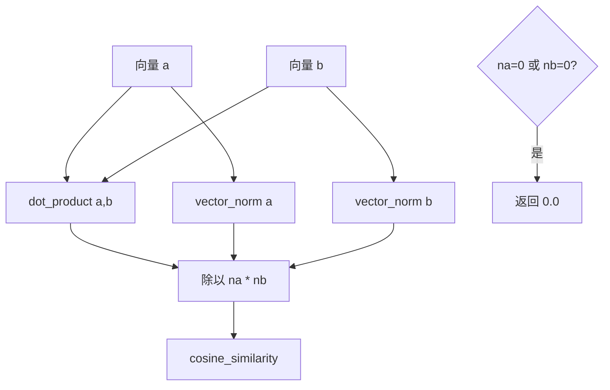
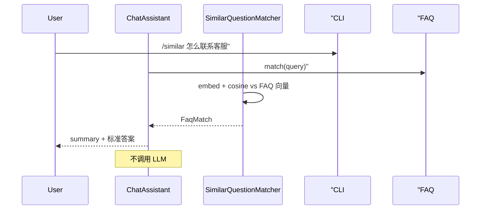
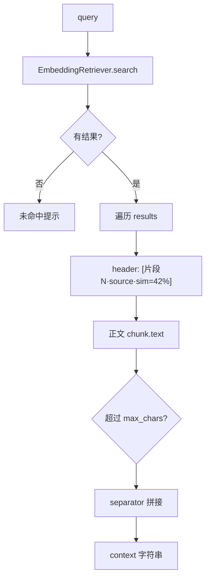
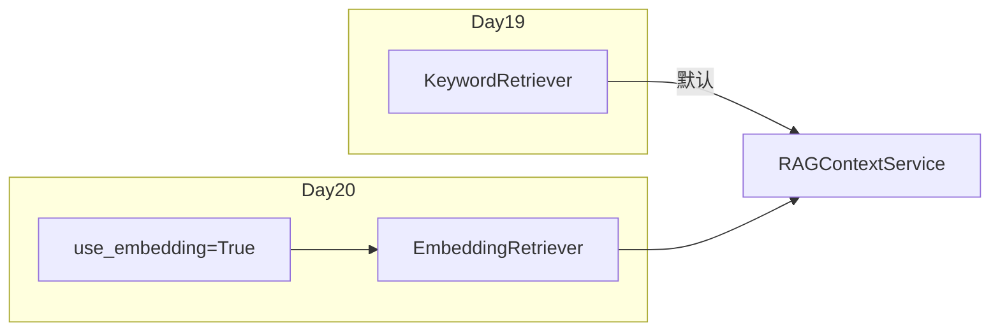

# Day 20 流程图与示意图

**主题**：Embedding 向量检索、FAQ 匹配与 RAG 全链路

---

## 1. 主流程（auto_route + Embedding RAG + FAQ）



## 2. Embedding 索引构建（离线）



## 3. 余弦相似度计算



公式：

\[
\text{sim}(A, B) = \frac{A \cdot B}{\|A\| \|B\|}
\]

## 4. expand_tokens 同义词扩展

```
查询: "投资回报率是多少"

tokenize → [投资回报率, 是多少, 投资, 资回, 回报, 报率, ...]

TOKEN_SYNONYMS["回报率"] → 收益, 投资回报, 年化收益
PHRASE_GROUPS 命中 → 年化收益率, 投资回报率, 收益率 ...

expand 后词表更丰富 → TF-IDF 向量与「年化收益」文档更接近
```

## 5. 关键词 vs 向量对比示意

| 查询 | KeywordRetriever | EmbeddingRetriever |
|------|------------------|-------------------|
| 年化收益率是多少 | 命中（字面重叠） | 命中（高 sim） |
| 投资回报率是多少 | 常未命中 | 命中（同义词+向量） |
| 怎么打客服 | 可能命中 | 命中 |
| 量子纠缠原理 | 未命中 | 未命中 |

## 6. /similar 命令流程



## 7. retrieve_context 与 sim 标注



## 8. Day 19 → Day 20 切换点



一行代码切换：`RAGContextService.from_sample_docs(use_embedding=True)`。
