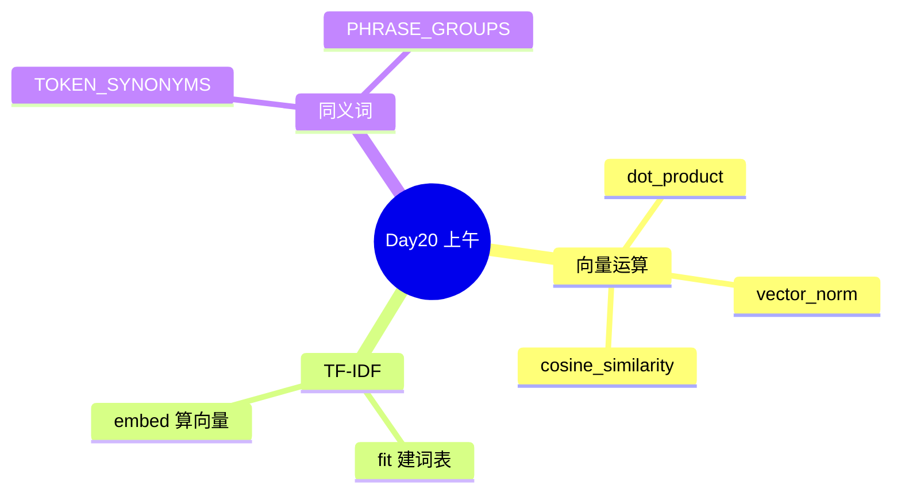

# Day 20 课堂笔记（上午）

**讲师**：陈默  
**记录**：林晓  
**时段**：09:00–12:00

---

## 09:00–09:30 | Embedding 概论与 Day 19 痛点

### 赵岩开场

- 内测数据：同义问法导致的**零命中**占 RAG 失败的 38%  
- 典型 case：「投资回报率」vs 文档「年化收益率」  
- 今日目标：向量相似度 + FAQ 去重

### 核心概念

| 概念 | 一句话 |
|------|--------|
| Embedding | 把文本变成数字向量 |
| 余弦相似度 | 看两个向量「方向」有多像 |
| TF-IDF | 今日用的离线向量化方法 |
| 同义词扩展 | 弥补 TF-IDF 稀疏性的工程手段 |



---

## 09:30–10:30 | vector.py 手算练习

### cosine_similarity 源码要点

```python
# rag/vector.py
na = vector_norm(a)
nb = vector_norm(b)
if na == 0.0 or nb == 0.0:
    return 0.0
return dot_product(a, b) / (na * nb)
```

### 课堂手算

向量 a = [1, 0]，b = [0, 1]：

- dot = 0，sim = 0（正交）  
- 向量 a = [3, 4]，与自身 sim = 1.0  

林晓笔记：零向量要返回 0，不能除零。

---

## 10:45–12:00 | embedding.py 与 synonyms.py

### TfidfEmbeddingModel.fit 步骤

1. 对每条语料 `expand_tokens(tokenize(text))`  
2. 统计 df（文档频率）  
3. 建 `_vocab` 有序词表  
4. IDF = log((1+N)/(1+df)) + 1  

### embed 步骤

1. 对查询同样 tokenize + expand  
2. 算 TF = count/len(tokens)  
3. 向量值 = TF × IDF  

### synonyms.py 示例

```python
TOKEN_SYNONYMS["收益"] = ("收益", "回报率", "盈利", "年化")
PHRASE_GROUPS 含 ("投资回报率", "年化收益", "年化收益率", ...)
```

陈默强调：这是**教学 MVP**，Day 25 密集向量可减少对同义词表的依赖。

### 上午小结

- `EmbeddingVector.similarity_to` 内部调 `cosine_similarity`  
- `EmbeddingClient` 是门面，`fit_corpus` + `embed_batch`  
- 下午讲 `EmbeddingRetriever` 与 FAQ

---

## 林晓疑问与解答

| 问题 | 解答 |
|------|------|
| TF-IDF 算 Embedding 吗？ | 今日是稀疏向量 MVP，原理相通 |
| 为何不用 numpy？ | 教学用纯标准库，降低环境依赖 |
| fit 要在哪做？ | `EmbeddingRetriever.index` 自动 fit 块文本 |
