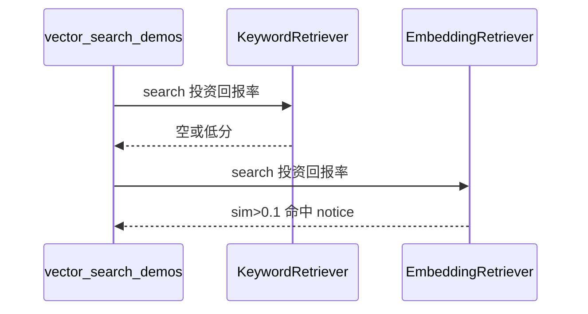

# Day 20 课堂笔记（下午）

**讲师**：陈默、助教  
**记录**：林晓  
**时段**：14:00–17:00

---

## 14:00–15:30 | EmbeddingRetriever 与 use_embedding

### EmbeddingRetriever.index 流程

1. `texts = [c.text for c in chunks]`  
2. `client.fit_corpus(texts)`  
3. `vectors = client.embed_batch(texts)`  
4. 组装 `IndexedChunk(chunk, vector)`  

### search 流程

1. `query_vec = client.embed(query)`  
2. 遍历 `_indexed`，`score = query_vec.similarity_to(item.vector)`  
3. 过滤 `score >= min_score`（默认 0.05）  
4. 排序取 top_k  

### context.py 集成

```python
if use_embedding:
    retriever = EmbeddingRetriever(chunks)
else:
    retriever = KeywordRetriever(chunks)
```

林晓跑通 `vector_search_demos.py`，亲眼看到关键词未命中、向量命中。



---

## 15:45–17:00 | FAQ 匹配与联调

### SimilarQuestionMatcher

- 构造时 `_reindex()`：对 FAQ 标准问题 fit + embed  
- `match(user_question)`：与每条 FAQ 比 sim，取最高且 ≥ threshold  
- 默认 `DEFAULT_FAQ` 五条：product / risk / service / platform / compliance  

### /similar 命令

```python
# cli_assistant.py
if cmd == "/similar":
    match = self.faq_matcher.match(query)
    return True, f"{match.summary()}\n答案：{match.entry.answer}", False
```

### routed_embedding_demo.py 脚本

```
/similar 投资回报率怎么算
/retrieve 投资回报率
根据资料，投资回报率是多少？
/exit
```

林晓观察：三条路径分别验证 FAQ、检索摘要、完整对话。

### 测试讲评（12 条）

周航强调：

- `test_keyword_vs_embedding_synonym`：允许 kw 空，但 emb 必须有  
- `test_faq_matcher_no_match`：阈值以下必须 None  
- `test_assistant_embedding_rag_route`：需同时传 `intent_router` + `rag_service`  

---

## 下午实验记录

| 脚本 | 林晓观察 |
|------|----------|
| embedding_demos.py | 「投资回报率」与「年化收益率可达 8%」sim ≈ 0.3+ |
| faq_matcher_demo.py | 「pdf能传吗」→ platform 类 FAQ |
| routed_embedding_demo.py | auto_route 显示 [路由: rag_qa] |

---

## 今日收获（林晓自评）

1. 理解余弦相似度与关键词打分的本质区别  
2. 会切换 `use_embedding=True`  
3. 会用 `/similar` 调试 FAQ  
4. 知道 Day 21 周测要整合工具调用
