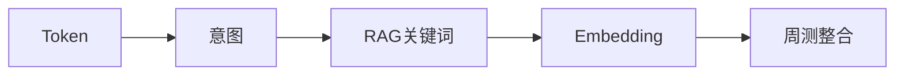

# Day 20 晚自习

**时间**：18:30–20:30  
**地点**：智链科技实训室  
**值班**：助教 + 周航

---

## 晚自习任务清单

| 序号 | 任务 | 预计 | 验收 |
|------|------|------|------|
| 1 | 重跑 `embedding_demos.py` 并抄写 PAIRS 相似度 | 15min | 四条 sim 值记录 |
| 2 | 阅读 `tests/day20/test_embedding.py` 全文 | 30min | 能说出 12 条覆盖点 |
| 3 | 完成 `08_作业` 作业 A | 45min | chunk_lab 可运行 |
| 4 | 预习 Day 21 周测范围（ROADMAP） | 20min | 笔记 3 条 |

---

## 一对一答疑记录（节选）

### 林晓 × 助教

**Q**：`test_embedding_similarity_synonym_pair` 为何阈值 0.15？  
**A**：TF-IDF 稀疏向量下同义词 sim 通常 0.15–0.5，密集向量会更高。测试取保守下界。

**Q**：FAQ threshold 0.32 如何调？  
**A**：构造 `SimilarQuestionMatcher(threshold=0.5)` 观察误拒率；生产用验证集 A/B。

### 赵岩巡场要点

- 强调「投资回报率」case 是产品真实反馈  
- 要求全员在 `vector_search_demos.py` 输出中截图留存  

---

## 自习环境

```bash
cd nexus-agent-platform
export PYTHONPATH=src
export NEXUS_LLM_MOCK=1

python3 -m pytest tests/day20/test_embedding.py -v
python3 src/day20/embedding_demos.py
```

---

## 明日预习：Day 21 Sprint 3 周测

根据 `course/ROADMAP.md`：

| 天 | 主题 | 交付 |
|----|------|------|
| Day 21 | 周测 | 多轮对话 + 工具调用整合 |

复习范围建议：

- Day 15–16：Token、流式  
- Day 17–18：Prompt 模板、意图路由  
- Day 19–20：RAG、Embedding、FAQ  



---

## 晚自习纪律

- 禁止抄袭作业代码  
- 遇到问题先查 `10_常见问题与排错指南.md`  
- 20:15 助教集中讲评 `test_keyword_vs_embedding_synonym`
