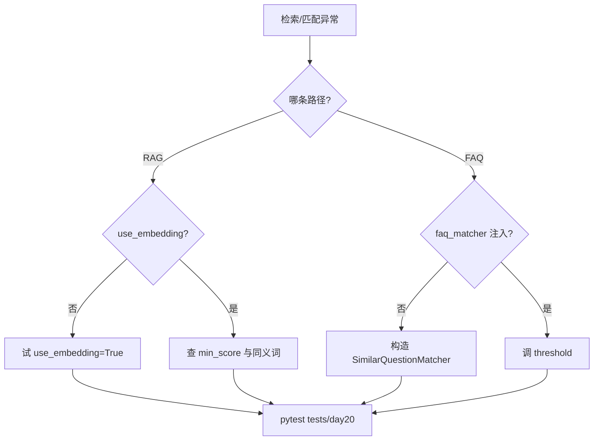

# Day 20 常见问题与排错指南

**维护**：助教组  
**关联测试**：`tests/day20/test_embedding.py`

---

## Q1：`RuntimeError: 请先调用 fit() 在语料上训练模型`

**原因**：`TfidfEmbeddingModel.embed` 在 `fit` 之前被调用。

**解决**：

```python
client = EmbeddingClient()
client.fit_corpus(["语料1", "语料2"])  # 必须先 fit
vec = client.embed("查询")
```

`EmbeddingRetriever.index` 会自动 fit；若手写 `EmbeddingClient` 需自行 `fit_corpus`。

---

## Q2：`ValueError: 向量维度不一致`

**原因**：两个 `EmbeddingVector` 来自不同 fit 词表。

**解决**：确保 query 与文档在同一 `fit_corpus` 后 embed。`SimilarQuestionMatcher._reindex` 会统一 fit FAQ 问题集。

---

## Q3：关键词命中但向量未命中（或相反）

**原因**：

- 向量：`min_score=0.05` 过滤  
- 关键词：无字面重叠即零分  
- 同义词：仅向量路径经 `expand_tokens` 受益（关键词 retriever 也有 tokenize 但无同义扩展）

**排查**：

```bash
python3 src/day20/vector_search_demos.py
python3 src/day20/embedding_demos.py
```

---

## Q4：`/similar` 返回「FAQ 匹配未启用」

**原因**：`ChatAssistant` 未传 `faq_matcher`。

**解决**：

```python
assistant = ChatAssistant(
    client=client,
    faq_matcher=SimilarQuestionMatcher(),
)
```

参考 `test_assistant_similar_command`。

---

## Q5：`/retrieve` 有结果但对话 context 仍差

**检查清单**：

1. `intent_router` 是否配置 `query_context_provider=rag.retrieve_context`  
2. `rag_service` 是否 `use_embedding=True`  
3. `auto_route` 是否路由到 `rag_qa`  

参考 `test_assistant_embedding_rag_route`。

---

## Q6：`test_embedding_similarity_synonym_pair` 失败

**原因**：NOTICE 常量与 fit 语料不一致；或 `synonyms.py` 被改坏。

**默认 NOTICE**：

```
智链科技理财产品说明书。本产品年化收益率可达8%。投资有风险，入市需谨慎。
```

确保 `fit_corpus([NOTICE, ...])` 且 sim > 0.15。

---

## Q7：FAQ 误匹配到不相关条目

**调参**：

```python
SimilarQuestionMatcher(threshold=0.4)  # 提高阈值
```

或用 `match_all` 查看 top3 分数分布。

---

## Q8：`ImportError: No module named 'rag'`

```bash
export PYTHONPATH=src
cd nexus-agent-platform
```

---

## Q9：cosine_similarity 返回略大于 1

浮点误差；测试用 `math.isclose`。生产展示用 `:.0%` 格式化。

---

## Q10：Day 21 周测会考什么？

- Day 15–20 核心 API 与三命令 `/route`、`/retrieve`、`/similar`  
- 工具调用整合（ROADMAP Day 21）  
- 复习 `16_复习卡片.md` 与 `21_课堂知识竞赛.md`

---

## 排错流程图


