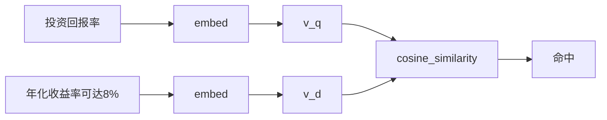

# Day 20 Embedding 向量检索详解

**深度专题** | 智链科技 NexusAgent 训练营

---

## 1. 为什么需要向量检索？

Day 19 `KeywordRetriever` 计算：

\[
\text{score} = \frac{|\text{query tokens} \cap \text{chunk tokens}|}{|\text{query tokens}|}
\]

当用户说「投资回报率」、文档写「年化收益率」时，交集为空 → 零命中。

**向量检索**将文本映射到连续空间，语义相近则距离近。



---

## 2. 余弦相似度深入

### 几何意义

衡量两向量**夹角**余弦值，与向量长度无关（TF-IDF 稀疏向量尤其重要）。

### 实现（rag/vector.py）

```python
def cosine_similarity(a, b):
    na, nb = vector_norm(a), vector_norm(b)
    if na == 0.0 or nb == 0.0:
        return 0.0
    return dot_product(a, b) / (na * nb)
```

### 典型取值

| 关系 | sim 约 |
|------|--------|
| 相同文本 | 1.0 |
| 同义短语（TF-IDF） | 0.15–0.5 |
| 无关文本 | 0–0.1 |
| 正交 | 0.0 |

---

## 3. TF-IDF 向量化

### TF（词频）

\[
\text{TF}(t, d) = \frac{\text{count}(t, d)}{|d|}
\]

### IDF（逆文档频率）

\[
\text{IDF}(t) = \log\frac{1+N}{1+\text{df}(t)} + 1
\]

### 向量分量

\[
\text{TF-IDF}(t, d) = \text{TF}(t,d) \times \text{IDF}(t)
\]

`TfidfEmbeddingModel.fit` 在全部 chunks 上统计 df；`embed` 对单条文本生成稀疏向量。

---

## 4. 同义词扩展层

`expand_tokens` 在 tokenize 后扩展：

1. `TOKEN_SYNONYMS` 词级映射  
2. `PHRASE_GROUPS` 短语组内互扩  

**作用**：让「回报率」与「收益率」在词表维度上共享权重，提升 TF-IDF「伪语义」能力。

**局限**：无法覆盖未收录的同义词；Day 25 密集向量可缓解。

---

## 5. EmbeddingRetriever 详解

### index

```python
texts = [c.text for c in chunks]
self._client.fit_corpus(texts)
vectors = self._client.embed_batch(texts)
```

在块集合上 fit，保证 query 与块同一词表空间。

### search

- `min_score=0.05` 过滤噪声  
- `_overlap_terms` 填充 `matched_tokens` 供可解释性  
- 排序：`(-score, chunk.index)`  

### 与 KeywordRetriever 接口对齐

两者均返回 `list[RetrievalResult]`，`RAGContextService.index.search` 无感切换。

---

## 6. RAGContextService use_embedding

```python
service = RAGContextService.from_sample_docs(use_embedding=True)
assert isinstance(service.index.retriever, EmbeddingRetriever)
context = service.retrieve_context("投资回报率")
```

header 从 `score=` 改为 `sim=`，语义更准确。

---

## 7. FAQ 相似问题匹配

### 场景

用户问法千变万化，标准 FAQ 有限。`SimilarQuestionMatcher` 将用户问映射到最近标准问，返回 canned answer。

### 流程

1. 构造时对 `DEFAULT_FAQ` 问题 fit + embed  
2. `match` 时 embed 用户问，逐条比 sim  
3. `score >= threshold` 才返回  

### 与 RAG 的分工

| 能力 | RAG | FAQ |
|------|-----|-----|
| 数据源 | sample_docs 文档块 | 结构化 FAQ 表 |
| 输出 | context 片段 | 标准答案 |
| 命令 | `/retrieve` | `/similar` |

---

## 8. 性能与规模

| 规模 | TF-IDF MVP | 说明 |
|------|------------|------|
| sample_docs | 毫秒级 | 今日场景 |
| 万级块 | 需向量库 | Day 29 Chroma |
| 百万级 | ANN 索引 | 生产架构 |

今日全量遍历 `_indexed` 可接受；规模上来需近似最近邻（ANN）。

---

## 9. 学习检查清单

- [ ] 能写出余弦相似度公式  
- [ ] 能解释 fit 与 embed 顺序  
- [ ] 能说明 `expand_tokens` 作用  
- [ ] 能切换 `use_embedding` 并对比结果  
- [ ] 能配置 `SimilarQuestionMatcher` 与 `/similar`
