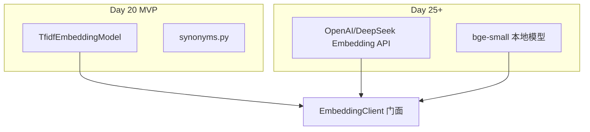
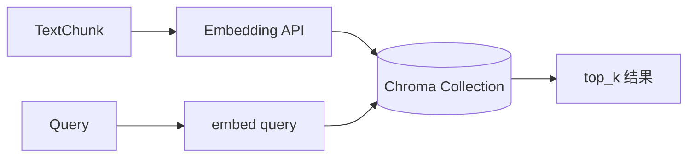

# Day 20 深度扩展：密集向量 API 与向量库

**定位**：Day 25+ 先导阅读，今日 TF-IDF 已实现  
**读者**：学有余力学员、架构组

---

## 1. TF-IDF 与密集 Embedding 对比

| 维度 | TF-IDF（Day 20） | 密集向量（Day 25+） |
|------|------------------|---------------------|
| 维度 | 词表大小（稀疏） | 固定 384/768/1536 |
| 语义 | 依赖同义词表 | 预训练语义空间 |
| 离线 | 完全可离线 | 需 API 或本地模型 |
| 延迟 | 极低 | API 网络延迟 |
| CI | 确定性高 | 需 mock 或快照 |



---

## 2. HttpEmbeddingModel 预期接口

```python
class HttpEmbeddingModel:
    def embed(self, text: str) -> EmbeddingVector:
        # POST /v1/embeddings
        ...
```

`EmbeddingClient` 构造注入新模型，`EmbeddingRetriever` 与 `SimilarQuestionMatcher` **无需修改**。

---

## 3. 向量数据库 Chroma（Day 29 预览）

| 能力 | 内存 TF-IDF | Chroma |
|------|-------------|--------|
| 持久化 | 否 | 是 |
| 增量更新 | 重建索引 | 支持 |
| ANN 检索 | 全量遍历 | HNSW 等 |
| 元数据过滤 | 手写 | 内置 |



---

## 4. 混合检索（Hybrid Search）

生产常见：**关键词 BM25 + 向量**，RRF 融合排序。

Day 20 架构预留：

```python
class HybridRetriever:
    def search(self, query, top_k=3):
        kw = self._keyword.search(query, top_k=top_k*2)
        emb = self._embedding.search(query, top_k=top_k*2)
        return rrf_merge(kw, emb)[:top_k]
```

---

## 5. Reranker

向量 top_k 召回后，用 Cross-Encoder Reranker 精排。适合 Day 31「RAG 调优」专题。

---

## 6. synonyms.py 何时退役？

| 阶段 | synonyms 角色 |
|------|---------------|
| Day 20 TF-IDF | 必要补偿 |
| Day 25 密集向量 | 可选增强 |
| Day 29 向量库 | 逐步弱化 |

---

## 7. 延伸阅读

- MTEB 中文 Embedding 排行榜  
- Chroma 官方文档「Getting Started」  
- 智链内部 wiki：ZL-NA-EMB-API-001（待 Day 25 发布）
