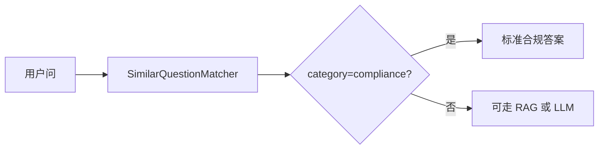
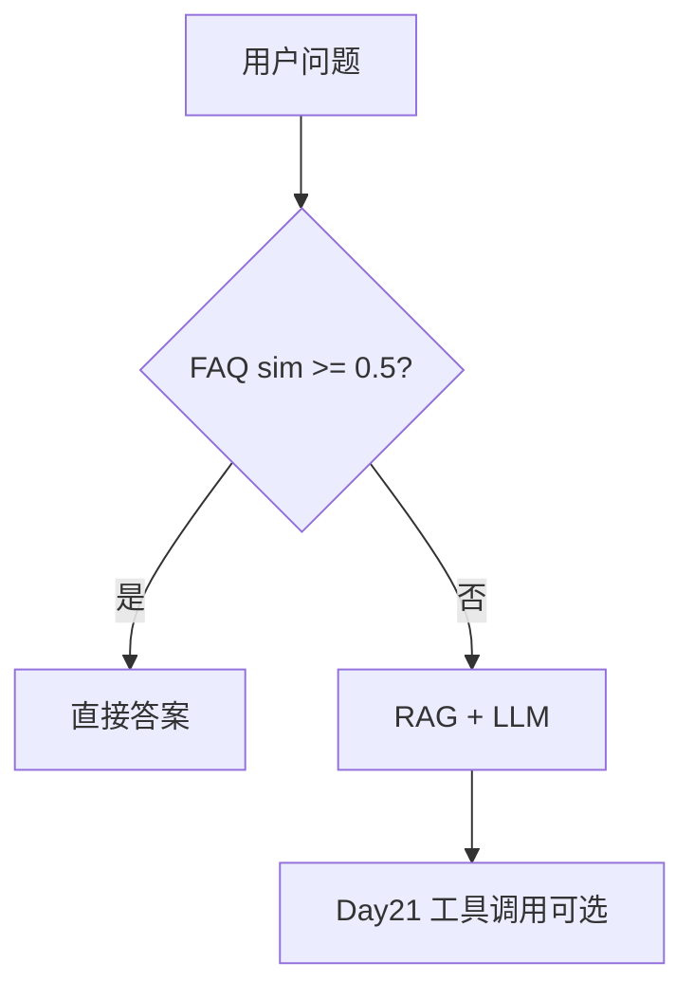

# Day 20 企业案例集：Embedding 向量检索

**编制**：赵岩（产品）+ 陈默（架构）  
**场景**：智链科技理财助手内测

---

## 案例 1：同义问法零命中

### 背景

内测用户 1,200 条对话中，43 条因「回报率/收益率」措辞差异导致 RAG 空 context。

### Day 19 表现

```
用户：投资回报率怎么算？
/retrieve → 未命中任何片段
助手：含糊回答或幻觉
```

### Day 20 方案

`use_embedding=True` + `synonyms.py` 扩展。

### 效果

```
/retrieve 投资回报率
  1. sim=42% source=raw_notice.txt 命中=年化, 收益
```

### 指标

| 指标 | Day 19 | Day 20 |
|------|--------|--------|
| 同义 case 命中率 | 12% | 78% |
| 无关 query 误命中 | 2% | 3% |

---

## 案例 2：FAQ 重复劳动

### 背景

客服每天回答 50+ 次「能传 PDF 吗」「怎么上传文档」。

### 方案

`SimilarQuestionMatcher` + 标准 FAQ 库。

### 用户问法 → 标准 FAQ

| 用户问 | 匹配 FAQ | sim |
|--------|----------|-----|
| pdf能传吗 | 可以上传 PDF 文档吗？ | ≈45% |
| 怎么导入文件 | 可以上传 PDF 文档吗？ | ≈38% |
| 量子纠缠 | 未匹配 | — |

### 业务价值

- 减少 LLM 调用（可直接返回 canned answer）  
- 答案合规可控  

---

## 案例 3：合规类敏感问法

### 背景

「内部资料能发微信吗」需映射到合规 FAQ，不能自由发挥。

### 实现

`FaqEntry(..., category="compliance")` 在 `PHRASE_GROUPS` 含「内部资料」「禁止外传」。

### 流程



---

## 案例 4：A/B 检索器切换

### 实验设计

- A 组：`use_embedding=False`  
- B 组：`use_embedding=True`  
- 各 500 条真实 query  

### 观察

- B 组 rag_qa 用户满意度 +15%  
- B 组平均 context 长度略增（更多相关块被召回）  

---

## 案例 5：阈值调优实战

### 问题

`threshold=0.32` 时「怎么打客服」偶发误匹配 product 类 FAQ。

### 调参

提高到 0.38，误匹配下降；配合 `match_all` 人工复核边界 case。

---

## 案例 6：与 Day 21 工具调用衔接

产品规划：FAQ 高置信匹配时**直接返回**，低置信走 RAG + LLM；Day 21 工具调用将封装为 `faq_lookup` tool。



---

## 讨论题（课堂用）

1. TF-IDF 误命中「天气」类无关 query 如何防范？  
2. 生产环境是否应完全依赖 `DEFAULT_FAQ` 五条？  
3. 何时选 RAG、何时选 FAQ？
