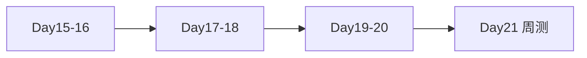

# Day 20 复习卡片

**用途**：考前 15 分钟速览 | 可打印双面小卡

---

## 卡片正面：核心 API

| API | 一句话 |
|-----|--------|
| `cosine_similarity(a,b)` | 余弦相似度，零向量→0 |
| `TfidfEmbeddingModel.fit(texts)` | 建词表与 IDF |
| `EmbeddingClient.embed(text)` | 单条转向量 |
| `EmbeddingRetriever.search(q)` | 向量检索 top_k |
| `RAGContextService.from_sample_docs(use_embedding=True)` | 启用向量 RAG |
| `SimilarQuestionMatcher.match(q)` | FAQ 最佳匹配 |
| `/similar [问题]` | 预览 FAQ，不调 LLM |

---

## 卡片背面：公式与阈值

### 余弦相似度

\[
\text{sim} = \frac{a \cdot b}{\|a\| \|b\|}
\]

### 默认阈值

| 参数 | 值 |
|------|-----|
| `min_score`（检索） | 0.05 |
| `threshold`（FAQ） | 0.32 |
| `top_k` | 3 |
| `max_chars` | 800 |

---

## 卡片 3：Day 19 vs Day 20

| | Day 19 | Day 20 |
|---|--------|--------|
| 检索器 | Keyword | Embedding |
| 打分 | token 比例 | cosine sim |
| 同义词 | 弱 | 强 |
| 新命令 | — | `/similar` |

---

## 卡片 4：文件路径

```
src/rag/vector.py
src/rag/embedding.py
src/rag/synonyms.py
src/rag/embedding_retriever.py
src/rag/context.py          # use_embedding
services/faq_matcher.py
chat/cli_assistant.py       # /similar
tests/day20/test_embedding.py  # 12 tests
```

---

## 卡片 5：演示命令

```bash
export PYTHONPATH=src
python3 src/day20/embedding_demos.py
python3 src/day20/vector_search_demos.py
python3 src/day20/faq_matcher_demo.py
NEXUS_LLM_MOCK=1 python3 src/day20/routed_embedding_demo.py
pytest tests/day20/test_embedding.py -v
```

---

## 卡片 6：易错点

1. embed 前必须 fit  
2. `/similar` 需 `faq_matcher`  
3. 对话 RAG 需 `query_context_provider`  
4. 勿混淆 score 与 sim 含义  

---

## 卡片 7：Day 21 预告

**Sprint 3 周测** — 多轮对话 + 工具调用整合

复习 Day 15–20 全链路。



---

## 自测 3 问

1. `expand_tokens` 解决什么问题？  
2. 为何 `EmbeddingRetriever.index` 要在块文本上 fit？  
3. FAQ 未匹配时返回什么？

<details>
<summary>答案</summary>
1. 同义词与短语扩展，提升 TF-IDF 召回<br>
2. 保证 query 与块同一词表维度<br>
3. None；/similar 显示未找到提示
</details>
