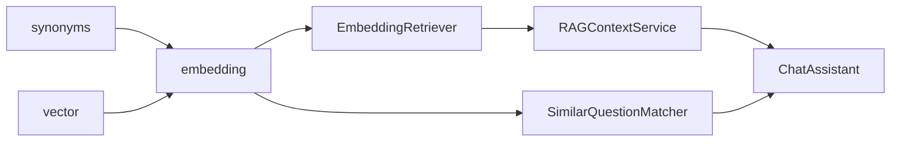

# Day 20 Embedding 速查手册

**版本**：ZL-NA-D20-QUICKREF  
**受众**：开发、测试、运维

---

## 1. 快速启动

```bash
cd nexus-agent-platform
export PYTHONPATH=src

# 向量 RAG
python3 -c "
from rag import RAGContextService
s = RAGContextService.from_sample_docs(use_embedding=True)
print(s.retrieve_summary('投资回报率'))
"

# FAQ
python3 -c "
from services import SimilarQuestionMatcher
m = SimilarQuestionMatcher()
print(m.match('怎么联系客服'))
"
```

---

## 2. cosine_similarity

```python
from rag import cosine_similarity

cosine_similarity([1.0, 0.0], [1.0, 0.0])  # 1.0
cosine_similarity([1.0, 0.0], [0.0, 1.0])  # 0.0
cosine_similarity([0.0, 0.0], [1.0, 1.0])  # 0.0 零向量
```

---

## 3. EmbeddingClient

```python
from rag import EmbeddingClient

client = EmbeddingClient()
client.fit_corpus(["文本1", "文本2"])
vec = client.embed("查询")
sim = client.similarity("投资回报率", "年化收益率可达8%")
```

---

## 4. EmbeddingRetriever

```python
from rag import EmbeddingRetriever, chunk_text

chunks = chunk_text("年化收益率可达8%", source="a.txt")
retriever = EmbeddingRetriever(chunks)
results = retriever.search("投资回报率", top_k=3)
for r in results:
    print(r.score, r.chunk.source, r.matched_tokens)
```

---

## 5. RAGContextService

```python
from rag import RAGContextService

# 关键词（Day 19）
kw = RAGContextService.from_sample_docs(use_embedding=False)

# 向量（Day 20）
emb = RAGContextService.from_sample_docs(use_embedding=True)

ctx = emb.retrieve_context("投资回报率", top_k=3, max_chars=800)
summary = emb.retrieve_summary("投资回报率")
```

---

## 6. SimilarQuestionMatcher

```python
from services import SimilarQuestionMatcher, FaqEntry

matcher = SimilarQuestionMatcher(
    entries=[
        FaqEntry("标准问？", "标准答。", "general"),
    ],
    threshold=0.32,
)

match = matcher.match("用户变体问法")
if match:
    print(match.entry.answer, match.score)

candidates = matcher.match_all("用户问", top_k=3)
```

---

## 7. ChatAssistant 集成

```python
from chat import ChatAssistant
from prompts import IntentRouter
from rag import RAGContextService
from services import SimilarQuestionMatcher

rag = RAGContextService.from_sample_docs(use_embedding=True)
router = IntentRouter(query_context_provider=rag.retrieve_context)
faq = SimilarQuestionMatcher()

assistant = ChatAssistant(
    client=client,
    intent_router=router,
    auto_route=True,
    rag_service=rag,
    faq_matcher=faq,
)

assistant.handle_command("/similar 怎么联系客服")
assistant.handle_command("/retrieve 投资回报率")
```

---

## 8. 同义词扩展

```python
from rag.synonyms import tokenize, expand_tokens, TOKEN_SYNONYMS

tokens = tokenize("投资回报率是多少")
expanded = expand_tokens(tokens, "投资回报率是多少")
# 含 收益、年化收益率 等扩展项
```

---

## 9. 测试速查

```bash
pytest tests/day20/test_embedding.py -v
pytest tests/day20/test_embedding.py::test_embedding_retriever_finds_synonym_query -v
```

| 测试 | 断言要点 |
|------|----------|
| test_cosine_similarity_identical | sim=1.0 |
| test_embedding_similarity_synonym_pair | sim>0.15 |
| test_faq_matcher_no_match | None |
| test_assistant_similar_command | 含「客服」 |

---

## 10. 故障速查

| 现象 | 检查 |
|------|------|
| fit 报错 | 先 fit_corpus |
| FAQ 未启用 | 传 faq_matcher |
| 向量未命中 | use_embedding=True |
| 维度不一致 | 同一 fit 语料 |

---

## 11. 架构一图


