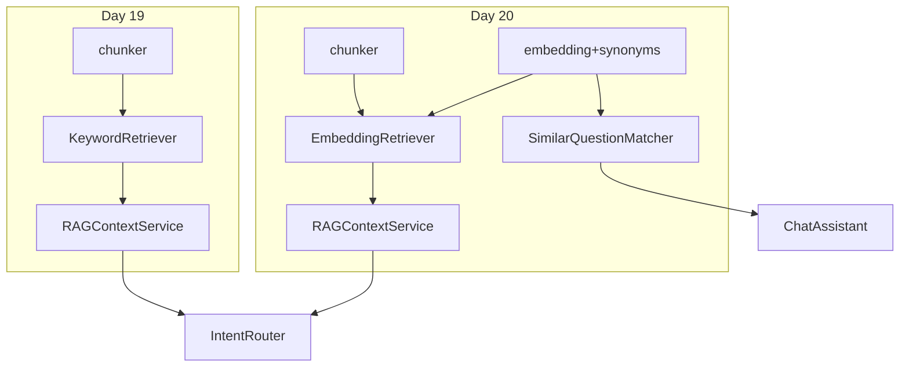

# Day 20 与 Day 19 关键词检索对照表

**用途**：迁移、调试、周测复习

---

## 1. 总览对照

| 维度 | Day 19 KeywordRetriever | Day 20 EmbeddingRetriever |
|------|-------------------------|---------------------------|
| 需求编号 | ZL-NA-REQ-019 | ZL-NA-REQ-020 |
| 核心模块 | `retriever.py` | `embedding.py` + `embedding_retriever.py` |
| 打分算法 | token 重叠 / 查询 token 数 | 余弦相似度 |
| 索引内容 | TextChunk 列表 | IndexedChunk（chunk + vector） |
| 同义词 | 仅 bigram | expand_tokens + 向量 |
| 工厂开关 | 默认 | `use_embedding=True` |
| context 标注 | `score=67%` | `sim=42%` |
| 预览命令 | `/retrieve` | `/retrieve` + `/similar` |
| 测试文件 | `test_rag.py` | `test_embedding.py` |
| 演示目录 | `day19/` | `day20/` |

---

## 2. API 对照

### 检索器 search 签名（一致）

```python
def search(self, query: str, *, top_k: int = 3) -> list[RetrievalResult]:
    ...
```

### RAGContextService 工厂

```python
# Day 19
RAGContextService.from_sample_docs()

# Day 20
RAGContextService.from_sample_docs(use_embedding=True)
```

### 返回类型（一致）

`RetrievalResult(chunk, score, matched_tokens)` — `score` 字段语义从比例变为 sim。

---

## 3. 行为对照实验

查询：「投资回报率是多少」

| 步骤 | Day 19 | Day 20 |
|------|--------|--------|
| `index.search` | 常 [] | 有结果 |
| top1 score | — | sim > 0.1 |
| matched_tokens | — | 含年化/收益等 |
| `retrieve_context` | 未命中文案 | 含 sim= 标注片段 |

---

## 4. 架构对照图



---

## 5. 调试命令对照

| 目的 | Day 19 命令 | Day 20 追加 |
|------|-------------|-------------|
| 看意图 | `/route` | 同左 |
| 看文档检索 | `/retrieve` | 同左（向量 sim） |
| 看 FAQ 匹配 | — | `/similar` |

---

## 6. 测试对照

| 主题 | Day 19 测试 | Day 20 测试 |
|------|-------------|-------------|
| 分块 | test_chunk_* | 复用 chunk_text |
| 检索命中 | test_retriever_finds_yield_info | test_embedding_retriever_finds_synonym_query |
| 服务层 | test_rag_service_* | test_rag_service_use_embedding |
| CLI | test_assistant_retrieve | test_assistant_similar_command |
| 对比 | — | test_keyword_vs_embedding_synonym |

---

## 7. 何时仍用关键词？

| 场景 | 建议 |
|------|------|
| 精确 SKU/编号查询 | 关键词或混合 |
| 离线极简环境 | 关键词 |
| 同义表达为主 | 向量 |
| FAQ 标准问匹配 | SimilarQuestionMatcher |

---

## 8. 迁移 Checklist

- [ ] `use_embedding=True` 创建 service  
- [ ] 回归 `test_embedding.py` 12 条  
- [ ] 对比 `vector_search_demos.py` 输出  
- [ ] 配置 `faq_matcher` 与 `/similar`  
- [ ] 更新运维文档中的 score 含义说明  

---

## 9. 林晓笔记

> Day 19 解决「有没有检索」；Day 20 解决「检索准不准」。接口不变，换引擎。
