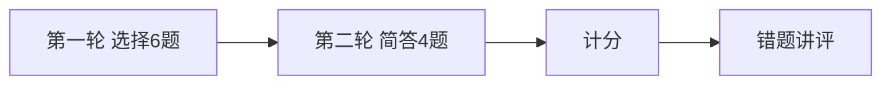

# Day 20 课堂知识竞赛

**形式**：小组抢答 + 个人闭卷  
**题量**：10 题（选择 6 + 简答 4）  
**建议时长**：20 分钟

---

## 第一部分：选择题（每题 10 分）

### 1

`cosine_similarity([0,0], [1,1])` 返回什么？

- A. 1.0  
- B. 0.5  
- C. 0.0  
- D. 抛异常  

答案
C — 零向量返回 0.0，见 vector.py

### 2

`TfidfEmbeddingModel.embed` 在 fit 之前调用会怎样？

- A. 返回零向量  
- B. 自动 fit  
- C. 抛 RuntimeError  
- D. 返回随机向量  

答案
C

### 3

`EmbeddingRetriever` 的 score 含义是？

- A. 命中 token 比例  
- B. TF-IDF 原始值  
- C. 余弦相似度  
- D. BM25  

答案
C

### 4

启用向量 RAG 的工厂调用是？

- A. `from_sample_docs(use_vector=True)`  
- B. `from_sample_docs(use_embedding=True)`  
- C. `from_sample_docs(embedding=True)`  
- D. `EmbeddingRAGService.from_sample_docs()`  

答案
B

### 5

`/similar` 命令会调用 LLM 吗？

- A. 会  
- B. 不会  
- C. 仅 rag_qa 会  
- D. 仅 sim>0.5 会  

答案
B — 仅 faq_matcher.match

### 6

`tests/day20/test_embedding.py` 共有多少条测试？

- A. 10  
- B. 11  
- C. 12  
- D. 15  

答案
C

---

## 第二部分：简答题（每题 10 分）

### 7

写出余弦相似度公式（文字或数学形式均可）。

答案
sim = (a·b) / (‖a‖‖b‖)；零向量返回 0

### 8

列举 `synonyms.py` 中两个常量名及其作用。

答案
TOKEN_SYNONYMS 词级同义；PHRASE_GROUPS 短语级同义组

### 9

`SimilarQuestionMatcher` 默认 threshold 是多少？低于阈值返回什么？

答案
0.32；返回 None

### 10

Day 20 相对 Day 19 解决了什么核心痛点？Day 21 主题是什么？（各一句）

答案
痛点：同义表达检索命中；Day 21：Sprint 3 周测 / 多轮对话与工具调用整合

---

## 竞赛流程

---

## 评分与奖品（示例）

| 区间 | 奖励 |
|------|------|
| 90–100 | Embedding 速查手册打印 + 复习卡片 |
| 70–89 | 电子版 Day 19 对照表 |
| 60–69 | 补考 Day 19 复习卡片 |
| &lt;60 | 晚自习一对一 15 分钟 |

---

## 讲师讲评要点

- 第 3 题：混淆 KeywordRetriever 与 EmbeddingRetriever  
- 第 5 题：混淆 `/similar` 与 `chat_turn`  
- 第 10 题：串联 Day 21 周测与 ROADMAP
