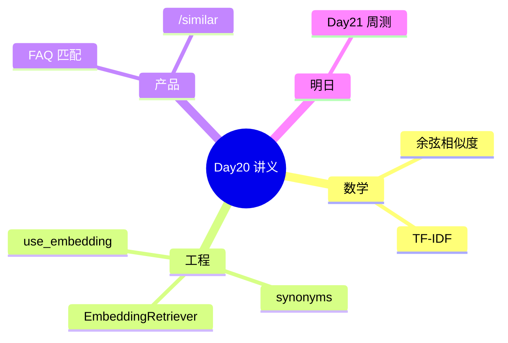

# Day 20 Embedding 检索深度讲义

**讲义编号**：ZL-NA-D20-LECTURE  
**适用**：上午理论课 90 分钟

---

## 第一讲：从符号匹配到向量空间（25 min）

### 1.1 符号主义的局限

关键词检索假设：查询与文档共享**相同字面**。

反例矩阵：

| 查询 | 文档 | Keyword | Embedding |
|------|------|---------|-----------|
| 投资回报率 | 年化收益率 8% | ✗ | ✓ |
| 客服咋联系 | 400-888-9999 | △ | ✓ |
| 产品编号 NX-001 | 产品编号 NX-001 | ✓ | ✓ |

### 1.2 向量空间模型（VSM）

文本 → \(\mathbb{R}^d\) 中的点，相似度 = 距离度量。


---

## 第二讲：余弦相似度数学基础（20 min）

### 2.1 点积与投影

\(a \cdot b = \|a\|\|b\|\cos\theta\)

故 \(\cos\theta = \frac{a \cdot b}{\|a\|\|b\|}\)

### 2.2 为何用余弦而非欧氏距离？

高维稀疏 TF-IDF 向量，**方向**比**长度**更能反映主题相似性。

### 2.3 代码对应

`rag/vector.py` 完整实现标准库版本，便于单测与教学。

---

## 第三讲：TF-IDF 构造（25 min）

### 3.1 词袋假设

忽略语序，文档 = 词频 multiset。

### 3.2 算法步骤

**Fit 阶段**（语料级）：

1. 分词 + 同义词扩展  
2. 建词表 V  
3. 计算每个 term 的 IDF  

**Embed 阶段**（文档级）：

1. 同上分词  
2. 仅 V 中 term 得非零坐标  
3. 坐标 = TF × IDF  

### 3.3 数值示例

语料两句：

- d1: 「年化收益」  
- d2: 「风险提示」  

词表 {年化, 收益, 风险, 提示, ...}，「年化」在 d1 中 TF 高，IDF 依 df 而定。

---

## 第四讲：同义词扩展工程层（10 min）

### 4.1 动机

TF-IDF 无预训练语义；`synonyms.py` 是**领域知识注入**。

### 4.2 两类结构

- `TOKEN_SYNONYMS`：点对点  
- `PHRASE_GROUPS`：组内广播  

### 4.3 与 Day 25 关系

密集向量后，扩展表从**必要**降为**可选**。

---

## 第五讲：EmbeddingRetriever 与系统集成（10 min）

### 5.1 索引生命周期

```
chunks → fit_corpus → embed_batch → IndexedChunk[]
query  → embed → 遍历比 sim → top_k
```

### 5.2 可替换检索器

`DocumentIndex.retriever` 类型为 Union，工厂 `use_embedding` 切换。

### 5.3 FAQ 复用 Embedding

同一 `EmbeddingClient` 模式，不同语料（FAQ 问题 vs 文档块）。

---

## 第六讲：评估与阈值（课外）

| 指标 | 定义 |
|------|------|
| Recall@k | 相关块在 top_k 比例 |
| MRR | 首个相关块排名倒数 |
| FAQ 准确率 | 匹配到正确标准问比例 |

今日测试用例即最小回归集。

---

## 讲义小结



---

## 参考代码路径

- `src/rag/vector.py`  
- `src/rag/embedding.py`  
- `src/rag/embedding_retriever.py`  
- `services/faq_matcher.py`  
- `tests/day20/test_embedding.py`
