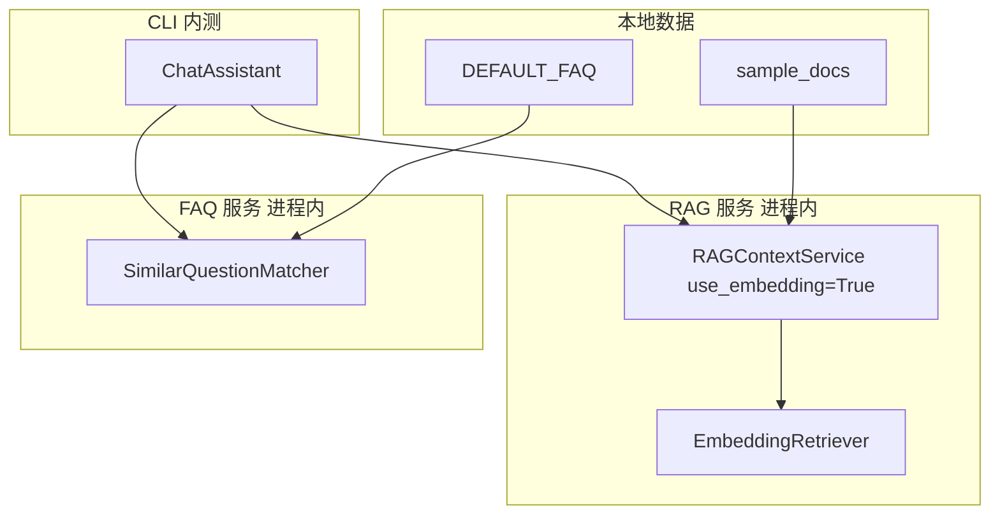

# Day 20 Embedding 检索企业实践

**编制**：智链科技 架构组  
**版本**：v1.0 | 2026-07-25

---

## 1. 实践背景

智链 NexusAgent 内测阶段，RAG 关键词检索在同义金融术语场景失效率高。Day 20 在**不改变对外 API** 前提下引入 Embedding 检索与 FAQ 匹配。

---

## 2. 部署拓扑



**特点**：全进程内、无 Redis/向量库，适合 Sprint 3 教学与 CI。

---

## 3. 配置建议

| 环境 | use_embedding | FAQ threshold |
|------|---------------|---------------|
| dev | True | 0.32 |
| ci | True | 0.32（固定语料） |
| staging | True | 0.35 |
| prod 预览 | A/B | 0.32 vs 0.38 |

---

## 4. 运维 Runbook

### 4.1 每日冒烟

```bash
export PYTHONPATH=src
pytest tests/day20/test_embedding.py -q
python3 src/day20/vector_search_demos.py | grep -i sim
```

### 4.2 同义词表变更

1. 修改 `synonyms.py`  
2. 跑全量 day20 测试  
3. 更新 `14_企业案例集` 回归查询  

### 4.3 FAQ 条目变更

1. 修改 `DEFAULT_FAQ` 或注入 `entries`  
2. `_reindex` 自动触发  
3. 验证 `/similar` 样例问法  

---

## 5. 监控指标（规划）

| 指标 | 说明 |
|------|------|
| rag_empty_context_rate | retrieve 空结果比例 |
| faq_match_rate | /similar 命中率 |
| avg_top1_sim | 向量 top1 均值 |
| synonym_query_recall | 同义 query 命中比例 |

Day 22+ FastAPI 接入后可上报 Prometheus。

---

## 6. 安全与合规

- FAQ 答案经法务审核，LLM 不得擅自改写高置信 FAQ  
- compliance 类匹配记审计日志  
- 向量检索不向外发送文本（TF-IDF 本地）  

---

## 7. 故障演练

### 场景 A：全量未命中

**症状**：`retrieve_context` 全是未命中文案  
**排查**：sample_docs 是否挂载；`use_embedding` 是否 True  

### 场景 B：FAQ 大面积未匹配

**症状**：`/similar` 全未找到  
**排查**：threshold 是否过高；FAQ 列表是否为空  

### 场景 C：测试 flaky

**症状**：sim 边界抖动  
**排查**：语料变更；使用 `math.isclose` 与保守阈值  

---

## 8. 与 Day 21 工具调用整合预览

企业实践路线：


规划工具：

- `search_docs(query)` → RAG retrieve  
- `match_faq(query)` → SimilarQuestionMatcher  
- `classify_intent(query)` → IntentRouter  

---

## 9. 成本分析

| 项 | Day 20 TF-IDF | 未来 API Embedding |
|----|---------------|-------------------|
| API 费用 | 0 | 按 token 计费 |
| 内存 | 低 | 中 |
| 延迟 | <10ms | 50–200ms |
| 运维 | 低 | 中 |

---

## 10. 经验总结

1. **接口稳定**降低迁移成本  
2. **同义词表**是 TF-IDF 阶段的关键补偿  
3. **三命令调试**（/route /retrieve /similar）提升联调效率  
4. Day 21 周测前务必全员跑通 `routed_embedding_demo.py`
