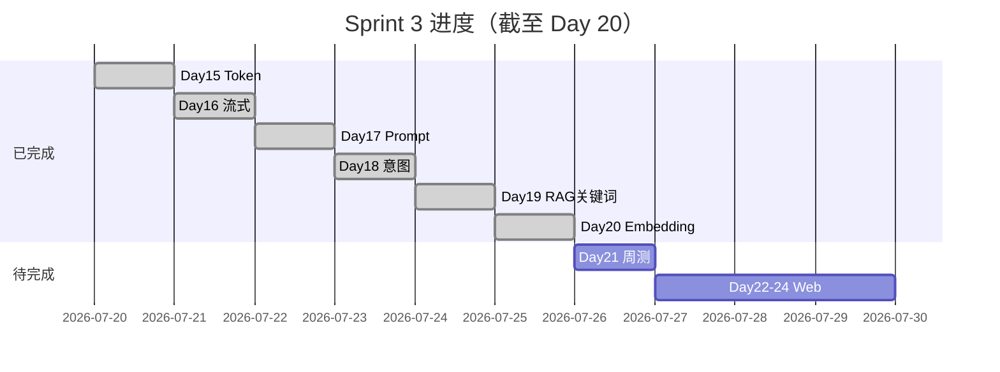
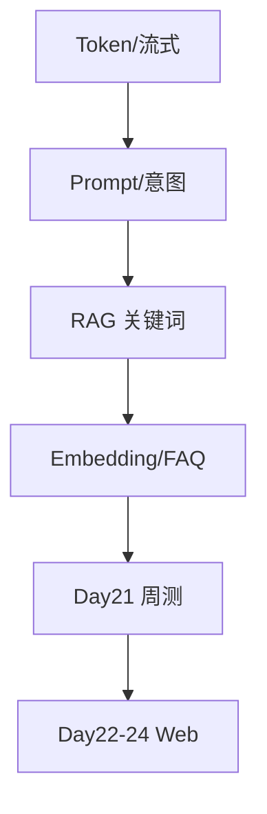

# Day 20 Sprint 3 阶段回顾

**Sprint**：Phase 2 Sprint 3（Day 15–24）  
**今日位置**：第六日 / 共十日  
**日期**：2026-07-25

---

## 1. Sprint 3 进度条



**完成度**：6/10 天（60%）

---

## 2. 能力栈累积

| Day | 能力 | 关键模块 |
|-----|------|----------|
| 15 | Token 计数 | token_counter |
| 16 | 流式输出 | streaming |
| 17 | Prompt 模板 | prompts/templates |
| 18 | 意图分类 | IntentRouter |
| 19 | RAG 关键词 | KeywordRetriever |
| 20 | Embedding + FAQ | EmbeddingRetriever, SimilarQuestionMatcher |



---

## 3. Day 15–20 代码资产

```
src/llm/token_counter.py      # Day 15
src/llm/streaming.py          # Day 16
src/prompts/                  # Day 17-18
src/rag/chunker.py            # Day 19
src/rag/retriever.py          # Day 19
src/rag/context.py            # Day 19-20
src/rag/vector.py             # Day 20
src/rag/embedding.py          # Day 20
src/rag/synonyms.py           # Day 20
src/rag/embedding_retriever.py # Day 20
services/faq_matcher.py       # Day 20
chat/cli_assistant.py         # Day 14+ 持续扩展
```

---

## 4. 测试资产

| 日 | 测试文件 | 条数 |
|----|----------|------|
| Day 19 | test_rag.py | 12 |
| Day 20 | test_embedding.py | 12 |
| **合计** | | **24** |

周航要求：Sprint 3 CI 合并跑通 24 passed。

---

## 5. 团队贡献（智链科技）

| 成员 | Day 15–20 贡献摘要 |
|------|-------------------|
| 林晓 | 实现 vector/embedding 核心、作业示范 |
| 陈默 | 架构设计、检索器可替换、讲义 |
| 赵岩 | 产品 case、FAQ 策略、案例集 |
| 周航 | CI、测试门禁、运维 Runbook |

---

## 6. 里程碑对照 ROADMAP

| ROADMAP 条目 | 状态 |
|--------------|------|
| Day 19 Function Calling 雏形 | 部分（工具调用 Day 21） |
| Day 20 相似问题匹配 | ✅ faq_matcher |
| Day 21 周测 | 🔜 明日 |
| Day 22–24 网页 Chat | 待开始 |

> 注：课件 Day 19 主题为 RAG 检索，与 ROADMAP 表格行号略有错位，以课件 Sprint 3 顺序为准。

---

## 7. 技术债与后续

| 项 | 优先级 | 目标日 |
|----|--------|--------|
| 密集向量 API | P1 | Day 25 |
| Chroma 持久化 | P1 | Day 29 |
| 混合检索 | P2 | Day 31 |
| FAQ 后台配置 | P2 | Day 23 API |

---

## 8. Day 21 周测准备

### 复习清单

- [ ] `pytest tests/day19 tests/day20 -v`  
- [ ] 口述余弦相似度与 TF-IDF  
- [ ] 演示 `/route` `/retrieve` `/similar`  
- [ ] 阅读 ROADMAP Day 21「工具调用整合」  

### 周测形式（预告）

- 理论 40% + 实操 60%  
- 实操含：给定 query 配置 RAG+FAQ+意图全链路  

---

## 9. 林晓 Sprint 3 自评

> Day 15–16 打基础，Day 17–18 让助手「会说话、会分流」，Day 19–20 让助手「找得到、找得准」。明天周测是第一次综合验收。

---

## 10. 下一步

**Day 21（2026-07-26）**：Sprint 3 周测 — 多轮对话 + 工具调用整合
