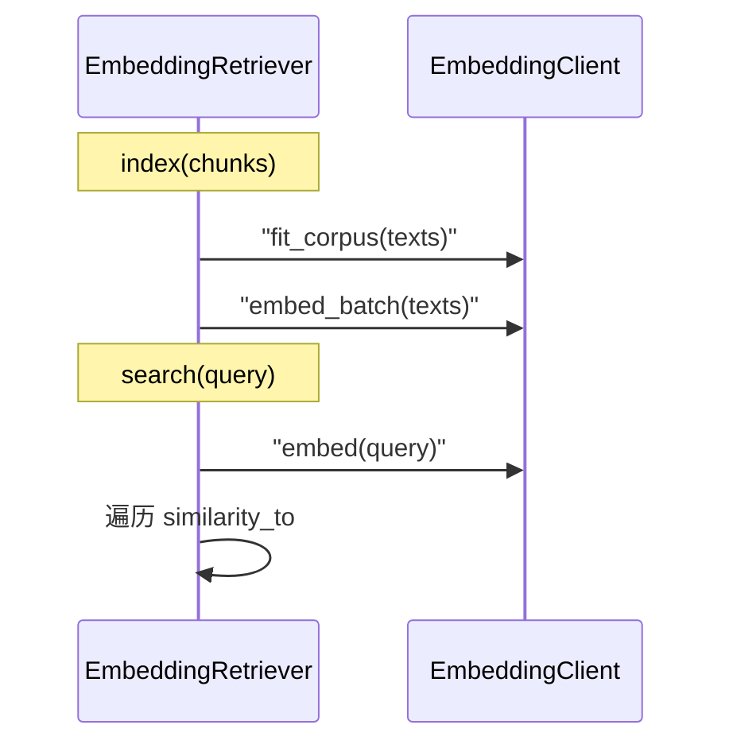

# Day 20 embedding 精读

**精读范围**：`vector.py` → `embedding.py` → `synonyms.py` → `embedding_retriever.py` → `faq_matcher.py`  
**建议时长**：120 分钟

---

## 精读 1：vector.py（15 min）

### 完整 API

| 函数 | 作用 |
|------|------|
| `dot_product` | 点积，维度校验 |
| `vector_norm` | L2 范数 |
| `cosine_similarity` | 主入口 |
| `normalize_vector` | 单位化展示 |

### 边界条件

- 空向量 → norm=0 → sim=0  
- 维度不一致 → ValueError  

### 练习

手算 `[1,2,3]` 与 `[2,4,6]` 的 sim（应得 1.0）。

---

## 精读 2：embedding.py（30 min）

### EmbeddingVector

不可变语义载体；`similarity_to` 委托 `cosine_similarity`。

### TfidfEmbeddingModel 状态机

```
初始 _fitted=False
  → fit() → _vocab, _idf, _fitted=True
  → embed() → EmbeddingVector
```

### fit 核心循环

```python
for text in texts:
    tokens = expand_tokens(tokenize(text), text)
    for term in set(tokens):
        df[term] = df.get(term, 0) + 1
```

### embed 核心循环

```python
for term, count in tf.items():
    idx = self._vocab[term]
    vec[idx] = (count / len(tokens)) * self._idf[idx]
```

### EmbeddingClient

薄封装；Day 25 可换 `HttpEmbeddingModel` 而不动 Retriever。

---

## 精读 3：synonyms.py（20 min）

### TOKEN_SYNONYMS 结构

```python
"收益": ("收益", "回报率", "盈利", "年化"),
```

键为触发词，值为扩展集合。

### PHRASE_GROUPS

组内任一词出现在 source 中 → 整组扩展。

### tokenize 双通道

1. 正则整词  
2. 中文 bigram（与 Day 19 retriever 一致）  

### 精读问题

> 若删除 `expand_tokens` 调用，Day 20 哪些测试会失败？

预期：至少 `test_embedding_similarity_synonym_pair`、`test_embedding_retriever_finds_synonym_query` 风险上升。

---

## 精读 4：embedding_retriever.py（25 min）

### IndexedChunk

预计算避免 search 时重复 embed 文档块。

### index 与 search 时序



### _overlap_terms

可解释性：从 expand 后的 query/chunk token 交集中取前 5。

### min_score

默认 0.05，过滤极低 sim 噪声。

---

## 精读 5：context.py 增量（10 min）

```python
Retriever = KeywordRetriever | EmbeddingRetriever
```

类型别名表达可替换设计；`use_embedding` 是唯一开关。

---

## 精读 6：faq_matcher.py（20 min）

### 数据模型

- `FaqEntry` frozen — 不可变 FAQ 行  
- `FaqMatch` — 含 `summary()` 格式化  

### match 算法

线性扫描 O(n)；FAQ 规模小可接受；大规模需 ANN 或倒排。

### DEFAULT_FAQ 五条

精读每条 category 与业务含义。

---

## 精读 7：cli_assistant /similar（10 min）

与 `/retrieve` 对称设计：

| 命令 | 依赖 | 调 LLM |
|------|------|--------|
| /retrieve | rag_service | 否 |
| /similar | faq_matcher | 否 |

---

## 精读 8：test_embedding.py 映射

| 测试 | 精读对应节 |
|------|------------|
| test_cosine_* | 精读 1 |
| test_embedding_model_* | 精读 2 |
| test_embedding_similarity_synonym_pair | 精读 2+3 |
| test_embedding_retriever_* | 精读 4 |
| test_rag_service_use_embedding | 精读 5 |
| test_faq_* | 精读 6 |
| test_assistant_* | 精读 7 |

---

## 精读作业

1. 在纸上画出 `EmbeddingRetriever.index` 数据流  
2. 解释为何 query 必须与 chunks 同一 fit 语料  
3. 对比 `match` 与 `match_all` 使用场景  

---

## 延伸阅读

- `22_Embedding检索深度讲义.md`  
- `13_深度扩展_密集向量与向量库.md`
