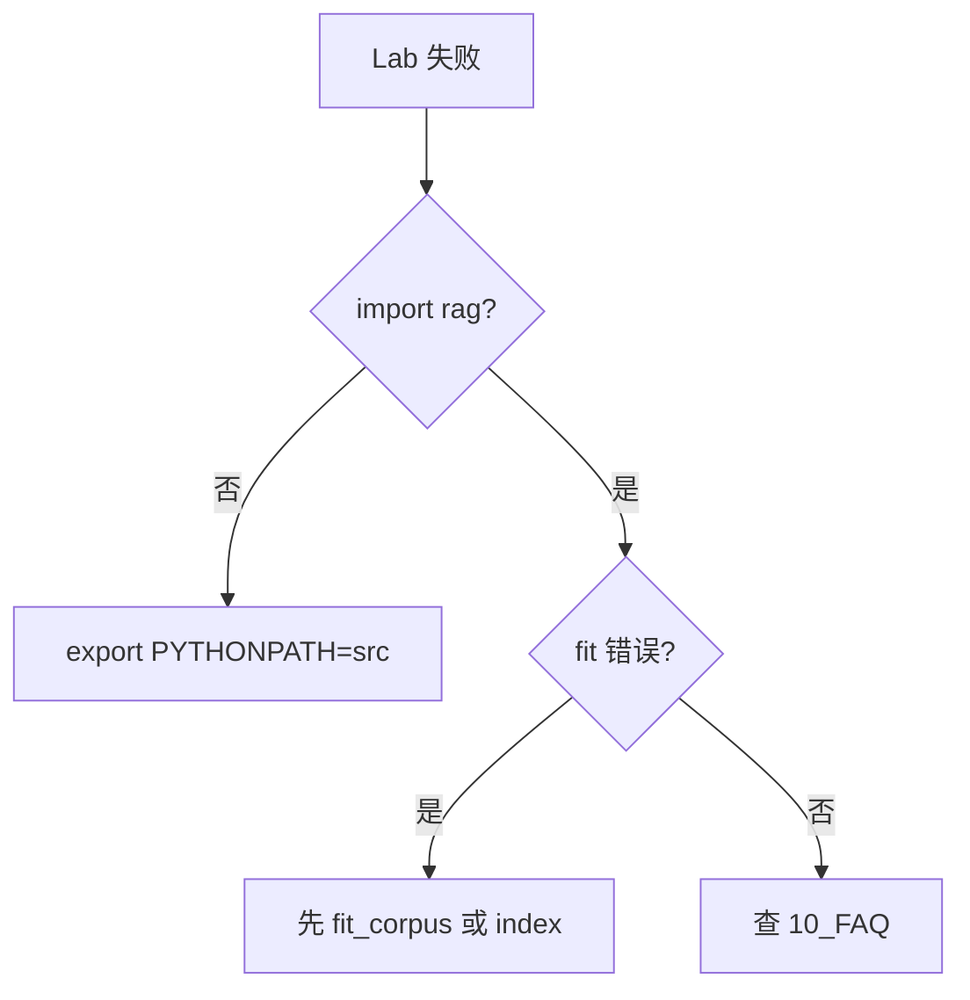

# Day 20 实操 Lab 手册

**实验环境**：`nexus-agent-platform`  
**预计时长**：90 分钟  
**角色**：林晓（学员）— 智链科技实训

---

## Lab 0：环境准备（10 分钟）

```bash
cd /workspace/nexus-agent-platform
export PYTHONPATH=src
export NEXUS_LLM_MOCK=1

python3 --version   # 建议 3.11+
python3 -m pytest tests/day20/test_embedding.py -v
```

**验收**：12 passed。

---

## Lab 1：余弦相似度观察（10 分钟）

### 步骤

1. 运行 `src/day20/embedding_demos.py`  
2. 记录 `PAIRS` 四条 sim 值  
3. 在 REPL 验证正交向量：

```python
from rag import cosine_similarity
cosine_similarity([1.0, 0.0], [0.0, 1.0])
```

### 记录表

| 查询 | 文档摘要 | sim |
|------|----------|-----|
| 年化收益 | 年化收益率可达 8% | |
| 投资回报率 | 年化收益率可达 8% | |
| 客服电话 | 请联系客服 400... | |
| 天气不错 | 理财产品说明书 | |

### 思考题

为何「投资回报率」与「年化收益率」sim 高于「天气」与「说明书」？

---

## Lab 2：关键词 vs 向量对比（15 分钟）

```bash
python3 src/day20/vector_search_demos.py
```

### 任务

在 `vector_search_demos.py` 中将 `QUERY` 改为 `"怎么打客服"`，重新运行。

### 记录表

| 检索器 | top1 结果 |
|--------|-----------|
| KeywordRetriever | |
| EmbeddingRetriever | |

### 思考题

对照 `test_keyword_vs_embedding_synonym`，关键词未命中时向量是否一定有结果？

---

## Lab 3：synonyms 扩展实验（15 分钟）

### 步骤

1. 打开 `src/rag/synonyms.py`  
2. 阅读 `TOKEN_SYNONYMS["回报率"]`  
3. REPL 实验：

```python
from rag.synonyms import tokenize, expand_tokens
q = "投资回报率是多少"
exp = expand_tokens(tokenize(q), q)
print("年化" in exp, "收益率" in exp)
```

### 扩展（可选）

临时注释 `PHRASE_GROUPS` 中收益率组，重跑 `embedding_demos.py` 观察 sim 变化（**记得恢复**）。

---

## Lab 4：use_embedding RAG（15 分钟）

```python
from rag import RAGContextService

emb = RAGContextService.from_sample_docs(use_embedding=True)
print(type(emb.index.retriever).__name__)
print(emb.retrieve_summary("投资回报率"))
print(emb.retrieve_context("投资回报率", max_chars=300))
```

### 任务

确认 context 含 `sim=` 标注而非仅 `score=`。

---

## Lab 5：FAQ 匹配（10 分钟）

```bash
python3 src/day20/faq_matcher_demo.py
```

### 记录表

| 用户问题 | 匹配 FAQ | sim | category |
|----------|----------|-----|----------|
| 投资回报率怎么算？ | | | |
| 有没有风险啊？ | | | |
| 量子纠缠原理是什么 | | | |

### 扩展

```python
from services import SimilarQuestionMatcher
m = SimilarQuestionMatcher(threshold=0.5)
print(m.match("怎么打客服"))
```

观察 threshold 提高后的变化。

---

## Lab 6：/similar 与 /retrieve 联调（15 分钟）

```bash
NEXUS_LLM_MOCK=1 python3 src/day20/routed_embedding_demo.py
```

### 观察清单

- [ ] `/similar` 输出 FAQ 摘要与标准答案  
- [ ] `/retrieve` 输出向量 sim 与 source  
- [ ] 自然语言对话出现 `[路由: rag_qa]`  
- [ ] LLM 收到的 context 含相关片段  

### 脚本扩展

在 `routed_embedding_demo.py` 的 `script` 末尾加一行：

```python
"/similar 怎么打客服",
```

---

## Lab 7：测试驱动复习（10 分钟）

```bash
pytest tests/day20/test_embedding.py -v --tb=short
```

### 任务

挑选 3 条测试，用一句话说明其保护的行为：

| 测试名 | 保护行为 |
|--------|----------|
| | |
| | |
| | |

---

## Lab 总结报告模板

提交 `homework/day20/lab20_summary.md`：

1. Lab 1 sim 记录表  
2. Lab 2 双检索对比结论（3 句话）  
3. Lab 5 FAQ 一条未匹配 case 分析  
4. Day 21 周测个人复习计划（3 条）  

---

## 讲师验收标准

| Lab | 通过标准 |
|-----|----------|
| 0 | 12 passed |
| 1 | 能解释四条 sim 排序 |
| 2 | 向量命中「投资回报率」 |
| 4 | context 含 sim= |
| 5 | 风险/客服有匹配 |
| 6 | 三联调脚本无报错 |

---

## 故障排除

见 `10_常见问题与排错指南.md`。



---

## Day 21 预习

完成 Lab 后阅读 `24_Sprint3阶段回顾.md`，准备 Sprint 3 周测。
