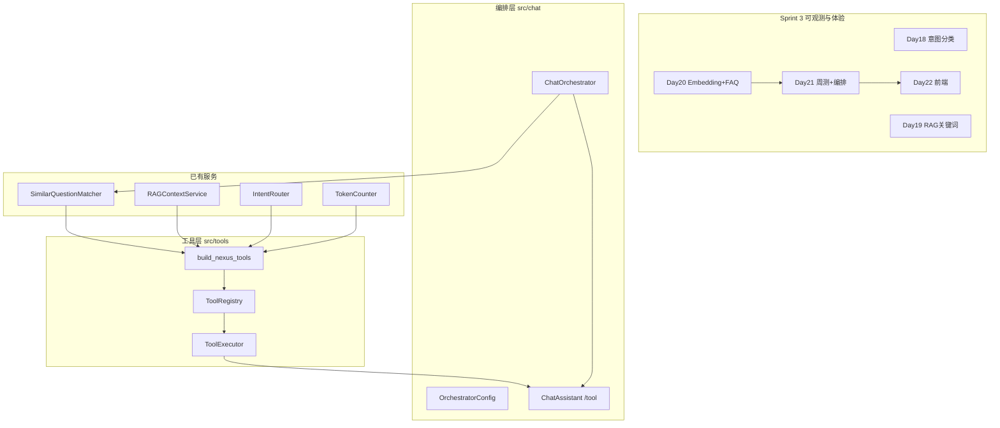

# Day 21 旁白解读：从分散能力到统一编排

> **前置要求**：完成 Day 15–20 全部模块；能独立运行 `routed_embedding_demo.py` 与 `test_embedding.py`

---

## 旁白

2026 年 7 月 26 日，周日。智链科技 Sprint 3 第七日，赵岩在晨会投屏上周内测数据：

> 「Day 15 到 Day 20，我们有了 Token 计数、流式输出、Prompt 模板、意图路由、RAG 检索、Embedding 与 FAQ 匹配——但用户仍觉得助手『各管各的』：`/similar` 是一套，`/retrieve` 是另一套，真正对话时又要走 LLM。今日周测 + **工具调用整合**，要把这些能力收成一条链。」

林晓举手：「是不是像 OpenAI 的 function calling，把 FAQ 和 RAG 都注册成工具？」

陈默在白板上画出今日主线：

```
用户消息
    ↓
ChatOrchestrator.handle_message
    ↓
① FAQ 高置信直答（score ≥ threshold）→ 跳过 LLM
    ↓ 未命中
② ChatAssistant.auto_route + query_context_provider
    ↓
IntentRouter → rag_qa 注入 context → LLM 多轮对话
    ↓ 调试路径
③ /tool list | /tool faq_lookup 问题 | /tool rag_search 查询
    ↓
ToolExecutor → ToolRegistry → 各 handler
```

> 「`build_nexus_tools` 把 `SimilarQuestionMatcher`、`RAGContextService`、`IntentRouter`、`TokenCounter` 封成四个标准工具。编排器负责**策略**——先 FAQ 直答再 LLM；执行器负责**调用**——校验参数、兜底异常。」

周航补充：

> 「`tests/day21/test_sprint3.py` 共 12 条：周测满分脚本、四工具注册、executor 成功/失败、编排器 FAQ 直答与 LLM 回落、`/tool` 命令、整合 demo 可导入。上午先 `sprint3_quiz.py` 周测，下午 Lab 跑 `integrated_assistant_demo.py`。」

上午十点，全班在机房开始纸质 + 程序双轨周测。林晓第十题选对「FAQ+RAG+意图+工具编排」，满分 100。她下午运行 `tool_demos.py`：

```
=== 工具注册表演示 ===

已注册工具：
  faq_lookup(query) — 相似 FAQ 匹配，适合标准产品/合规/客服问题
  rag_search(query, top_k) — 从知识库检索相关文档片段
  intent_classify(text) — 意图分类预览，返回模板路由建议
  estimate_tokens(text) — 估算文本 token 数量

[faq_lookup] sim=38% Q: 投资回报率怎么算？
年化收益率可达8%，具体以产品说明书为准。
```

傍晚 `integrated_assistant_demo.py` 脚本依次执行 `/tool list`、FAQ 直答「有没有风险啊？」、RAG 路由「根据资料，年化收益率是多少？」。站会末尾陈默预告：

> 「明天 Day 22 前端速成，在 `frontend/` 做静态聊天页，把今日编排器接到浏览器。」

---

## 今日在架构中的位置



---

## 林晓的学习建议

1. 先完成 `sprint3_quiz.py` 自测，错题对照 Day 15–20 课件  
2. 读 `tool_registry.py` 的 `ToolDefinition` 与 `build_nexus_tools` 四个 handler  
3. 读 `executor.py` 的 `_invoke` 参数过滤与 query/text 互用逻辑  
4. 读 `orchestrator.py` 的 `handle_message` 三步策略  
5. 在 REPL 中试 `/tool list` 与 `/tool faq_lookup 客服电话`  
6. 阅读 `tests/day21/test_sprint3.py` 全部 12 条  
7. `NEXUS_LLM_MOCK=1 integrated_assistant_demo.py` 对照脚本输出理解编排顺序

---

## 今日关键词

| 术语 | 含义 |
|------|------|
| ToolDefinition | 工具元数据：name、description、parameters、handler |
| ToolRegistry | 工具注册表，`register` / `get` / `list_names` |
| build_nexus_tools | 工厂函数，按注入服务构建四工具 |
| ToolExecutor | 执行器，`execute(name, args)` 返回 `ToolResult` |
| ChatOrchestrator | 多能力编排入口，`handle_message` 统一处理 |
| OrchestratorConfig | 编排策略：`faq_direct_threshold` 等 |
| FAQ 直答 | 高置信 FAQ 跳过 LLM，降延迟与成本 |
| /tool | Chat 命令，显式调用工具或 `list` 列工具 |
| sprint3_quiz | Day 15–20 十题周测程序 |

---

## 与昨日衔接

Day 20 回答「**语义相近也能命中**」；Day 21 回答「**能力如何统一调度**」。`/similar` 与 `/retrieve` 的底层服务被封装为 `faq_lookup` 与 `rag_search` 工具；`ChatOrchestrator` 在对话入口做 FAQ 直答与 auto_route，为 Day 22 网页版 Chat 提供稳定后端接口。

---

## 故事线续写：周日下午机房

林晓完成周测后，陈默让她在白板前向全班讲解 `integrated_assistant_demo` 第三条脚本「有没有风险啊？」。她指着输出 `[FAQ 直答·72%]` 说：「这条没进 LLM，省了一次 API 调用。」赵岩点头：「这就是我们要的产品行为——标准问题秒回，复杂问题再走模型。」

周航在后排补充 CI 视角：`test_orchestrator_faq_direct` 用 `threshold=0.5` 保证实验性环境下仍能命中；生产默认 0.65 是产品与陈默折中结果。林晓把这句话记进作业阈值实验里。

---

## 与智链科技 ROADMAP 的对齐说明

根据 ROADMAP，Day 19 标注 Function Calling 雏形，Day 21 标注多轮对话与工具整合。课件与代码以实现为准：`tools/` 包在 Day 21 完整落地。学员理解**渐进交付**即可：Day 19 先 RAG，Day 21 再统一工具化与编排。

---

## 扩展阅读路径（按角色）

| 角色 | 推荐阅读顺序 |
|------|--------------|
| 学员林晓 | 00→01→10 周测→11 详解→26 Lab |
| 讲师陈默 | 02 需求→03 架构→19 补充→20 走查 |
| 产品赵岩 | 14 案例→23 企业实践→24 回顾 |
| 运维周航 | 17 速查→test_sprint3→CI 配置 |

---

## 深度思考题（旁白附录）

1. 若 FAQ 直答与 rag_search 同时命中，产品应展示哪一个？  
2. 工具层是否需要版本号字段供 API 兼容？  
3. 周测是否应每 Sprint 举行一次？智链科技答案是肯定的。

这些开放问题供晚自习小组讨论；讲师可收集团队简报作为 Day 22 晨会破冰。
