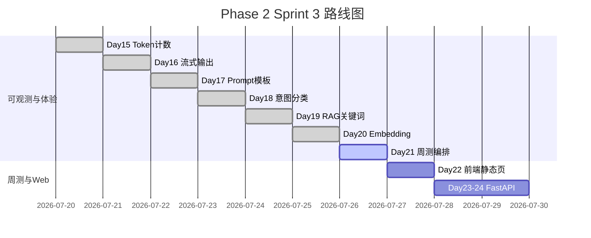

# Day 21 企业背景与今日任务

**日期**：2026 年 7 月 26 日  
**Sprint**：Sprint 3 第七日 — 周测 / 工具调用整合

## 晨会纪要

### 赵岩（产品）

> 「Sprint 3 前半程六天交付了 Token、流式、Prompt、意图、RAG、Embedding。内测反馈：能力分散，运营无法一眼看清助手调了哪些模块。今日周检验收 Day 15–20，并上线 **工具注册表 + 对话编排器**，让用户消息走统一入口。」

### 陈默（架构）

> 「新增 `tools/tool_registry.py`、`tools/executor.py`、`chat/orchestrator.py`；`build_nexus_tools` 封装 faq_lookup、rag_search、intent_classify、estimate_tokens；`ChatOrchestrator` 先 FAQ 直答再 `ChatAssistant.auto_route`；CLI 扩展 `/tool` 命令。」

### 周航（DevOps）

> 「`tests/day21/test_sprint3.py` 12 条进 CI；`sprint3_quiz.py --scripted` 供流水线评分；演示脚本全离线可跑。周测及格线 60 分，与 `constants.QUIZ_PASS_SCORE` 一致。」

### 林晓（学员代表）

> 「编排器和直接调 ChatAssistant 有什么区别？工具和未来 LLM function calling 怎么接？」

陈默：「编排器管**策略顺序**——FAQ 阈值、是否 auto_route；工具层管**可调用契约**——name、parameters JSON Schema、handler。Day 30+ 可把 `schemas_for_prompt` 注入 system prompt，让模型产出 tool_calls。」

## 任务分配

| ID | 任务 | 负责人 | 优先级 |
|----|------|--------|--------|
| ZL-NA-REQ-021 | Sprint 3 周测 + 工具编排整合 | 全员 | P0 |
| ZL-NA-501 | `ToolDefinition` + `ToolRegistry` | 林晓 | P0 |
| ZL-NA-502 | `build_nexus_tools` 四工具 | 林晓 | P0 |
| ZL-NA-503 | `ToolExecutor` 参数校验与执行 | 助教 | P0 |
| ZL-NA-504 | `ChatOrchestrator` + `OrchestratorConfig` | 助教 | P0 |
| ZL-NA-505 | `/tool` 命令 + `parse_tool_arguments` | 助教 | P0 |
| ZL-NA-506 | `day21/*` 演示与 `sprint3_quiz.py` | 助教 | P1 |
| ZL-NA-507 | `tests/day21/test_sprint3.py` 全绿 | 周航 | P0 |

## Definition of Done

- [ ] `python3 src/day21/sprint3_quiz.py --scripted` 输出 100/100
- [ ] `python3 src/day21/sprint3_review.py` 打印 Day 15–21 里程碑
- [ ] `python3 src/day21/tool_demos.py` 四工具均有 summary 输出
- [ ] `NEXUS_LLM_MOCK=1 python3 src/day21/integrated_assistant_demo.py` 联调通过
- [ ] `pytest tests/day21/test_sprint3.py -v` 12 passed
- [ ] 能口述：`handle_message` 处理顺序、四工具名称与用途
- [ ] 能解释：FAQ 直答阈值与 `/similar` 预览的区别
- [ ] 能说明：`/tool` 简写参数与 JSON 参数两种写法

## 今日节奏

| 时段 | 内容 |
|------|------|
| 09:00-09:45 | Sprint 3 周测（纸质 + `sprint3_quiz.py`） |
| 09:45-10:30 | 周测讲评，薄弱点回顾 Day 15–20 |
| 10:45-12:00 | `ToolRegistry` 与 `build_nexus_tools` 走读 |
| 14:00-15:30 | `ToolExecutor` 与 `/tool` 命令实操 |
| 15:45-17:00 | `ChatOrchestrator` 整合与 `integrated_assistant_demo` 讲评 |

## 环境准备

```bash
cd nexus-agent-platform
export PYTHONPATH=src
export NEXUS_LLM_MOCK=1

python3 src/day21/sprint3_quiz.py --scripted
python3 src/day21/sprint3_review.py
python3 src/day21/tool_demos.py
python3 src/day21/integrated_assistant_demo.py
python3 -m pytest tests/day21/test_sprint3.py -v
```

## Sprint 3 全景（Day 15–24 预览）



## 与 Day 20 的差异

| 维度 | Day 20 Embedding + FAQ | Day 21 周测 + 工具编排 |
|------|------------------------|------------------------|
| 关注点 | 语义检索与 FAQ 匹配 | 能力统一调度与周检验收 |
| 核心模块 | embedding_retriever、faq_matcher | tool_registry、orchestrator |
| 用户入口 | `/similar`、`/retrieve` | `ChatOrchestrator` + `/tool` |
| 调试方式 | 分命令预览 | 工具 list + 编排器直答 |
| 测试 | test_embedding.py 12 条 | test_sprint3.py 12 条 + 周测 10 题 |
| 下一日 | — | Day 22 前端静态聊天页 |

---
## 补充阅读：Sprint 3 工具整合问答集（智链科技培训组）

**问**：Day 21 与 OpenAI Assistants API 的 tools 有何异同？  
**答**：同为工具 schema + 执行器模式；Assistants 由平台托管线程与运行，NexusAgent Day 21 是本地教学实现，不依赖外网 Assistants。

**问**：为何 ChatAssistant 已有 auto_route 还要 Orchestrator？  
**答**：auto_route 是单轮对话内路由；Orchestrator 在对话入口前增加 FAQ 直答策略，并冻结为 Web API 门面。

**问**：build_nexus_tools 返回可变注册表吗？  
**答**：返回新 ToolRegistry 实例；可继续 register 第五工具，但生产建议工厂函数扩展而非散落 register。

**问**：SimilarQuestionMatcher 与 EmbeddingRetriever 都用 embedding，会重复 fit 吗？  
**答**：各自维护客户端与语料，Day 21 未做全局共享；优化留待后续。

**问**：周测程序版与纸质版分数以哪个为准？  
**答**：以程序版录入系统；纸质用于课堂氛围，差异由讲师人工复核。

**问**：integrated_assistant_demo 第四条为何走编排器？  
**答**：「根据资料查询收益率」触发 rag_qa 与 LLM，非 FAQ 直答，展示 fallback 路径。

**问**：test_assistant_tool_execute 为何断言 doc_summary 或意图？  
**答**：「总结要点」类问句意图分类结果依模板库版本可能含 doc_summary 或中文「意图」摘要。

**问**：Day 22 是否必须会 JavaScript？  
**答**：需基础 DOM 操作与 fetch 概念；无框架要求。

**问**：智链科技为何选周日做周测？  
**答**：Sprint 排期 2026-07-26 为周日， fictional 企业日历，强调冲刺节奏。

**问**：课件中 mermaid 图渲染失败怎么办？  
**答**：用 GitHub 或支持 mermaid 的 Markdown 预览；文字流程图见 04_。

**问**：REQ-021 与 REQ-020 依赖关系？  
**答**：021 依赖 020 的 FAQ 与 Embedding RAG；020 依赖 019 RAG 基座。

**问**：学员代表林晓是否对应真人？  
**答**：合成角色，代表典型优秀学员成长弧。

**问**：四工具描述为何用中文？  
**答**：运营与学员母语文档；代码 identifier 仍英文。

**问**：handle_message 线程安全吗？  
**答**：Day 21 未保证；多线程应每线程独立 assistant。

**问**：完课标志是什么？  
**答**：作业 A–E 提交 + pytest 12 passed + 周测≥60。

以上十五问答可作为晚自习快问快答素材，讲师可随机抽题计分。

---

## 延伸阅读：智链科技 Sprint 3 整合里程碑时间轴（叙事）

2026 年 7 月 20 日周一，林晓第一次在智链科技机房算出一段产品说明书的 token 数，陈默说「成本意识从今天开始」。21 日周二流式输出让她觉得助手「活了起来」。22 日周三 Prompt 模板让她理解「同样的问题可以问出不同风格」。23 日周四意图分类像给问题「贴快递单」。24 日周五 RAG 关键词检索第一次从 pdf 里抠出合规条款。25 日周六 Embedding 让「投资回报率」终于撞上「年化收益率」。26 日周日周测后，赵岩在全员邮件写：「今天我们不再新增零件，我们把机器组装起来。」周航附言 CI 链接十二绿。这就是 Day 21 在 70 天培训中的情感坐标——不是最高峰，但是第一个「整机通电」的时刻。明日 Day 22，整机要装上一块玻璃面板：静态聊天页面。请带着今日整理的笔记与 FAQ 直答的兴奋感进入前端速成。加油顺利！本课程由智链科技培训组维护，内容随 NexusAgent 平台代码演进同步更新。

### 课后寄语（赵岩）

「Sprint 3 前半程的每一次作业、每一次 pytest 绿光，都是在为今天周测与整合做准备。工具不是炫技，是我们对业务能力的诚实命名；编排不是魔法，是我们对用户问题路径的尊重。愿各位在 Day 22 第一次把自己的后端能力画到浏览器里时，仍然记得：先 FAQ 直答，再慎重调用大模型。金融科技的底线是准确与可追溯，NexusAgent 从 Day 21 起，又向这个目标迈进了一大步。」

### 课后寄语（陈默）

「读源码时盯住三个文件：tool_registry.py、executor.py、orchestrator.py。加起来不到三百行，却承上启下。启下者，Day 22 至 Day 24 的 Web；承上者，Day 15 至 Day 20 的全部服务。能把三百行讲清楚，比背一千行框架代码更有职业竞争力。」

### 课后寄语（周航）

「请把 `pytest tests/day21/test_sprint3.py -v` 加入你的 git pre-push 习惯。十二绿是最低礼仪。CI 不会原谅侥幸。」

### 课后寄语（林晓）

「今天我终于把 Sprint 3 串成一条线了。推荐各位今晚只做一件事：重跑 integrated_assistant_demo，盯着终端里 FAQ 直答那一行，感受工程落地。」

### 知识点速记收尾（二十条）

1. ToolDefinition 含 name/description/parameters/handler。2. ToolRegistry 用 register 注册。3. build_nexus_tools 构建四工具。4. ToolExecutor 执行 execute。5. ToolResult 有 success 字段。6. ChatOrchestrator 编排对话。7. OrchestratorConfig 设阈值。8. handle_message 先 FAQ 后 LLM。9. /tool list 列工具。10. parse_tool_arguments 支持简写。11. sprint3_quiz 十题。12. QUIZ_PASS_SCORE 为 60。13. test_sprint3 十二条。14. faq_lookup 调 SimilarQuestionMatcher。15. rag_search 调 retrieve_context。16. intent_classify 调 classify。17. estimate_tokens 调 TokenCounter。18. Day 22 做静态 frontend。19. 需求号 ZL-NA-REQ-021。20. 智链科技四人组：林晓、陈默、赵岩、周航。
