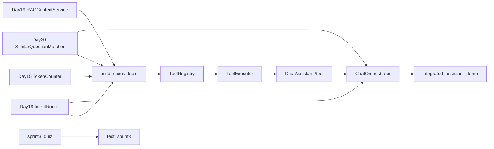

# ZL-NA-REQ-021 需求文档

**需求编号**：ZL-NA-REQ-021  
**需求名称**：Sprint 3 周测 / 工具调用整合  
**优先级**：P0  
**Sprint**：Sprint 3 第七日  
**状态**：已交付

---

## 1. 背景

智链科技 NexusAgent 在 Day 15–20 陆续交付 Token 计数、流式输出、Prompt 模板、意图分类、RAG 关键词检索、Embedding 向量检索与 FAQ 匹配。各能力分散在不同命令与代码路径，缺乏统一编排。产品要求：进行 **Sprint 3 周测** 验收前半程知识，并落地 **工具注册表 + 执行器 + 对话编排器**，将 FAQ、RAG、意图、Token 封装为可调用工具。

## 2. 目标用户

- 终端用户（高置信 FAQ 秒回，复杂问题走 RAG + LLM）
- 运营与测试（`/tool list` 一眼看清可用能力，周测量化掌握度）
- 后端开发（为 Day 22–24 Web API 提供稳定 `handle_message` 接口）
- CI 与讲师（`sprint3_quiz.py --scripted` 与 `test_sprint3.py` 自动化）

## 3. 功能需求

### FR-001 工具定义 ToolDefinition 与注册表 ToolRegistry

| 项 | 描述 |
|----|------|
| 模块 | `src/tools/tool_registry.py` |
| 类 | `ToolDefinition`（name、description、parameters、handler） |
| 方法 | `schema_summary()` — 生成 `name(keys) — description` 摘要 |
| 类 | `ToolResult`（name、success、output、error、`summary()`） |
| 类 | `ToolRegistry` |
| 方法 | `register(tool)` — 注册，空名抛 `ValueError` |
| 方法 | `get(name)`、`list_tools()`、`list_names()` |
| 方法 | `schemas_for_prompt()` — 供 system prompt 参考的工具列表 |
| 约束 | handler 签名为 `Callable[..., str]`，返回字符串 |

### FR-002 内置工具集 build_nexus_tools

| 项 | 描述 |
|----|------|
| 模块 | `src/tools/tool_registry.py` |
| 函数 | `build_nexus_tools(faq_matcher=, rag_service=, intent_router=, token_counter=)` |
| 工具 | `faq_lookup(query)` — 调用 `SimilarQuestionMatcher.match`，未命中返回「未匹配到 FAQ」 |
| 工具 | `rag_search(query, top_k=3)` — 调用 `RAGContextService.retrieve_context` |
| 工具 | `intent_classify(text)` — 调用 `IntentRouter.classify(text).summary()` |
| 工具 | `estimate_tokens(text)` — 调用 `TokenCounter.estimate_text`，返回「约 N tokens」 |
| 行为 | 仅注入非 None 依赖时注册对应工具；全 None 返回空注册表 |
| 参数 | 各工具 parameters 符合 JSON Schema 风格（type、properties、required） |

### FR-003 工具执行器 ToolExecutor

| 项 | 描述 |
|----|------|
| 模块 | `src/tools/executor.py` |
| 类 | `ToolExecutor` |
| 方法 | `execute(name, arguments)` — 返回 `ToolResult` |
| 未知工具 | success=False，error=`未知工具: {name}` |
| 参数校验 | `_invoke` 按 properties 过滤；required 缺失抛 `TypeError` |
| 兼容 | `query` 与 `text` 参数互用（简写 `/tool faq_lookup 问题`） |
| 异常 | `TypeError` → 参数错误；其他 Exception → error 字符串兜底 |
| 方法 | `list_help()` — 列出已注册工具 schema 摘要 |

### FR-004 对话编排器 ChatOrchestrator

| 项 | 描述 |
|----|------|
| 模块 | `src/chat/orchestrator.py` |
| 类 | `OrchestratorConfig` |
| 字段 | `faq_direct_threshold=0.65`、`enable_faq_direct=True`、`enable_auto_route=True` |
| 类 | `ChatOrchestrator` |
| 依赖 | `ChatAssistant`、`SimilarQuestionMatcher`、`RAGContextService`、`IntentRouter`、`ToolRegistry` |
| 方法 | `handle_message(user_text)` — 编排单条用户消息 |
| 顺序 | ① FAQ 高置信直答 ② `assistant.chat_turn`（auto_route） |
| FAQ 直答 | `match.score >= faq_direct_threshold` 时返回 `[FAQ 直答·{score}] {answer}`，跳过 LLM |
| 默认工具 | 未传 tool_registry 时自动 `build_nexus_tools(...)` |
| 方法 | `run_tool(name, arguments)`、`tools_help()` |

### FR-005 ChatAssistant /tool 命令

| 项 | 描述 |
|----|------|
| 模块 | `chat/cli_assistant.py` |
| 命令 | `/tool` — 调用工具（`/tool list` 或 `/tool 名称 JSON参数`） |
| list | `/tool list` 或 `/tool` 无参 → `tool_executor.list_help()` |
| 执行 | `/tool {name} {args}` → `parse_tool_arguments` → `execute` → `result.summary()` |
| 未启用 | 无 `tool_registry` 时返回「工具调用未启用。请传入 tool_registry。」 |
| 函数 | `parse_tool_arguments(raw)` — JSON 或简写 `{query: raw, text: raw}` |

### FR-006 Sprint 3 周测 sprint3_quiz

| 项 | 描述 |
|----|------|
| 模块 | `src/day21/sprint3_quiz.py` |
| 题量 | 10 题单选，每题 10 分，覆盖 Day 15–20 |
| 函数 | `run_quiz_scripted(answers)` — 非交互评分，供 CI |
| 函数 | `run_quiz()` — 交互式周测 |
| 及格 | `QUIZ_PASS_SCORE=60`（`constants.py`） |
| 配套 | `sprint3_review.py` — 打印 Day 15–21 能力里程碑 |

### FR-007 演示脚本与单元测试

| 项 | 描述 |
|----|------|
| `tool_demos.py` | 四工具注册 + execute 演示 |
| `integrated_assistant_demo.py` | `/tool` + `ChatOrchestrator.handle_message` 脚本联调 |
| 文件 | `tests/day21/test_sprint3.py` |
| 数量 | 12 条 |
| 覆盖 | 周测题量/满分/零分、四工具注册、executor 成功失败、FAQ 直答、LLM 回落、/tool 命令、demo 可导入 |

## 4. 非功能需求

| 编号 | 要求 |
|------|------|
| NFR-001 | 工具层零外网，单测秒级，与 Day 20 测试并行 |
| NFR-002 | `ToolRegistry` 可扩展，后续 LLM tool_calls 复用同一注册表 |
| NFR-003 | `ChatOrchestrator.handle_message` 接口稳定，Day 22 API 直接调用 |
| NFR-004 | FAQ 直答阈值可配置，便于 A/B 与运营调参 |
| NFR-005 | `/tool` 简写与 JSON 双模式，降低调试门槛 |

## 5. 验收标准

```bash
export PYTHONPATH=src
python3 src/day21/sprint3_quiz.py --scripted
python3 src/day21/tool_demos.py
NEXUS_LLM_MOCK=1 python3 src/day21/integrated_assistant_demo.py
python3 -m pytest tests/day21/test_sprint3.py -v
```

全部通过，且 `test_orchestrator_faq_direct` 验证 FAQ 直答含「FAQ 直答」与「风险」。

## 6. 范围外（后续迭代）

- Day 22–24：静态前端 + FastAPI Chat REST API  
- Day 30+：LLM 原生 function calling 与 tool_calls 解析  
- 工具权限与审计日志  
- 并行多工具调用与结果聚合  

## 7. 依赖关系



---

## 8. 用户故事（补充）

**US-021-01** 作为终端用户，我希望问「有没有风险」时秒级得到标准答复，以便不必等待大模型思考。  
验收：handle_message 返回 FAQ 直答且不调 LLM。

**US-021-02** 作为运营，我希望用 `/tool list` 查看当前助手能力，以便培训新客服。  
验收：四工具齐全时 list 含四条 schema_summary。

**US-021-03** 作为测试，我希望 pytest 覆盖编排器主路径，以便 CI 阻断回归。  
验收：test_sprint3 十二绿。

**US-021-04** 作为学员，我希望周测覆盖 Day 15–20，以便检验 Sprint 3 前半程。  
验收：sprint3_quiz 十题与教师版一致。

---

## 9. 风险与缓解

| 风险 | 影响 | 缓解 |
|------|------|------|
| FAQ 直答误答 | 用户信任下降 | 阈值 0.65 + 监控 |
| 工具与命令行为不一致 | 运营困惑 | 对照表 18_ |
| 周测与课件不同步 | 教学事故 | QUESTIONS 与 10_ 共源 |
| 编排器单例串话 | 隐私泄露 | Day 23 会话隔离 |

---

## 10. 术语表

| 术语 | 定义 |
|------|------|
| 工具 | 具名、带 schema 的可调用能力单元 |
| 编排 | 决定消息处理顺序的策略层 |
| 直答 | 高置信 FAQ 跳过 LLM |
| 周测 | Sprint 3 Day 15–20 知识笔试 |
| 整合 | 多模块通过统一入口协同工作 |

---

## 11. 修订记录

| 版本 | 日期 | 作者 | 说明 |
|------|------|------|------|
| 1.0 | 2026-07-26 | 陈默 | 初始发布，FR-001 至 FR-007 |
