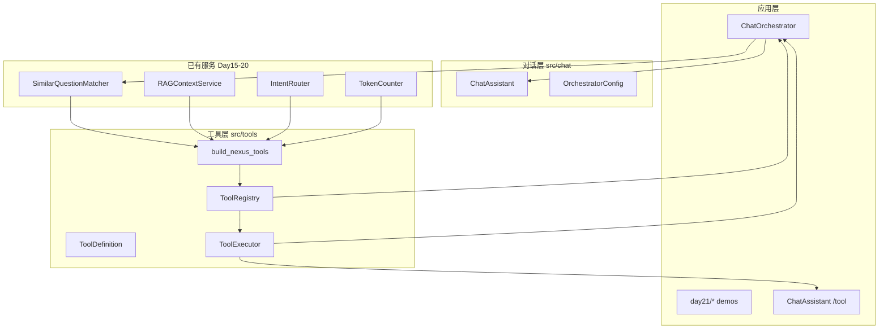
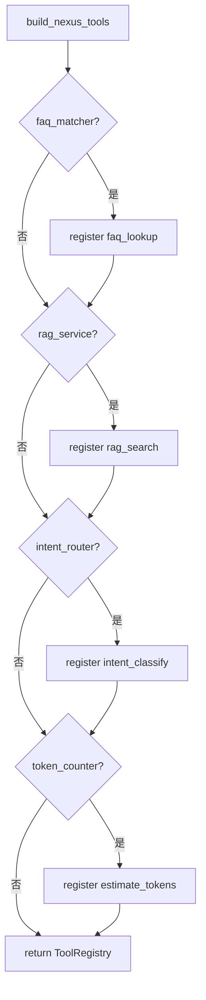
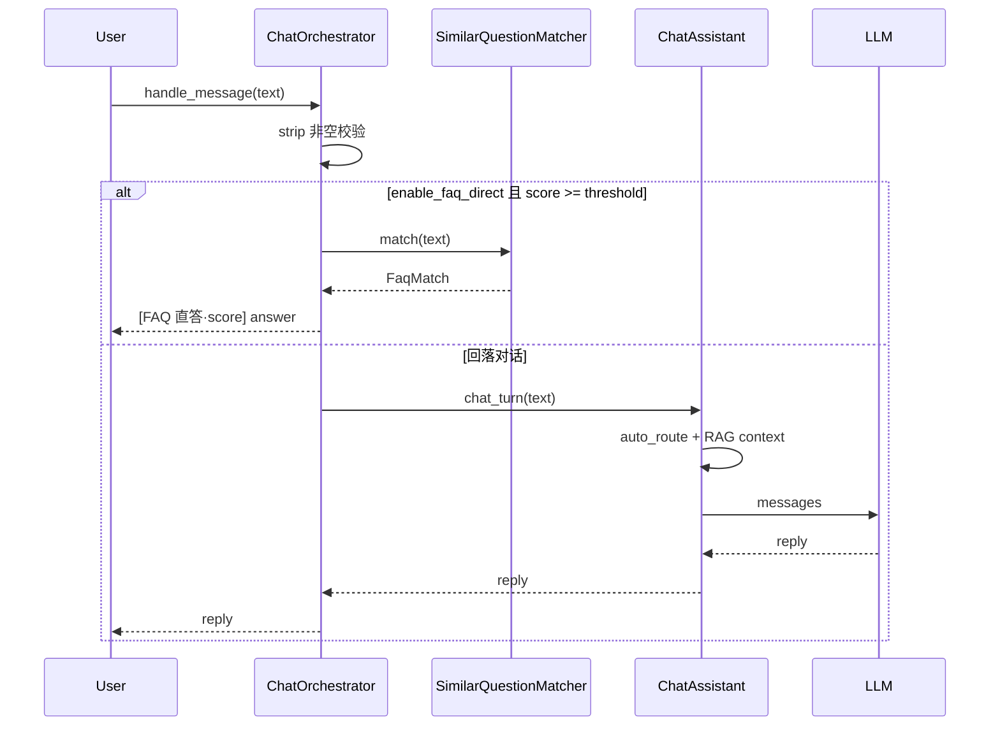
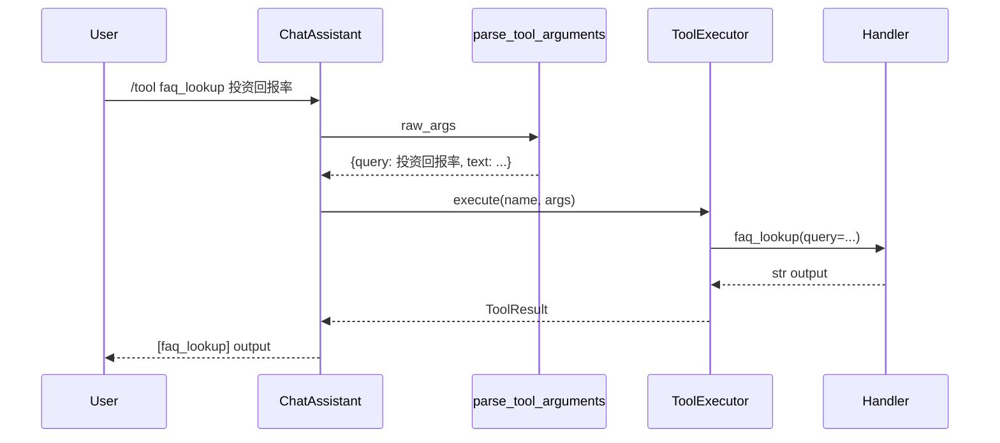
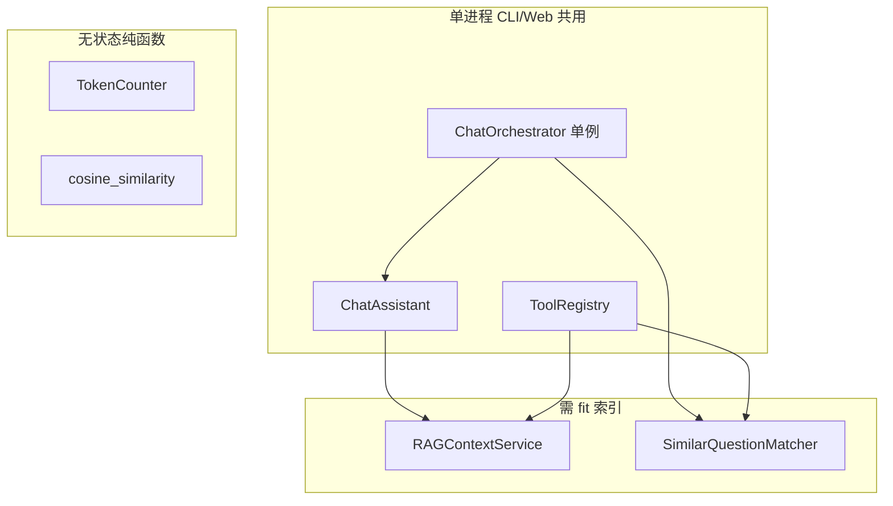

# Day 21 架构设计

**模块**：`src/tools/tool_registry.py`、`executor.py` + `src/chat/orchestrator.py`  
**需求**：ZL-NA-REQ-021

---

## 1. 分层架构

## 2. 核心类与符号

| 符号 | 模块 | 职责 |
|------|------|------|
| `ToolDefinition` | tool_registry.py | 工具元数据 + handler |
| `ToolResult` | tool_registry.py | 执行结果 success/output/error |
| `ToolRegistry` | tool_registry.py | 注册、查询、列表 |
| `build_nexus_tools` | tool_registry.py | 四工具工厂 |
| `parse_tool_arguments` | tool_registry.py | /tool 参数解析 |
| `ToolExecutor` | executor.py | 校验并 invoke handler |
| `OrchestratorConfig` | orchestrator.py | FAQ 阈值与开关 |
| `ChatOrchestrator` | orchestrator.py | 编排 handle_message |
| `/tool` | cli_assistant.py | 显式工具调用命令 |

## 3. build_nexus_tools 注册流

## 4. handle_message 序列图

## 5. /tool 命令流

## 6. 与 Day 20 组件关系

| Day 20 组件 | Day 21 用法 |
|-------------|-------------|
| `SimilarQuestionMatcher` | faq_lookup handler + 编排器 FAQ 直答 |
| `RAGContextService` | rag_search handler + query_context_provider |
| `IntentRouter` | intent_classify + auto_route |
| `/similar` | 仍保留；工具层并行存在 |
| `/retrieve` | 仍保留；rag_search 内部 retrieve_context |

## 7. 扩展点（Day 22+）

1. **HTTP API**：`POST /chat`  body `{"message": "..."}` → `orchestrator.handle_message`  
2. **前端**：静态页 fetch API，展示 FAQ 直答前缀  
3. **流式**：编排器返回后由 API 层套 `streaming` 模块  
4. **LLM FC**：`schemas_for_prompt()` 注入 system，解析 `tool_calls` 调 `ToolExecutor`

## 8. 设计原则

- **单一职责**：Registry 管注册，Executor 管执行，Orchestrator 管策略  
- **依赖注入**：`build_nexus_tools` 按 None 跳过，测试可最小注入  
- **失败友好**：工具层统一 `ToolResult`，不抛到 CLI 顶层  
- **可测性**：`run_quiz_scripted`、`handle_message` 均无副作用可单测

---

## 9. 模块职责边界（智链科技评审纪要）

陈默在架构评审中强调：工具层**不得**包含编排策略，编排层**不得**重复实现 FAQ 匹配逻辑。这意味着 `faq_lookup` 与 `handle_message` 内的 FAQ 直答都调用同一个 `SimilarQuestionMatcher` 实例，只是输出格式与是否继续走 LLM 不同。若未来要在直答后仍将问答写入会话历史，应在 `ChatOrchestrator` 层扩展，而不是在 `ToolExecutor` 内偷偷调用 `assistant.messages.append`。

林晓提问：能否把 `IntentRouter` 也放进 `handle_message` 的第一步？陈默答复：意图分类更适合在 `chat_turn` 内部与模板渲染联动；过早分类会导致「仅想查 FAQ」的短句被误判为 `chitchat` 等意图。今日顺序经过内测验证：FAQ 直答针对**高置信标准问**，其余交给已有 auto_route 管线。

---

## 10. 部署视角组件图

周航补充：CI 环境每次测试构造新的 `from_sample_docs`，避免索引污染；生产环境将复用同一 `RAGContextService` 实例注入编排器，减少重复 fit 开销。

---

## 11. 错误传播策略

| 层级 | 错误类型 | 处理方式 |
|------|----------|----------|
| handler 内 | 业务未命中 | 返回说明字符串，success=True |
| ToolExecutor | 未知工具/参数错误 | ToolResult.success=False |
| ChatAssistant /tool | 解析失败 | 用户可见提示，不崩溃 |
| ChatOrchestrator | 空输入 | 固定文案，不调下游 |
| chat_turn | LLM 异常 | 由 Day 14+ 既有逻辑处理 |

这一表格是林晓在代码走查时的笔记摘要，帮助她理解「为何 execute 吞掉大部分异常」——工具调试场景不允许一条坏命令拖垮整个 REPL 会话。

---

## 12. 与 Day 19–20 RAG 架构的继承关系

Day 19 确立 `DocumentIndex` + `Retriever.search` 接口；Day 20 用 `EmbeddingRetriever` 替换实现；Day 21 **未新增检索算法**，仅将 `retrieve_context` 包装为 `rag_search` 工具。因此架构图上 RAG 层节点与 Day 20 完全相同，应用层多出一个 `tools` 包和 `orchestrator` 模块。这种「薄封装」刻意为之：学员应看到**集成成本远低于发明新算法**。

---

## 13. 配置项全景

| 配置 | 位置 | 影响 |
|------|------|------|
| faq_direct_threshold | OrchestratorConfig | 直答灵敏度 |
| enable_faq_direct | OrchestratorConfig | 直答总开关 |
| enable_auto_route | OrchestratorConfig | 是否强制 auto_route |
| SimilarQuestionMatcher.threshold | 服务构造 | match 是否 None |
| use_embedding | RAGContextService 工厂 | rag_search 检索 backend |
| NEXUS_LLM_MOCK | 环境变量 | 演示与测试是否 mock LLM |

赵岩要求产品文档中明确：运营可调的是编排器阈值与 FAQ 库内容，不应直接改 `ToolDefinition.handler`。

---

## 14. 架构演进路线图（讲师备注）

- **Day 21**：显式工具 + 编排策略  
- **Day 22–24**：HTTP 边界，编排器成为 application service  
- **Day 25+**：LangChain Tool 互操作，对比学习  
- **Day 30+**：LLM 产出 tool_calls，Executor 不变  

学员完成本日架构阅读后，应能在白板画出四层：服务层、工具层、编排层、接口层（CLI/未来 API），并各举两个类名。
