# Day 21 流程图与示意图

**需求**：ZL-NA-REQ-021  
**用途**：课堂投屏、学员笔记配图

---

## 1. 今日总览：周测 + 整合

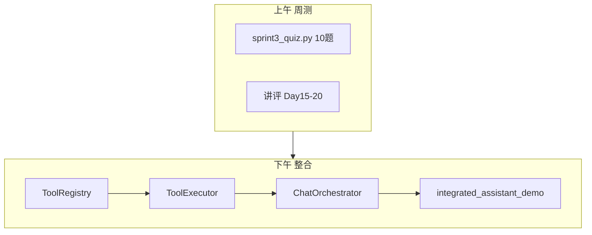

## 2. Sprint 3 能力汇入编排器

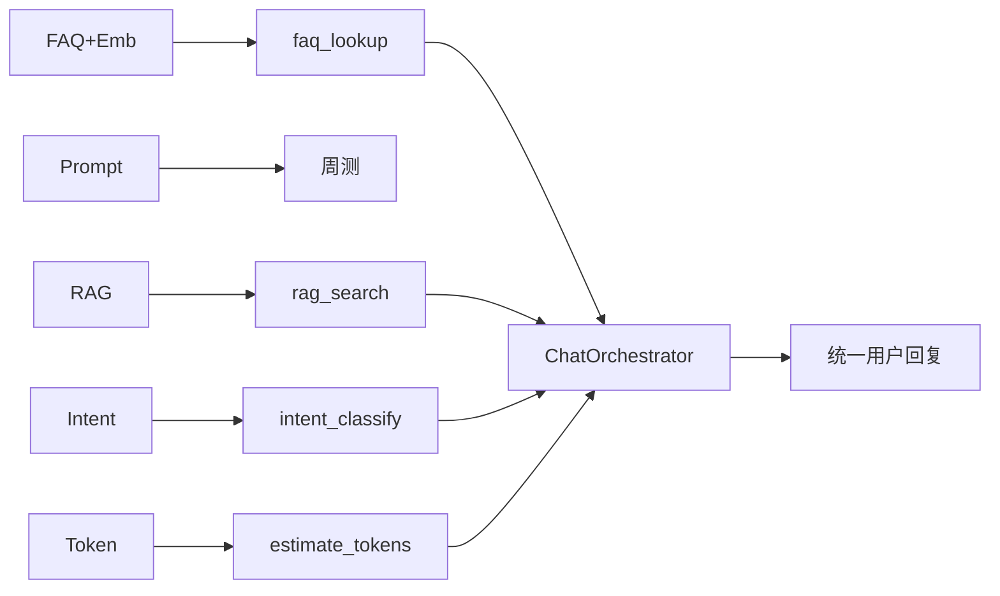

## 3. 用户消息决策树

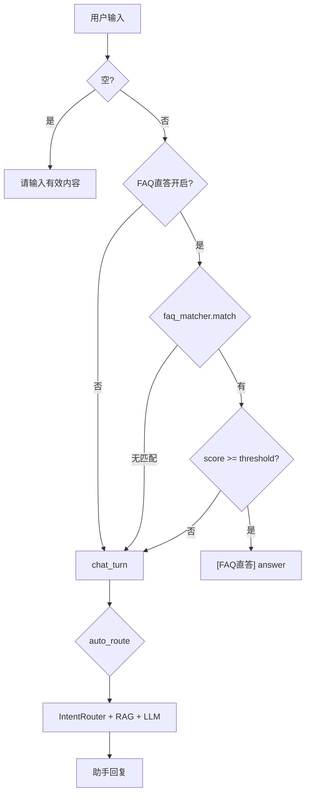

## 4. 四工具与底层服务映射

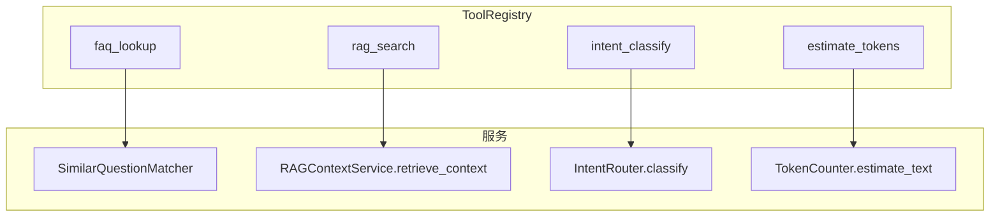

## 5. CLI 命令全景（Sprint 3 累计）

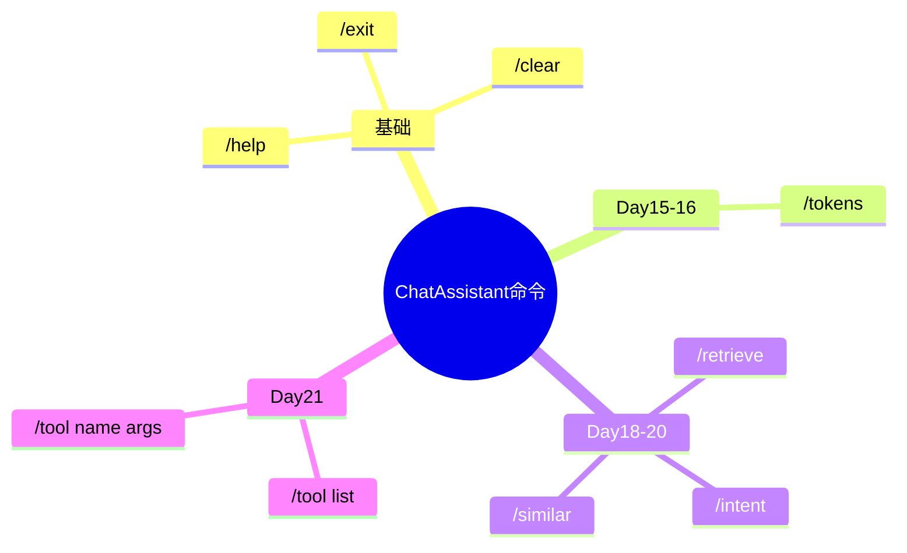

## 6. 测试金字塔

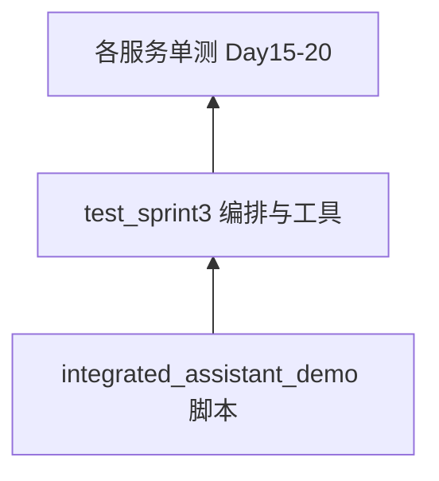

## 7. Day 21 → Day 22 衔接

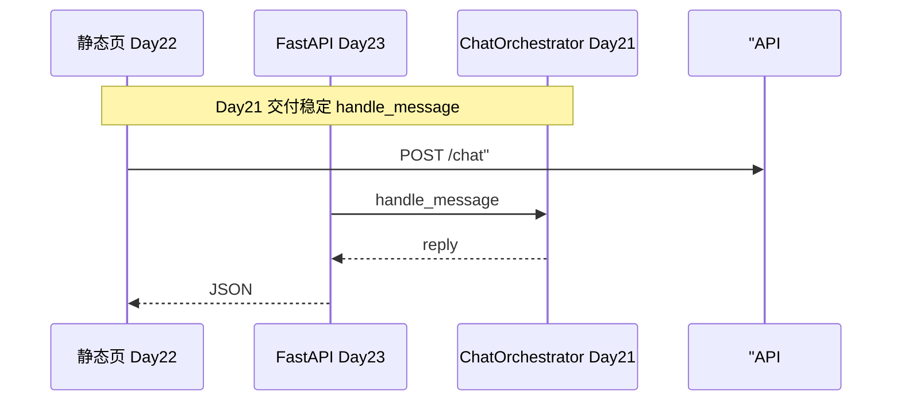

## 8. 周测知识覆盖图

| 题号 | 知识点 | 对应 Day |
|------|--------|----------|
| 1 | Token 估算 | 15 |
| 2 | SSE 流式 | 16 |
| 3 | Prompt ConfigError | 17 |
| 4 | query_context_provider | 18-19 |
| 5 | chunk overlap | 19 |
| 6 | Embedding vs Keyword | 20 |
| 7 | cosine_similarity 范围 | 20 |
| 8 | /similar | 20 |
| 9 | use_embedding | 20 |
| 10 | Day21 整合 | 21 |

---

## 9. 上午周测流程（运营视角）

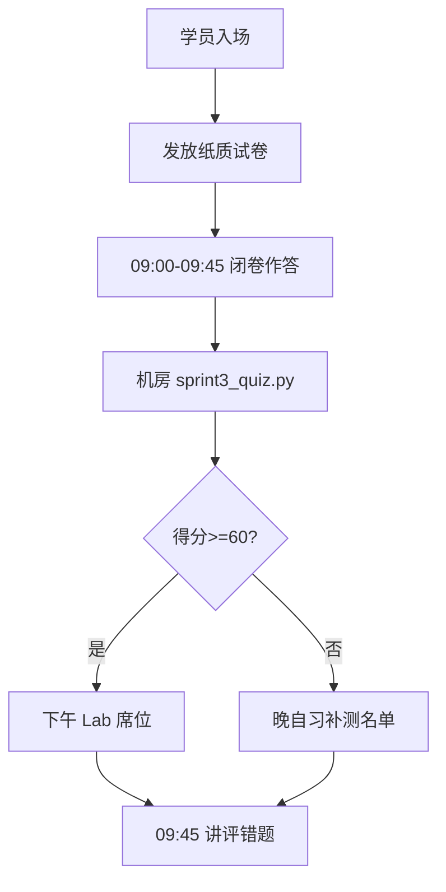

赵岩在流程图旁标注：周测不是为难学员，而是**对齐 Sprint 3 前半程共同语言**。若大量学员第 4、6 题错误，说明 Day 19–20 检索课件需加练，而非加快 Day 22 前端进度。

---

## 10. tool_demos 执行时序

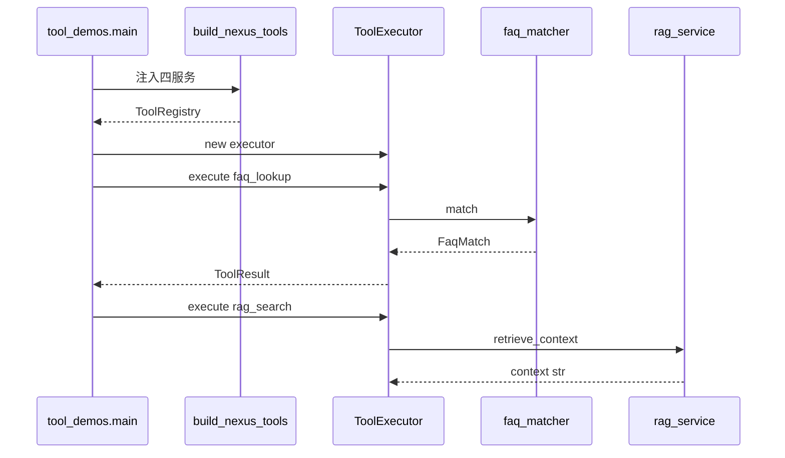

林晓在 Lab 报告中需能手绘此图，标明**哪一步发生 fit 语料**（rag_service 首次 retrieve 时若已 index 则跳过）。

---

## 11. FAQ 直答与工具调用路径对比

| 路径 | 触发 | 调 LLM | 典型前缀 |
|------|------|--------|----------|
| handle_message 直答 | 自然语言 | 否 | [FAQ 直答·] |
| /tool faq_lookup | 命令 | 否 | [faq_lookup] |
| /similar | 命令 | 否 | sim= 摘要 |
| chat_turn | 自然语言 | 是 | 助手正文 |

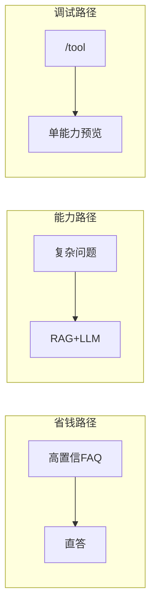

---

## 12. Sprint 3 测试依赖图

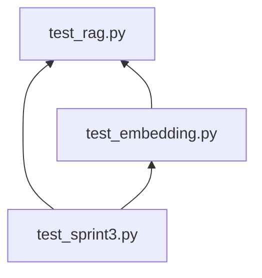

周航要求合并 CI 时按依赖顺序跑；任一日回归失败应阻塞发布。Day 21 测试**不 mock** FAQ 与 RAG 核心逻辑，仅 LLM 走 mock transport。

---

## 13. 智链科技团队沟通图（非技术）

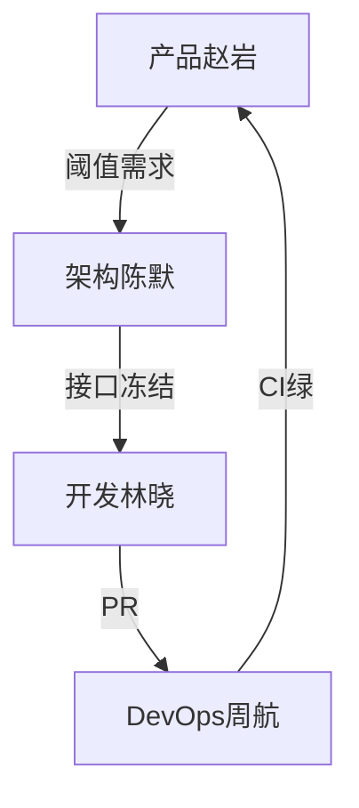

今日站会新增沟通项：`handle_message` 返回字符串格式是否满足客服系统对接——结论：暂保持纯文本，Day 23 再议 JSON 包装。

---

## 14. 学员一日学习时间线

| 时刻 | 活动 | 产出 |
|------|------|------|
| 09:00 | 周测 | 分数 |
| 10:45 | 工具理论 | 笔记 |
| 14:00 | tool_demos | 终端日志 |
| 15:45 | integrated demo | 观察报告 |
| 18:30 | 晚自习 pytest | 12 passed |

此时间线供讲师控制节奏；若周测超时，压缩 10:45 理论，保证下午上机不少于 120 分钟。
