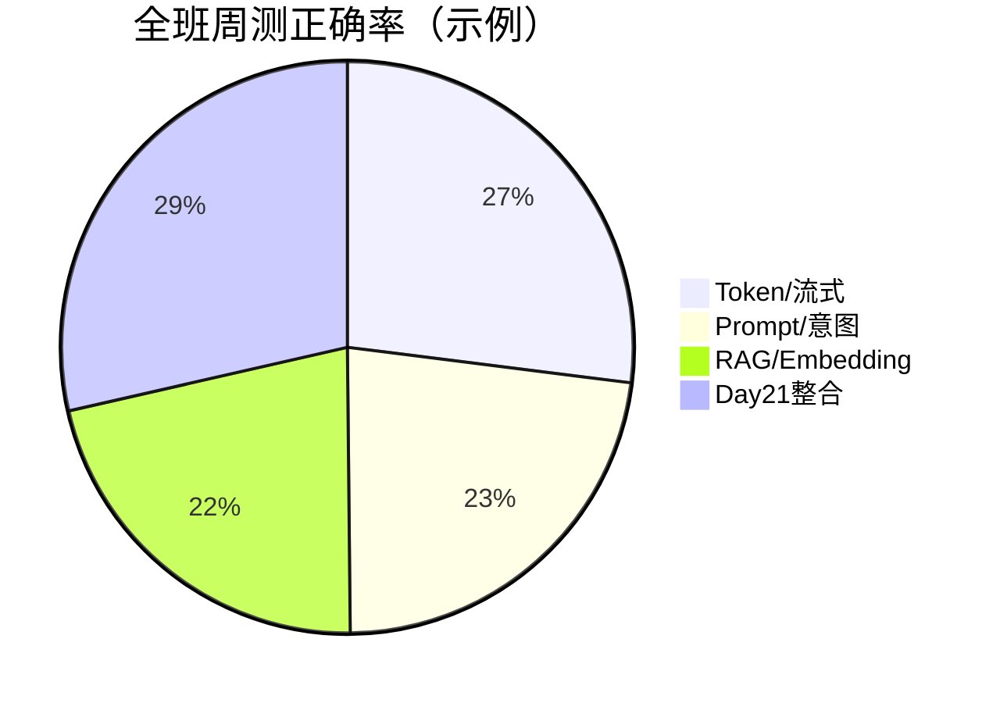

# Day 21 课堂笔记（上午）

**讲师**：陈默  
**记录**：林晓  
**时段**：09:00–12:00

---

## 09:00–09:45 | Sprint 3 周测

### 赵岩开场

- 周测形式：纸质 10 题 + 机房 `sprint3_quiz.py` 对照  
- 及格线 60 分，满分者下午优先实操席位  
- 覆盖 Day 15–20，第 10 题预告今日整合主题

### 周测高频错题（讲评 09:45）

| 题号 | 易错项 | 正确理解 |
|------|--------|----------|
| 3 | 选 ValueError | 项目用 `ConfigError` 表示模板变量缺失 |
| 4 | 选 context_provider | rag_qa 需 `query_context_provider(query)` 动态检索 |
| 6 | 选「更快」 | Embedding 优势是**同义语义召回** |
| 9 | 选 KeywordRetriever | `use_embedding=True` 注入 EmbeddingRetriever |



---

## 09:45–10:30 | Sprint 3 回顾

### sprint3_review.py 输出解读

```
Day 15: Token 计算器 token_counter
Day 16: 流式输出 streaming
...
Day 21: 工具编排 ChatOrchestrator ← 今日
```

**陈默要点**：前六天是**纵向能力**，今日是**横向串联**。不要重复实现 FAQ，而是 `build_nexus_tools` 包装已有服务。

---

## 10:45–12:00 | ToolRegistry 走读

### ToolDefinition 结构

```python
@dataclass
class ToolDefinition:
    name: str
    description: str
    parameters: dict[str, Any]  # JSON Schema 风格
    handler: ToolHandler        # Callable[..., str]
```

### faq_lookup handler 逻辑

1. `faq_matcher.match(query)`  
2. 无 match → 返回「未匹配到 FAQ」  
3. 有 match → `summary() + answer`  

### 课堂提问

**林晓**：为何 handler 返回 str 而不是 dict？  
**陈默**：与 LLM tool result 对齐，便于拼进对话；结构化可 JSON.dumps 放进 str。

### build_nexus_tools 条件注册

- 只传 `faq_matcher` → 仅 `faq_lookup`  
- 四依赖齐全 → 四工具，对应 `test_build_nexus_tools_registers_four`

---

## 上午小结

| 时间 | 产出 |
|------|------|
| 09:00-09:45 | 周测完成 |
| 09:45-10:30 | 薄弱点回顾 |
| 10:45-12:00 | 理解 ToolRegistry 与四工具 |

**林晓笔记**：周测第 4 题 query_context_provider 是 RAG 按问检索的关键；下午学 Executor 和 /tool。
---

## 附录：上午答疑逐字录（节选）

学员甲：周测能带小抄吗？  
赵岩：纸质笔记可以，电脑不行。  

学员乙：build_nexus_tools 能注册第五个吗？  
陈默：可以，作业 F 就是设计第五工具。  

学员丙：FAQ 直答会记进对话历史吗？  
陈默：Day 21 默认不记，技术债已登记。  

学员丁：intent_classify 会调 LLM 吗？  
陈默：不会，规则+模板路由。  

林晓：我第十题对了但前面错不少。  
赵岩：下午 Lab 帮你看代码，概念补在 10_ 附录 A。  

## 上午关键词闪卡复习

Token、SSE、ConfigError、query_context_provider、overlap、EmbeddingRetriever、cosine、SimilarQuestionMatcher、ChatOrchestrator、ToolRegistry。十词覆盖周测考点。

## 陈默白板照片文字还原（示意）

服务层 FAQ/RAG/Intent/Token → build_nexus_tools → ToolRegistry → ToolExecutor；用户 → ChatOrchestrator → FAQ? → ChatAssistant → LLM。
