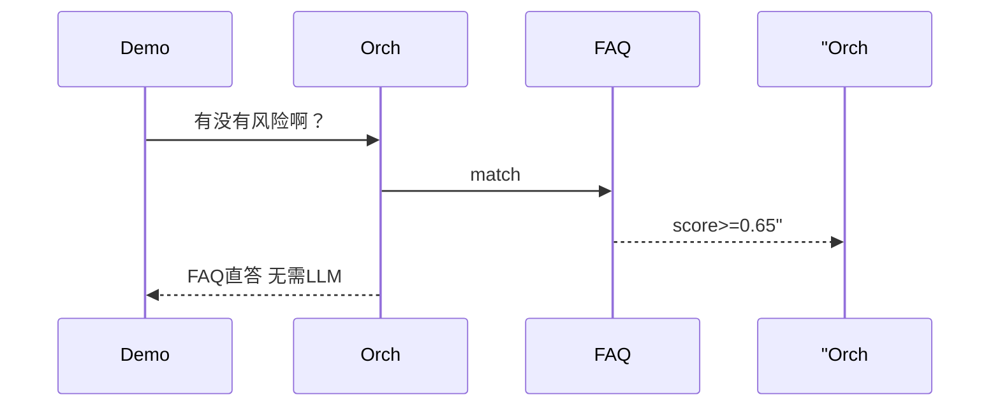

# Day 21 课堂笔记（下午）

**讲师**：陈默  
**记录**：林晓  
**时段**：14:00–17:00

---

## 14:00–15:30 | ToolExecutor 与 /tool

### execute 三步

1. `registry.get(name)` — 无则失败  
2. `_invoke(tool, args)` — 过滤参数、校验 required  
3. 捕获异常 → `ToolResult(success=False, error=...)`

### query/text 互用

```python
# /tool faq_lookup 投资回报率
# parse_tool_arguments → {"query": "投资回报率", "text": "投资回报率"}
# _invoke 缺 query 时从 text 补
```

### 实操：tool_demos.py

林晓运行四组 demo：

| 工具 | 参数 | 观察 |
|------|------|------|
| faq_lookup | 投资回报率怎么算 | 含 sim 与年化收益答案 |
| rag_search | 年化收益率, top_k=2 | context 多片段 |
| intent_classify | 请审阅宣传语是否合规 | doc_summary 等意图 |
| estimate_tokens | 智链科技 NexusAgent 测试 | 约 N tokens |

### /tool 命令语法

```
/tool list
/tool faq_lookup 客服电话
/tool rag_search {"query":"风险","top_k":1}
/tool intent_classify 总结要点
```

**未启用**：`ChatAssistant` 未传 `tool_registry` → 「工具调用未启用」

---

## 15:45–17:00 | ChatOrchestrator 整合

### OrchestratorConfig

| 字段 | 默认 | 含义 |
|------|------|------|
| faq_direct_threshold | 0.65 | FAQ 直答最低分 |
| enable_faq_direct | True | 是否尝试直答 |
| enable_auto_route | True | 是否 chat_turn 时 auto_route |

### handle_message 源码走读

```python
if self.config.enable_faq_direct and self.faq_matcher:
    match = self.faq_matcher.match(user_text)
    if match and match.score >= self.config.faq_direct_threshold:
        return f"[FAQ 直答·{match.score:.0%}] {match.entry.answer}"
return self.assistant.chat_turn(user_text)
```

### integrated_assistant_demo 脚本

| 步骤 | 输入 | 预期 |
|------|------|------|
| 1 | /tool list | 四工具列表 |
| 2 | /tool faq_lookup 投资回报率 | [faq_lookup] 摘要 |
| 3 | 有没有风险啊？ | [FAQ 直答·xx%] 风险相关 |
| 4 | 根据资料，年化收益率是多少？ | 路由 + LLM 或 context |



---

## 下午 Lab 检查点

- [ ] `test_tool_executor_unknown_tool` 理解未知工具失败路径  
- [ ] `test_orchestrator_faq_direct` 阈值 0.5 可触发直答  
- [ ] `test_orchestrator_fallback_to_llm` 高 threshold FAQ 走 LLM  
- [ ] pytest 12 passed  

---

## 站会收尾

**赵岩**：明日 Day 22 前端速成，静态页先 mock，Day 23 接 API。  
**林晓**：今日最大收获是编排顺序——先便宜 FAQ，再贵 LLM。
---

## 附录：下午 Lab 巡场记录

14:12 三组 PYTHONPATH 未 export，已纠正。  
14:35 林晓组率先跑通 tool_demos 四工具。  
15:02 争论 /tool JSON 里单引号非法，统一双引号。  
15:40 integrated_assistant_demo FAQ 直答全场鼓掌。  
16:20 五个组 pytest 12 passed。  
16:50 赵岩宣布 Day 22 带笔记本电脑装浏览器即可，无需 Node。

## 下午核心代码片段背诵

handle_message 三行：strip、FAQ 直答判断、chat_turn。ToolExecutor.execute：get、invoke、ToolResult。/tool：list、split、parse、execute。

## 林晓下午心得

「以前觉得工具调用很高深，今天发现就是给函数起个名加描述。编排器才是产品灵魂。」
