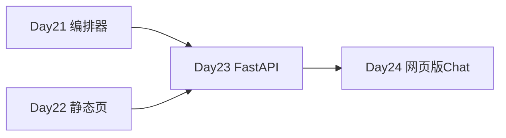

# Day 21 晚自习

**时间**：18:30–20:30  
**地点**：机房 / 线上  
**助教**：值班答疑

---

## 自习任务（按优先级）

### 必做（约 90 分钟）

1. **重跑周测**  
   ```bash
   python3 src/day21/sprint3_quiz.py
   ```  
   目标 ≥ 80 分；低于 60 对照 [10_Sprint3周测题库.md](10_Sprint3周测题库.md) 重修。

2. **精读 test_sprint3.py**  
   12 条测试各对应哪段源码？在笔记中写一行映射。

3. **/custom 实验**  
   在 Python REPL 中：
   ```python
   from tools import build_nexus_tools, ToolExecutor
   from services import SimilarQuestionMatcher
   reg = build_nexus_tools(faq_matcher=SimilarQuestionMatcher())
   ex = ToolExecutor(reg)
   print(ex.execute("faq_lookup", {"query": "如何联系客服"}).summary())
   ```

### 选做（约 60 分钟）

4. 调整 `OrchestratorConfig(faq_direct_threshold=0.99)`，观察「有没有风险」是否仍直答。  
5. 阅读 [22_ChatOrchestrator深度讲义.md](22_ChatOrchestrator深度讲义.md) 前两节。  
6. 预习 [27_Day22前端速成预习.md](27_Day22前端速成预习.md)。

---

## 答疑 FAQ（晚自习版）

**Q：FAQ 直答和 /tool faq_lookup 有什么区别？**  
A：直答在 `handle_message` 入口，高置信直接返回答案前缀 `[FAQ 直答·]`；`/tool` 是调试命令，输出 `[faq_lookup]` 前缀，不调 LLM。两者都用 `SimilarQuestionMatcher`。

**Q：编排器会自动调工具吗？**  
A：Day 21 不会。工具由 `/tool` 显式触发，或你写代码 `orchestrator.run_tool`。LLM 自动 tool_calls 是后续课程。

**Q：周测 --scripted 为何总 100 分？**  
A：默认 `answers=[q["answer"] for q in QUESTIONS]`，测的是评分逻辑；`test_sprint3_quiz_scripted_fail` 用全 3 确保 0 分。

---

## 自习环境检查

```bash
cd nexus-agent-platform
export PYTHONPATH=src
export NEXUS_LLM_MOCK=1
python3 -m pytest tests/day21/test_sprint3.py -v --tb=short
```

全部 passed 方可签退。

---

## 明日预习提醒

| 项 | 内容 |
|----|------|
| Day 22 主题 | 前端速成 / 静态聊天页面 |
| 目录 | `frontend/` |
| 准备 | 浏览器 DevTools、基础 HTML/CSS/JS |



---

## 签到与反馈

- 晚自习签到码：NA-D21-EVENING  
- 反馈表单：今日难度 1–5 星，工具层 vs 编排层哪个更难

---
## 补充阅读：Sprint 3 工具整合问答集（智链科技培训组）

**问**：Day 21 与 OpenAI Assistants API 的 tools 有何异同？  
**答**：同为工具 schema + 执行器模式；Assistants 由平台托管线程与运行，NexusAgent Day 21 是本地教学实现，不依赖外网 Assistants。

**问**：为何 ChatAssistant 已有 auto_route 还要 Orchestrator？  
**答**：auto_route 是单轮对话内路由；Orchestrator 在对话入口前增加 FAQ 直答策略，并冻结为 Web API 门面。

**问**：build_nexus_tools 返回可变注册表吗？  
**答**：返回新 ToolRegistry 实例；可继续 register 第五工具，但生产建议工厂函数扩展而非散落 register。

**问**：SimilarQuestionMatcher 与 EmbeddingRetriever 都用 embedding，会重复 fit 吗？  
**答**：各自维护客户端与语料，Day 21 未做全局共享；优化留待后续。

**问**：周测程序版与纸质版分数以哪个为准？  
**答**：以程序版录入系统；纸质用于课堂氛围，差异由讲师人工复核。

**问**：integrated_assistant_demo 第四条为何走编排器？  
**答**：「根据资料查询收益率」触发 rag_qa 与 LLM，非 FAQ 直答，展示 fallback 路径。

**问**：test_assistant_tool_execute 为何断言 doc_summary 或意图？  
**答**：「总结要点」类问句意图分类结果依模板库版本可能含 doc_summary 或中文「意图」摘要。

**问**：Day 22 是否必须会 JavaScript？  
**答**：需基础 DOM 操作与 fetch 概念；无框架要求。

**问**：智链科技为何选周日做周测？  
**答**：Sprint 排期 2026-07-26 为周日， fictional 企业日历，强调冲刺节奏。

**问**：课件中 mermaid 图渲染失败怎么办？  
**答**：用 GitHub 或支持 mermaid 的 Markdown 预览；文字流程图见 04_。

**问**：REQ-021 与 REQ-020 依赖关系？  
**答**：021 依赖 020 的 FAQ 与 Embedding RAG；020 依赖 019 RAG 基座。

**问**：学员代表林晓是否对应真人？  
**答**：合成角色，代表典型优秀学员成长弧。

**问**：四工具描述为何用中文？  
**答**：运营与学员母语文档；代码 identifier 仍英文。

**问**：handle_message 线程安全吗？  
**答**：Day 21 未保证；多线程应每线程独立 assistant。

**问**：完课标志是什么？  
**答**：作业 A–E 提交 + pytest 12 passed + 周测≥60。

以上十五问答可作为晚自习快问快答素材，讲师可随机抽题计分。
