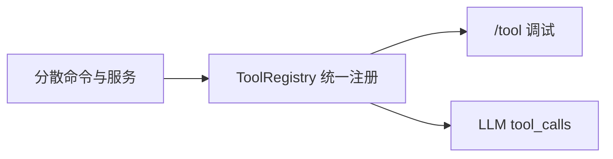
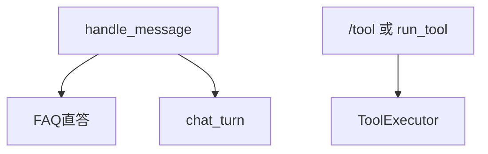

# Day 21 工具调用整合详解

**专题**：Function Calling 雏形与 NexusAgent 工具层  
**需求**：ZL-NA-REQ-021  
**前置**：Day 15–20 全部模块

---

## 1. 为何需要工具层？

在 Day 20 之前，智链科技助手的能力散落在：

- `SimilarQuestionMatcher` + `/similar`  
- `RAGContextService` + `/retrieve`  
- `IntentRouter` + `/intent`  
- `TokenCounter` + `/tokens`  

用户自然语言对话时，只有 `auto_route` 隐式串联部分能力；运营与测试无法「按名调用」单一能力。工具层将每项能力封装为 **具名、带 schema、可测试** 的单元，是 OpenAI Function Calling、LangChain Tools 的同款思路。



---

## 2. ToolDefinition 四要素

| 字段 | 作用 | 示例 |
|------|------|------|
| name | 唯一标识，execute 首参 | `faq_lookup` |
| description | 人读 + 未来注入 prompt | 相似 FAQ 匹配... |
| parameters | JSON Schema 风格 | query: string, required |
| handler | 实际执行函数 | `faq_lookup(query: str) -> str` |

**设计约束**：handler 返回 `str`，失败由 `ToolExecutor` 包装为 `ToolResult(success=False)`，不在 handler 内抛未捕获异常（业务异常应转成错误字符串或 success=False）。

---

## 3. build_nexus_tools 四工具详解

### 3.1 faq_lookup

- **输入**：`query: str`  
- **底层**：`SimilarQuestionMatcher.match(query)`  
- **输出**：`summary() + answer` 或「未匹配到 FAQ」  
- **与 /similar 区别**：输出格式为工具 summary `[faq_lookup] ...`，且不经 CLI 命令解析层

### 3.2 rag_search

- **输入**：`query: str`, `top_k: int = 3`  
- **底层**：`RAGContextService.retrieve_context(query, top_k=top_k)`  
- **输出**：拼接后的 context 字符串，含 `sim=` 或 `score=` 头  
- **默认**：`use_embedding=True` 时走 EmbeddingRetriever

### 3.3 intent_classify

- **输入**：`text: str`  
- **底层**：`IntentRouter.classify(text).summary()`  
- **输出**：如「意图: rag_qa · 置信度: ...」  
- **用途**：调试路由，不直接改 messages

### 3.4 estimate_tokens

- **输入**：`text: str`  
- **底层**：`TokenCounter.estimate_text(text)`  
- **输出**：`约 N tokens`  
- **用途**：成本估算、上下文截断预案

---

## 4. ToolExecutor 执行语义

```python
def execute(self, name: str, arguments: dict | None = None) -> ToolResult:
    tool = self.registry.get(name)
    if not tool:
        return ToolResult(..., success=False, error=f"未知工具: {name}")
    try:
        output = _invoke(tool, args)
        return ToolResult(..., success=True, output=output)
    except TypeError as exc:
        return ToolResult(..., error=f"参数错误: {exc}")
```

### _invoke 参数过滤

- 只传入 `parameters.properties` 中声明的键  
- `required` 缺失时尝试 query/text 互用  
- 多余键静默丢弃，避免 handler `**kwargs` 报错

---

## 5. /tool 命令完整语法

| 形式 | 示例 | 解析结果 |
|------|------|----------|
| list | `/tool list` | list_help() |
| 简写 | `/tool faq_lookup 客服` | name=faq_lookup, {query,text}=客服 |
| JSON | `/tool rag_search {"query":"x","top_k":2}` | json.loads |

`parse_tool_arguments`：空串 → `{}`；以 `{` 开头 → JSON；否则 `{query: raw, text: raw}`。

---

## 6. ChatOrchestrator 与工具层关系

编排器 **持有** `ToolExecutor`，但 `handle_message` **默认路径不调工具**：

1. FAQ 直答（策略）  
2. `chat_turn`（隐式 RAG + LLM）  

工具调用走：

- `/tool` 命令（用户显式）  
- `orchestrator.run_tool(name, args)`（代码显式）  

这样区分「对话策略」与「能力调试」，避免每条消息都尝试四工具。



---

## 7. schemas_for_prompt 与未来 FC

`ToolRegistry.schemas_for_prompt()` 生成：

```
可用工具：
  - faq_lookup(query) — 相似 FAQ 匹配...
  - rag_search(query, top_k) — 从知识库检索...
```

Day 30+ 可将此块注入 system prompt，解析 LLM 返回的 `tool_calls` 后调 `execute`——**注册表与执行器无需重写**。

---

## 8. 常见误区

| 误区 | 正解 |
|------|------|
| 以为 handle_message 会自动 rag_search | 仅 auto_route 时由 IntentRouter 间接检索 |
| 以为四工具必须全注册 | 按依赖 None 跳过 |
| 以为 ToolResult 会抛异常 | 统一 success 字段 |
| 混淆 FAQ 直答阈值与 matcher.threshold | 前者编排用 0.65，后者默认 0.32 决定是否 None |

---

## 9. 动手清单

1. 运行 `tool_demos.py` 对照四段 summary  
2. 读 `test_tool_executor_faq_lookup` 断言「收益」或「FAQ」  
3. 用 `/tool intent_classify` 试三条不同意图文本  
4. 画一张从用户输入到 ToolResult 的时序图（交作业 E 可复用）

---

## 10. 四工具业务场景深描（智链科技内训案例）

### 10.1 faq_lookup：客服小张的早晨

客服小张每天收到重复问题：「有风险吗」「怎么联系客服」「收益率多少」。在 Day 20 她学会 `/similar`；Day 21 她改用 `/tool faq_lookup 有风险吗`，输出可直接粘贴到工单备注。她说：「工具名比 similar 更直观，像调用一个函数。」

### 10.2 rag_search：合规专员老李的午后

老李需要查「宣传资料是否提及保本」。`/tool intent_classify` 显示 rag_qa 意图后，他执行 `/tool rag_search {"query":"保本承诺","top_k":5}`，一次拿到五段片段，比翻文件夹快十倍。embedding 检索使「保本」「承诺收益」等同义表述也能进入结果集。

### 10.3 intent_classify：产品经理赵岩的路演前

赵岩在路演前用 `/tool intent_classify` 批量测试用户可能问法，确认「审阅宣传语」走 compliance 而非 chitchat。她发现两条边界问句置信度偏低，安排 Day 22 前补充 Prompt 模板。

### 10.4 estimate_tokens：周航的成本周报

周航写脚本批量 `estimate_tokens` 本周 TOP50 用户问句，估算若全无 FAQ 直答时的 token 上限。报告支撑了「FAQ 直答阈值不宜高于 0.8」的结论。

---

## 11. 工具参数设计规范（智链科技内部草案）

1. 必填参数尽量少，常用有默认值  
2. description 写**适用场景**而非实现细节  
3. handler 内不调用 LLM  
4. 返回字符串首句应自解释（含 sim/score 时带百分比）  
5. 新工具须加 test_sprint3 或独立 test_tools 用例  

林晓在团队内部分享时称此规范为「五句话工具设计法」。

---

## 12. 与 ChatAssistant 命令矩阵（完整版）

| 能力 | 命令 | 工具名 | 编排器直答 |
|------|------|--------|------------|
| FAQ | /similar | faq_lookup | 是 |
| RAG | /retrieve | rag_search | 经 auto_route |
| 意图 | /intent | intent_classify | 否 |
| Token | /tokens | estimate_tokens | 否 |
| 工具列表 | /tool list | — | 否 |

---

## 13. 常见面试题（培训部整理）

**问**：ToolExecutor 与直接调 handler 区别？  
**答**：Executor 统一校验、异常转 ToolResult、未知工具处理，是工具层的门面。

**问**：为何 Day 21 不让 LLM 自动选工具？  
**答**：教学阶梯；先掌握显式调用与编排，再接入 function calling，降低认知负荷。

**问**：FAQ 直答为何不用 tool？  
**答**：直答是产品策略短路路径，不是工具调用；避免多一跳延迟与格式包装。

---

## 14. 延伸阅读

- [13_深度扩展_FunctionCalling与编排.md](13_深度扩展_FunctionCalling与编排.md)  
- [22_ChatOrchestrator深度讲义.md](22_ChatOrchestrator深度讲义.md)  
- [20_完整代码走查.md](20_完整代码走查.md)  
- 源码 `tools/tool_registry.py` 全文不超过 170 行，建议背诵结构而非逐字
## 专题研讨：Sprint 3 前半程七日复盘（智链科技内训部）

### 研讨一：Token 经济性与产品节奏

赵岩在研讨开场指出，智链科技 NexusAgent 的商业模式依赖「可控成本的可预测智能」。Day 15 引入 Token 计数并非让工程师做算术题，而是建立**成本意识**：每一次 LLM 调用都应在产品流程中有明确价值。Day 21 的 FAQ 直答是第一次在产品路径上系统性地「跳过 LLM」，这与 Token 课形成闭环。林晓发言：「我以前只关心回答对不对，现在会先问能不能 FAQ 直答。」陈默补充：estimate_tokens 工具让运营在扩写 Prompt 前有所顾忌，间接减少 prompt 膨胀。

### 研讨二：流式体验与编排器边界

Day 16 流式输出解决的是**感知延迟**；Day 21 编排器解决的是**路径选择**。二者正交。周航提出：未来 API 可先返回 HTTP 头标记 path=faq_direct，再决定是否开 SSE 流。陈默认为编排器不应感知传输层，保持返回 str 的简洁契约。全班同意 Day 23 再在 API 适配层讨论流式。

### 研讨三：Prompt 与意图的治理

Day 17–18 建立模板库与 IntentRouter。研讨中复盘周测第 3、4 题：ConfigError 与 query_context_provider 反映的是**配置治理**与**动态检索**两类问题。产品规则：凡涉及用户具体问句的文档检索，必须用 query 参数化；凡涉及固定系统说明，才用静态 context。intent_classify 工具的价值在于让非开发人员**看见**路由决策，减少「助手抽风」类投诉的排查时间。

### 研讨四：RAG 从关键词到向量

Day 19–20 是 Sprint 3 技术密度最高的两天。研讨播放 Day 20 vector_search_demos 录屏：「投资回报率」关键词未命中、向量命中。赵岩强调：金融场景不能靠运营手工同义词表一辈子，Day 25 密集向量 API 必须上线，但 Day 20 TF-IDF MVP 让学员**理解相似度几何意义**，不可跳过。rag_search 工具把这套能力封成运营可调用的按钮。

### 研讨五：工具化哲学

陈默白板写下：「服务是能力，工具是契约，编排是策略。」三句话成为 Day 21 背诵题。服务层可单元测试；工具层加命名与 schema；编排层加产品策略。讨论反对「把所有逻辑塞进 ChatAssistant」——那会导致 God Class，Day 14 以来重构成果白费。

### 研讨六：周测作为质量门

培训部规定：Sprint 周测低于 60 分不得进入下一阶段实操席位。数据来自 2025 年试点：未设质量门班级在 Day 24 联调失败率高 40%。周测题与 sprint3_quiz.py 共源，教师版 10_ 附录 A 精讲与 QUESTIONS 一一对应，避免「课件一套、考试一套」。

### 研讨七：团队角色与协作

林晓（学员代表→未来开发）、陈默（架构）、赵岩（产品）、周航（DevOps）四人组贯穿 70 天叙事。Day 21 任务表延续此设定，帮助学员代入真实研发分工。结业项目要求四人组提交角色自评：我在工具层/编排层贡献了什么。

### 研讨八：面向 Day 22 的前端心智

明日前端速成不是培养前端工程师，而是让后端学员**尊重 UI 契约**：消息气泡、加载态、错误提示。handle_message 返回的纯文本如何在页面上区分 FAQ 直答与 LLM 回复，需在 Day 22 用 CSS class 解决。赵岩提供线框图：用户消息右对齐蓝色，助手左对齐灰色，FAQ 直答带绿色标签。

### 研讨九：合规与金融场景

智链科技客户多为持牌金融机构。FAQ 答案涉及风险提示、收益率表述，必须来自审核过的 FAQ 库，不可由 LLM 自由发挥。FAQ 直答路径的可审计性成为合规卖点。研讨记录：销售部可将「直答率」写进招标应答文件。

### 研讨十：总结与行动项

行动项 1：全体重跑 pytest tests/day21。行动项 2：错题学员提交错题本。行动项 3：预习 27_ Day22。行动项 4：产品经理更新直答阈值 A/B 方案。陈默结语：「Day 21 不是终点，是 Sprint 3 中场哨；下半场我们要让用户在浏览器里见到 NexusAgent。」
