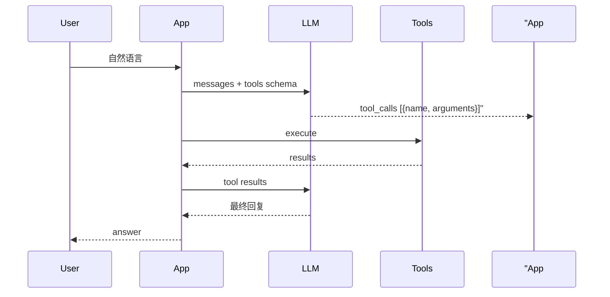

# Day 21 深度扩展：Function Calling 与多步编排

**定位**：超越 Day 21 MVP，预习 Phase 3 工具生态  
**读者**：学有余力者、架构方向学员

---

## 1. Function Calling 产业图景

大模型工具调用典型链路：



NexusAgent Day 21 实现了 **Tools** 与 **execute**，尚未让 **LLM** 产出 `tool_calls`。这是刻意的教学阶梯。

---

## 2. JSON Schema 与 parameters

`ToolDefinition.parameters` 遵循 OpenAI tools 子集：

```json
{
  "type": "object",
  "properties": {
    "query": {"type": "string", "description": "用户问题"},
    "top_k": {"type": "integer", "default": 3}
  },
  "required": ["query"]
}
```

扩展方向：

- `enum` 约束意图名  
- `minimum` / `maximum` 约束 top_k  
- 嵌套 `object` 支持多字段检索过滤器  

---

## 3. 多工具并行与串行

### 串行（Day 21 演示）

先 `intent_classify` 再 `rag_search` — 人工在脚本里写两步 execute。

### 并行（概念）

用户问「这问题该查 FAQ 还是 RAG？」可并行：

```text
faq_lookup(query)  ─┐
rag_search(query)  ─┼→ 合并结果 → LLM 总结
```

注意：并行需定义冲突策略（FAQ 命中是否覆盖 RAG）。

---

## 4. 编排模式对比

| 模式 | 代表 | Day 21 |
|------|------|--------|
| 路由优先 | ChatOrchestrator FAQ 直答 | ✅ |
| 显式命令 | /tool | ✅ |
| ReAct 循环 | LLM 思考-行动-观察 | ❌ 后续 |
| Plan-and-Execute | 先规划工具序列 | ❌ 后续 |

---

## 5. 安全与治理

工具层上线生产需考虑：

- **权限**：`rag_search` 是否过滤敏感文档  
- **限流**：`estimate_tokens` 防滥用  
- **审计**：记录 `ToolResult` 到日志  
- **沙箱**：禁止任意代码执行类工具  

智链科技合规场景：`intent_classify` 对「宣传语审阅」路由到人工审核模板。

---

## 6. 与 LangChain Tools 对照

| NexusAgent | LangChain |
|------------|-----------|
| ToolDefinition | StructuredTool |
| ToolRegistry | Tool list |
| ToolExecutor.invoke | tool.run |
| build_nexus_tools | @tool 装饰器集合 |

学完 Day 25 LangChain 后可做迁移实验，比较注册方式差异。

---

## 7. 推荐阅读

- OpenAI Tools 文档：function calling 格式  
- 项目源码：`tools/tool_registry.py` 全文  
- Day 21 作业 F：自定义第五工具设计  

---

## 8. 思考题

1. 若 LLM 一次返回两个 tool_calls，Executor 应串行还是并行？  
2. FAQ 直答阈值 0.65 与工具层 faq_lookup 同时存在，如何避免用户看到重复答案？  
3. `schemas_for_prompt` 工具过多时如何压缩 token？（提示：按意图过滤工具子集）
---

## 9. 主流框架工具调用对比表（扩展）

| 框架 | 注册方式 | 执行方式 | Day21 对应 |
|------|----------|----------|------------|
| NexusAgent | ToolDefinition | ToolExecutor | 本日 |
| OpenAI | tools param | client 回调 | Day30+ |
| LangChain | @tool | AgentExecutor | Day25 |
| LlamaIndex | FunctionTool | query engine | Day35 |

## 10. 安全沙箱讨论

禁止注册任意 exec/eval 类工具。智链科技安全红线：工具 handler 仅只读查询 FAQ/RAG/分类/计数。写操作须单独审批。

## 11. 多租户场景

SaaS 下每租户独立 ToolRegistry 还是共享？架构倾向：共享只读服务实例，租户级 FAQ 库与文档索引隔离；registry 可按租户缓存。

## 12. 观测：分布式追踪

OpenTelemetry span：orchestrator.handle_message → faq.match / assistant.chat_turn → tool.execute。Day 23 API 引入 trace_id 贯穿。

## 13. 读书清单

《设计数据密集型应用》检索章、OpenAI function calling 文档、本项目 20_ 走查。三周读完写 500 字书评加分。
