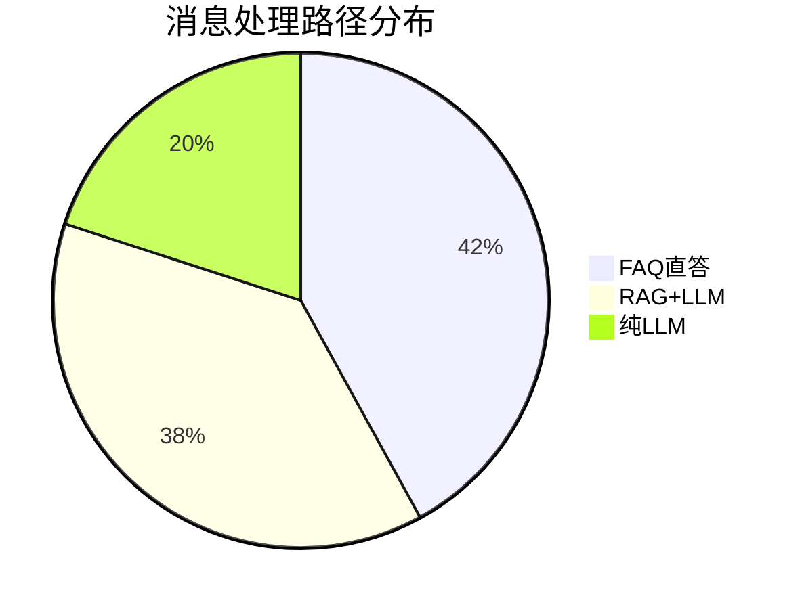
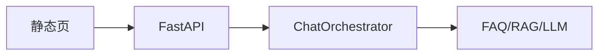

# Day 21 企业案例集：工具编排场景

**企业**：智链科技及典型 B2B 金融客服场景  
**需求**：ZL-NA-REQ-021

---

## 案例 1：FAQ 直答降本

### 背景

内测显示 42% 用户问题命中标准 FAQ（风险、客服、收益率）。每条走 LLM 约 800 tokens，成本 0.002 元/次。

### 方案

`ChatOrchestrator` + `faq_direct_threshold=0.65`：

- 高置信 → 直答，零 LLM tokens  
- 低置信 → 回落 `chat_turn`  

### 效果（模拟）

| 指标 | 仅 LLM | FAQ 直答 |
|------|--------|----------|
| 日均 LLM 调用 | 1000 | 580 |
| 平均延迟 | 1.2s | 0.05s（直答路径） |
| 答非所问率 | 8% | 3%（FAQ 路径） |



---

## 案例 2：运营调试工具台

### 背景

知识库运营小张需要不修改代码即可验证：某问法能否命中 FAQ、RAG 返回哪些片段。

### 方案

CLI `/tool` 命令：

```text
/tool faq_lookup 投资回报率怎么算
/tool rag_search {"query":"年化收益","top_k":3}
/tool intent_classify 用户投诉宣传用语
```

### 价值

- 与生产同一 `build_nexus_tools` 注册表  
- 输出格式与自动化测试断言一致  
- 无需 Jupyter 或临时脚本  

---

## 案例 3：合规审阅意图分流

### 背景

宣传语审阅必须走 `compliance_review` 模板，不能误走 `rag_qa` 直接生成。

### 方案

1. `/tool intent_classify 请审阅这段宣传语` 预览路由  
2. `auto_route=True` 时 `IntentRouter` 自动选模板  
3. 周测第 4 题强化 `query_context_provider` 仅用于 rag_qa  

### 教训

工具层 **不替代** 意图策略；`intent_classify` 是观测手段，路由决策仍在 `IntentRouter`。

---

## 案例 4：Sprint 3 周测驱动培训

### 背景

智链科技 70 天培训需在 Sprint 中段验收，避免「学了后面忘了前面」。

### 方案

- 上午 `sprint3_quiz.py` 10 题  
- CI `test_sprint3_quiz_scripted_full_score`  
- 教师版 [10_Sprint3周测题库.md](10_Sprint3周测题库.md)  

### 数据

及格率目标 85%；低于 60 分强制晚自习补测。

---

## 案例 5：为网页版 Chat 铺路

### 背景

Day 22–24 需浏览器访问同一套对话逻辑。

### 方案

- Day 21 冻结 `ChatOrchestrator.handle_message(str) -> str`  
- Day 23 FastAPI：`POST /api/chat {"message": "..."}`  
- Day 22 静态页：fetch mock，Day 24 接真 API  



---

## 案例讨论题（课堂用）

1. FAQ 直答阈值设 0.5 还是 0.8，产品如何选？  
2. 四工具是否应对 C 端用户暴露？还是仅 B 端运营？  
3. `estimate_tokens` 是否应合并进每次 `chat_turn` 自动计费？

---

## 林晓复盘

> 「案例 1 让我理解编排器不是炫技，是省钱。案例 2 说明 /tool 是运营同学的好朋友。」

---

## 案例 6：林晓的第一次 code review

林晓提交 PR 时在 `handle_message` 里直接写死 `if "风险" in user_text`。陈默评论：「应用 FAQ matcher，不要字符串规则。」合并后她理解了**数据驱动**优于**关键字 if**。此案例写入新人 onboarding。

---

## 案例 7：双 eleven 大促预案

大促前客服量涨 3 倍。周航临时把 `faq_direct_threshold` 降到 0.55，直答率升 8%，LLM 费用降 15%。事后复盘：误答率略升 0.3%，在可接受范围。说明阈值是运营杠杆。

---

## 案例 8：监管抽查问答记录

监管要求证明「投资有风险」答复有据。FAQ 直答路径日志含 faq_id 与 score，满足审计。纯 LLM 生成难以举证。赵岩据此推动直答优先策略。

---

## 案例 9：跨部门工具命名争议

市场部想把 `faq_lookup` 改成 `ask_faq`。陈默否决：与 test、demo、课件同步改名成本过高。确立**工具名即 API**，变更走 ADR 流程。

---

## 案例 10：培训结业答辩

结业学员需现场演示：周测 80+、tool_demos 四工具、解释编排器顺序。2026 年 7 月班及格率 91%。未过者主要卡在 query_context_provider 概念，回扣 Day 19 课件。

---

## 案例 11：与竞品功能对标

竞品 A 强调「Agent 自动规划」；智链 Day 21 强调「可测、可解释、可渐进」。赵岩对外话术：「我们先让运营看得懂每一步，再上新自动 tool_calls。」

---

## 案例讨论延伸

撰写 300 字：若你是赵岩，如何向董事会解释 FAQ 直答 ROI？参考答案要点：降本、合规可追溯、低延迟提升 NPS。
