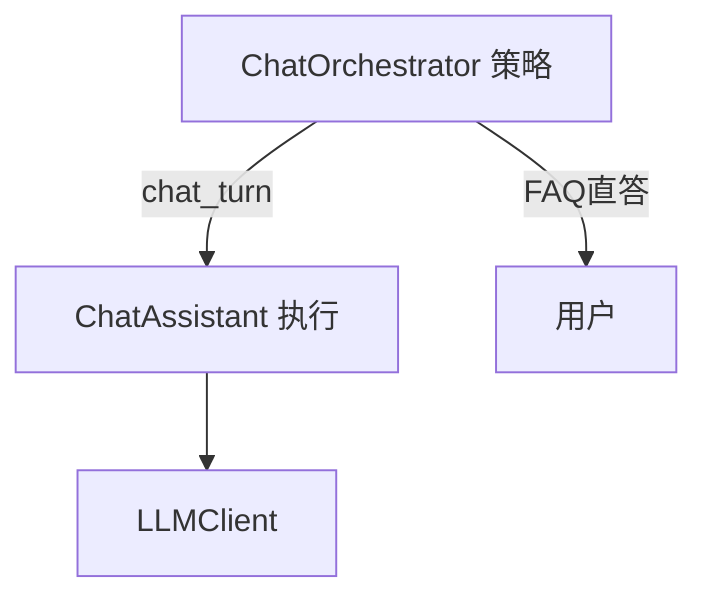
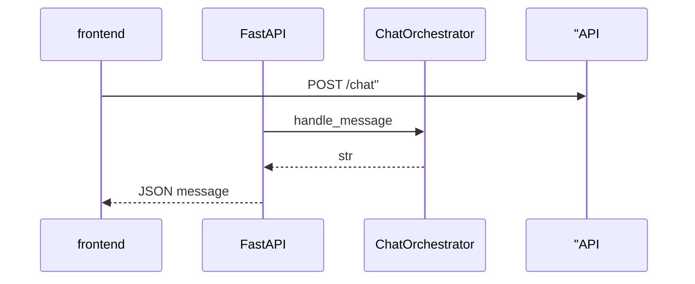

# Day 21 ChatOrchestrator 深度讲义

**专题**：对话编排策略与实现细节  
**需求**：ZL-NA-REQ-021

---

## 第一章：为何需要编排器

`ChatAssistant.chat_turn` 已支持多轮、auto_route、RAG 注入，但产品还需要：

1. **成本策略**：高置信 FAQ 不应消耗 LLM tokens  
2. **统一入口**：Web API 只需 `handle_message` 一个方法  
3. **可配置策略**：阈值、开关而不改 chat_turn 源码  

`ChatOrchestrator` 是 **策略层**，`ChatAssistant` 是 **执行层**。



---

## 第二章：OrchestratorConfig 详解

| 字段 | 类型 | 默认 | 说明 |
|------|------|------|------|
| faq_direct_threshold | float | 0.65 | 直答最低相似度 |
| enable_faq_direct | bool | True | 总开关 |
| enable_auto_route | bool | True | chat_turn 前设 auto_route=True |

### 阈值调参指南

- **0.5–0.6**：激进直答，省钱，可能误答  
- **0.65**：默认平衡  
- **0.8+**：保守，更多走 LLM  

与 `SimilarQuestionMatcher(threshold=0.32)` 关系：matcher 决定 `match` 是否为 None；编排器在 match 存在时再比 `score >= 0.65`。

---

## 第三章：handle_message 完整逻辑

```python
def handle_message(self, user_text: str) -> str:
    user_text = (user_text or "").strip()
    if not user_text:
        return "请输入有效内容。"

    if self.config.enable_faq_direct and self.faq_matcher:
        match = self.faq_matcher.match(user_text)
        if match and match.score >= self.config.faq_direct_threshold:
            return f"[FAQ 直答·{match.score:.0%}] {match.entry.answer}"

    if self.config.enable_auto_route:
        self.assistant.auto_route = True

    return self.assistant.chat_turn(user_text)
```

### 边界情况

| 输入 | 行为 |
|------|------|
| `""` / 空白 | 提示有效内容 |
| FAQ 无 match | chat_turn |
| score < threshold | chat_turn |
| enable_faq_direct=False | 跳过 FAQ，chat_turn |

---

## 第四章：与 ChatAssistant 协作

### 构造 integrated_assistant_demo

```python
assistant = ChatAssistant(
    client=client,
    intent_router=router,
    auto_route=True,
    rag_service=rag,
    faq_matcher=faq,
    tool_registry=tools,
)
orchestrator = ChatOrchestrator(
    assistant,
    faq_matcher=faq,
    rag_service=rag,
    intent_router=router,
    tool_registry=tools,
    config=OrchestratorConfig(faq_direct_threshold=0.65),
)
```

**注意**：FAQ 直答走编排器，不经过 `assistant.chat_turn`；因此 messages 历史**不**自动追加 FAQ 直答（Day 22 API 可扩展）。

---

## 第五章：run_tool 与 tools_help

```python
def run_tool(self, name: str, arguments: dict | None = None) -> str:
    result = self.tool_executor.execute(name, arguments)
    return result.summary()
```

供 API 层 `POST /tools/execute` 预留；与 `/tool` 命令同底层。

---

## 第六章：测试策略解读

### test_orchestrator_faq_direct

- `faq_direct_threshold=0.5`  
- 输入「投资有风险吗」  
- 断言含「FAQ 直答」与「风险」  

### test_orchestrator_fallback_to_llm

- `SimilarQuestionMatcher(threshold=0.99)` 使 FAQ 难命中  
- 输入「根据资料查询收益率」  
- 断言含「路由」或 mock LLM「好的」  

---

## 第七章：Day 22–24 演进

| 日 | 编排器用法 |
|----|------------|
| 22 | 静态页 mock，函数签名对齐 |
| 23 | FastAPI 依赖注入单例 Orchestrator |
| 24 | 流式包装 handle_message 结果 |



---

## 第八章：思考题

1. FAQ 直答是否应写入 `assistant.messages`？优缺点？  
2. 多轮对话中第二轮重复 FAQ 问法，直答是否仍合适？  
3. 如何实现「仅首轮 FAQ 直答」配置项？

---

## 附录：FAQ 直答输出格式

```
[FAQ 直答·72%] 投资有风险，入市需谨慎。请根据自身风险承受能力选择产品。
```

`{score:.0%}` 与 Day 20 `FaqMatch.summary` 的 sim 格式一致，便于运营对照。

---

## 第九章：多轮对话与 messages 历史

当前 `handle_message` 在 FAQ 直答时**不**调用 `assistant.chat_turn`，因此直答内容不会自动进入 `messages` 列表。这是 Day 21 的已知限制，产品上有利有弊：利是不污染 LLM 上下文；弊是用户追问「刚才那个风险怎么说」时模型可能不知前文。林晓在讨论中建议 Day 23 增加可选参数 `record_faq_to_history: bool`。陈默记录为技术债 TD-021-01。

若走 `chat_turn` 路径，messages 按 Day 14 行为累积 user/assistant 对。编排器不改变 messages 结构，仅决定**是否调用** chat_turn。测试 `test_orchestrator_fallback_to_llm` 隐含验证：fallback 时 assistant 仍正常工作。

---

## 第十章：并发与线程安全

CLI 与单 worker FastAPI 下，单例 `ChatOrchestrator` 共享一个 `ChatAssistant` 实例会有会话串话风险。Day 22–24 将引入「每会话一个 assistant」工厂。`ToolRegistry` 与 `RAGContextService` 只读索引可共享；`messages` 必须隔离。周航在部署文档草案中写明：生产禁多用户共用一个 assistant 单例。

---

## 第十一章：可观测性钩子（预习）

建议在 `handle_message` 三分支打 metric：faq_direct、chat_turn、empty_input。标签含 intent（若可 cheap 获取）与是否命中 RAG。智链科技监控栈用 Prometheus，Day 23 API .middleware 实现。编排器源码 Day 21 未内置，避免教学代码膨胀。

---

## 第十二章：失败降级策略

FAQ matcher 抛异常时，Day 21 未捕获——将冒泡至 CLI。生产应 wrap：记录日志后降级 chat_turn。同理 rag_service 不可用时不应阻断 chitchat。工具层 `ToolExecutor` 已示范异常转 ToolResult；编排器可参考同样模式，列为学员选做。

---

## 第十三章：配置中心愿景

赵岩希望运营后台可调 `faq_direct_threshold` 无需发版。架构上 `OrchestratorConfig` 可从 Redis 读取，每分钟刷新。Day 21 硬编码 dataclass 默认值是 MVP。学员理解**配置与代码分离**方向即可。

---

## 第十四章：与客服系统对接

客服工单系统需要 structured JSON：`{type: faq_direct, score, answer_id}`。Day 21 返回纯文本 `[FAQ 直答·72%] ...` 仅供人机阅读。Day 23 API 可并行提供 `/chat/structured`。编排器内部可先返 dict，CLI 再 format——接口演进预留。

---

## 第十五章：学员答辩常见问题

**问**：能否在编排器里自动先 rag_search 再 LLM？  
**答**：auto_route 的 rag_qa 已注入 context，重复 rag_search 浪费；除非 multi-step agent 设计。

**问**：FAQ 直答能否播放语音？  
**答**：TTS 在 API 层，编排器仍只返文本。

**问**：handle_message 支持多模态吗？  
**答**：Day 21 不支持；ROADMAP 多模态在更后阶段。

本章完结。配合 [25_orchestrator精读.md](25_orchestrator精读.md) 与源码 `orchestrator.py` 使用效果更佳。
